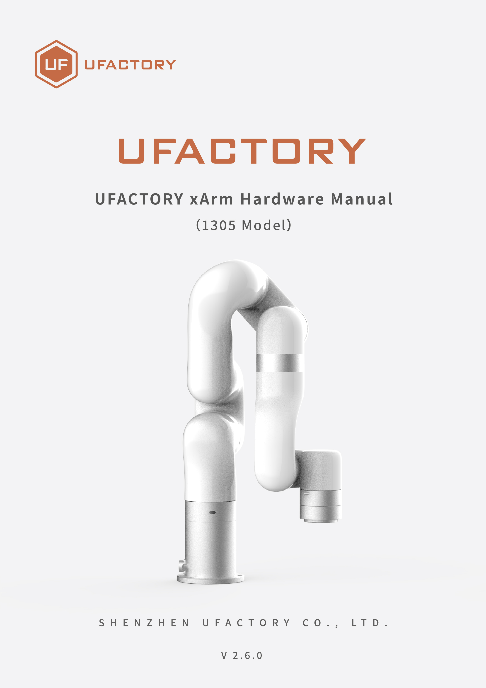

# Preface

Apply to Model: XF1305, XI1305, XS1305.

**Joint Range:**

| Model | xArm 5     | xArm 6     | xArm 7     |
| --- | ---------- | ---------- | ---------- |
| J1  | ±360°      | ±360°      | ±360°      |
| J2  | -117°～116° | -117°～116° | -117°～116° |
| J3  | -219°～10°  | -219°～10°  | ±360°      |
| J4  | -97°～180°  | ±360°      | -6°～225°   |
| J5  | ±360°      | -97°～180°  | ±360°      |
| J6  | -          | ±360°      | -97°～180°  |
| J7  | -          | -          | ±360°      |

**Motion Parameters:**

|            | TCP Motion         | Joint Motion     |
| ---------- | ------------- | ----------- |
| Speed  | 0～1000mm/s    | 0～180°/s    |
| Acceleration   | 0～50000mm/s²  | 0～1145°/s²  |
| Jerk | 0～100000mm/s³ | 0～28647°/s³ |

**Unit Definition:** 

| Parameter          | Python-SDK     | Blockly        | Communication Protocol |
| ------------------ | -------------- | -------------- | ---------------------- |
| X（Y/Z）             | millimeter（mm） | millimeter（mm） | millimeter（mm）         |
| Roll（Pitch/Yaw）    | degree（°）      | degree（°）      | radian（rad）            |
| J1~J7              | degree（°）      | degree（°）      | radian（rad）            |
| TCP Speed          | mm/s           | mm/s           | mm/s                   |
| TCP Acceleration   | mm/s²          | mm/s²          | mm/s²                  |
| TCP Jerk           | mm/s³          | mm/s³          | mm/s³                  |
| Joint Speed        | °/s            | °/s            | rad/s                  |
| Joint Acceleration | °/s²           | °/s²           | rad/s²                 |
| Joint Jerk         | °/s³           | °/s³           | rad/s³                 |

