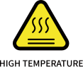

# 1. Safety

## 1.1 Validity and Responsibility
The information in this manual does not cover designing, installing, and operating of a complete robotic application system, nor does it cover all peripheral equipment that can influence the safety of the application. The complete system must be designed and installed under the safety requirements outlined in the standards and regulations of the country where the robotic arm is installed.

The integrators of xArm are responsible for the compliance of applicable safety laws and regulations in the country, to prevent any hazards in the operating environment.
This includes, but is not limited to:

* Making a risk assessment for the complete system. Make sure to have a safe distance between people and xArm when interacting with the xArm. 
* Interfacing other machines and additional safety devices if defined by the risk assessment.
* For software programming, please read the interface documentations carefully and set up the appropriate safety functions in the software. 
* Specifying instructions for use to prevent unnecessary property damage or personal injury caused by improper operation. 

## 1.2 Limitation of Liability
Any safety information provided in this manual must be construed as a warranty by UFACTORY, that the xArm will not cause injury or damage even if all safety instructions are complied with.

| Safety Alarms |                                                                                                                                                           |
| ---------------------------- | --------------------------------------------------------------------------------------------------------------------------------------------------------- |
|                              | **DANGER**  This indicates an imminently hazardous electrical situation, which if not avoided, could result in death or serious damage to the device. |
|                              | **WARNING**  This indicates a potentially hazardous situation which, if not avoided, could result in death or serious damage to the device.           |
|                              | **HIGH TEMPERATURE**  This indicates a potential hot surface, which if touched, could result in personal injury.                                    |
|                              | **NOTICE**  Failure to prevent this may lead to personal injury or equipment damage.                                                                 |
|                              | **CAUTION**  Failure to prevent this may lead to personal injury or equipment damage.                                                                 |

## 1.3 General Warning and Cautions
This section contains some general warnings and cautions on installation and application planning for the robotic arm. To prevent damage to the machine and associated equipment, users need to learn all the relevant content and fully understand the safety precautions. We do not control or guarantee the relevance or completeness of such information in this manual, for which users should conduct self-assessment of their specific problems.   

**DANGER** 
* Make sure to use the correct installation settings in this manual for the robotic arm and all the electrical equipment. 
* Please follow the instructions in this manual, installation, and commissioning needs to be performed by professionals in accordance
* Make sure the robotic arm and tool are properly and securely bolted in place.
* The integrity of the device and system must be checked before each use (e. g. the operational safety and the possible damage of the robotic arm and other device systems). 
* Preliminary testing and inspection for both robotic arm and peripheral protection system before production is essential.
* The operator must be trained to guarantee a correct operation procedure when using SDK(Python/ROS/C++) and graphical interface UFactory studio. 
* A complete safety assessment must be recorded each time the robotic arm is re-installed and debugged. 
* When the robotic arm is in an accident or abnormal operation, the emergency stop switch needs to be pressed down to stop the movement, and the posture of the robotic arm will slightly brake and fall. 
* The xArm joint module has brakes inside, which will remain manipulator’s pose when a power outage occurs.
* When the robotic arm is in operation, make sure no people or other equipment are in the working area. 
* When releasing the brakes of xArm, please take protective measures to prevent the robotic arm or operator from damage or injury. 
* When connecting the xArm with other machinery, it may increase risk and result in dangerous consequences. Make sure a consistent and complete safety assessment is conducted for the installation system.

**HIGH TEMPERATURE** 
* The robotic arm and Control Box will generate heat during operation. Do not handle or touch the robotic arm and Control Box while in operation or immediately after the operation.
* Never stick fingers to the connector of the end-effector.

**CAUTION**
* Make sure the robotic arm’s joints and tools are installed properly and safely, and check the status for all circuits.
* Make sure that there is enough space for the manipulator to move freely. 
* Make sure that there is no obstacle in the robotic arm’s working space. 
* The Control Box must be placed outside the working range of the robotic arm to ensure the emergency stop button can be pressed once an emergency occurs.
* If the robotic arm is in operation and needs an emergency stop, make sure the restart/reset motions will not collide with any obstacle.
* Do not modify the robotic arm (or Control Box). Any modification may lead to unpredictable danger to the integrators. The authorized restructuring needs to be in accordance with the latest version of all relevant service manuals. If the robotic arm is modified or altered in any way, UFACTORY (Shenzhen) Technology Co., Ltd. disclaims all liability. 
* Users need to check the collision protection and water-proof measures before any transportation. 

**NOTICE**
* When the xArm cooperates with other machinery, a   comprehensive safety assessment of the entire collaboration system should be performed. It is recommended that any equipment that may cause mechanical damage to xArm be placed outside the working range during application planning.

## 1.4 Personnel Safety
When operating or running robots, the foremost priority must be to ensure the safety of operating personnel. General precautions are listed below. Please properly implement corresponding measures to guarantee the safety of personnel involved in the operation.

**CAUTION**
* Each operator who uses the robotic arm system should read the product user manual carefully. Users should fully understand the standardized operating procedures with the robotic arm, and the solution to the robotic arm running error. 
* When the device is running, even if the robotic arm seems to stop, the robotic arm may be waiting for the signal and in the upcoming action status. Even in such a state, it should be considered as the robotic arm is in action.
* A line should be drawn to mark the range of motion of the robotic arm to let the operator acknowledge the robotic arm, including its end tools (such as gripper and suction cup, etc) operating range.
* Check the robotic arm regularly to prevent loosening of the bolts that may cause undesirable consequences. 
* Be careful when the robotic arm is running too fast. 
* Be careful about dropping items that can be caused by accidental power off or unstable clamping of the robotic arm.

**WARNING**
* Do not alter any information in the controller safety configuration. If parameters in the configuration file are modified, the entire robot system shall be deemed a new system, which necessitates the update of all safety review processes, such as risk assessments.
* Replace faulty components only with new parts of the same part number or UFACTORY-approved equivalent components.
* Document all maintenance operations in writing and retain these records within the technical documentation associated with the entire robot system.

**DANGER**
* Remove the main power cable from the controller to ensure complete power disconnection. Take necessary precautions to prevent unauthorized re-energization of the system by others during maintenance.
* Before restarting the system, ensure that grounding connections are verified.
* Comply with ESD (Electrostatic Discharge) regulations when disassembling the mechanical arm or controller.
* Avoid disassembling the power supply system within the controller. The power supply system may retain high voltage for several hours after the controller is shut down.
* Prevent the ingress of water or dust into the mechanical arm or controller.