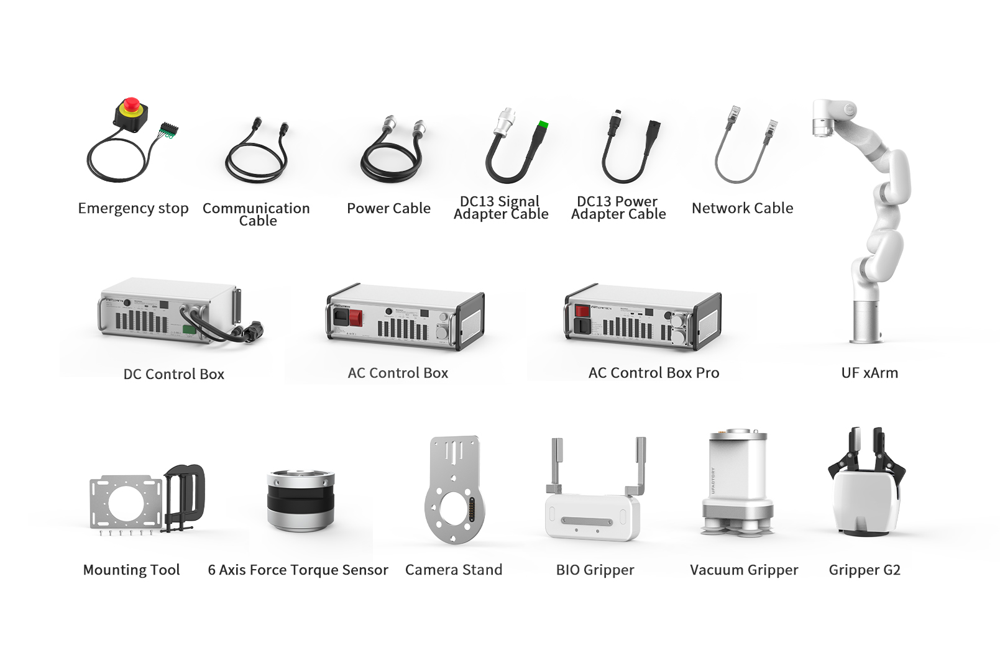
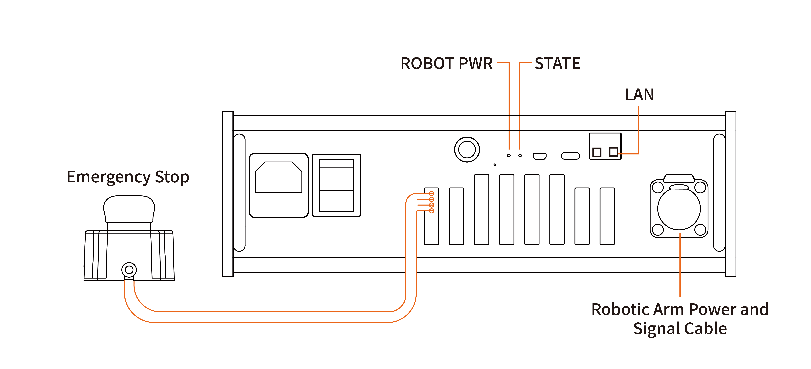
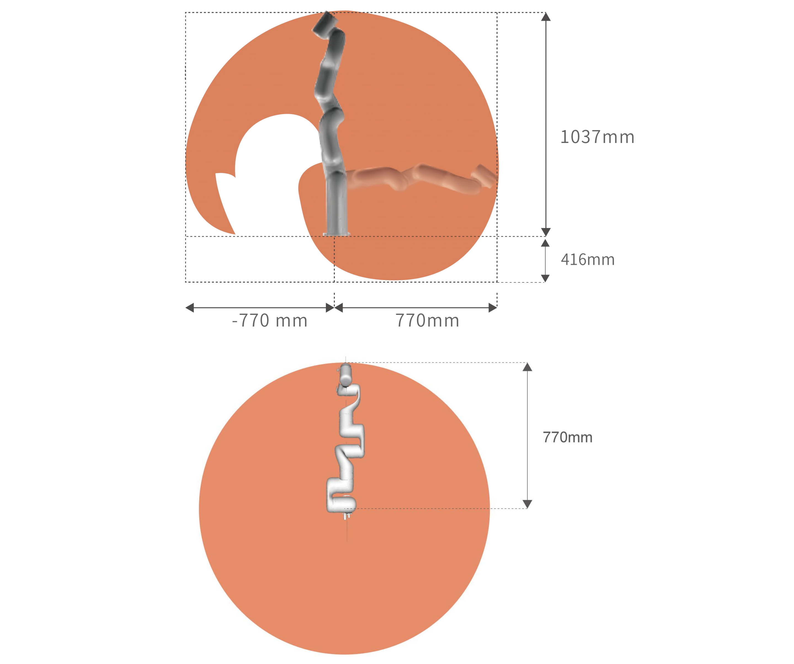
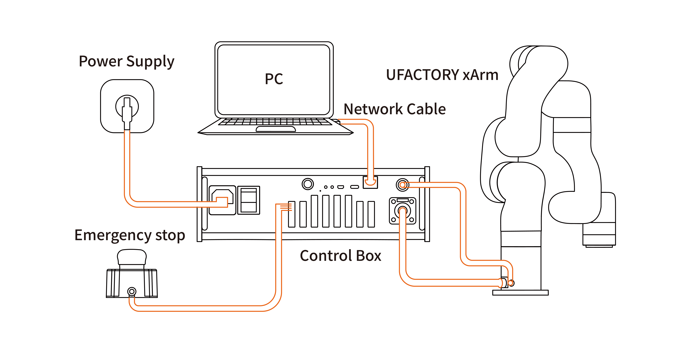
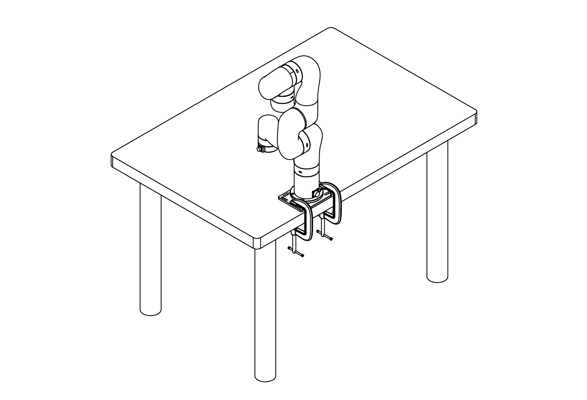
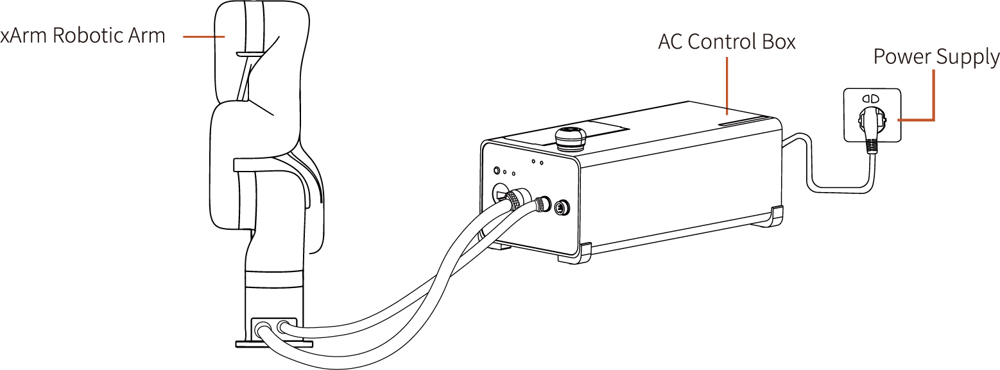
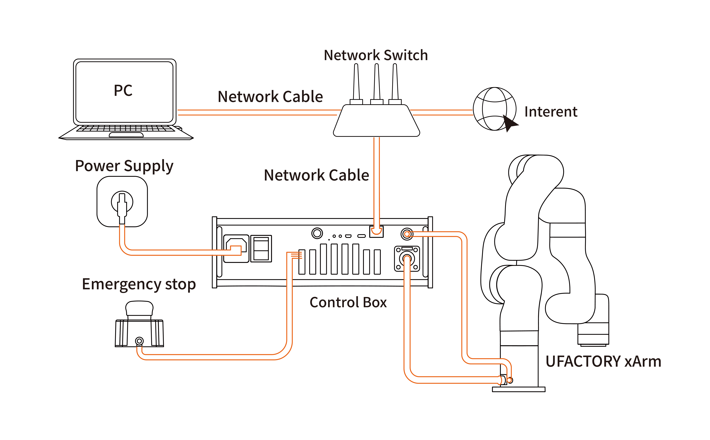
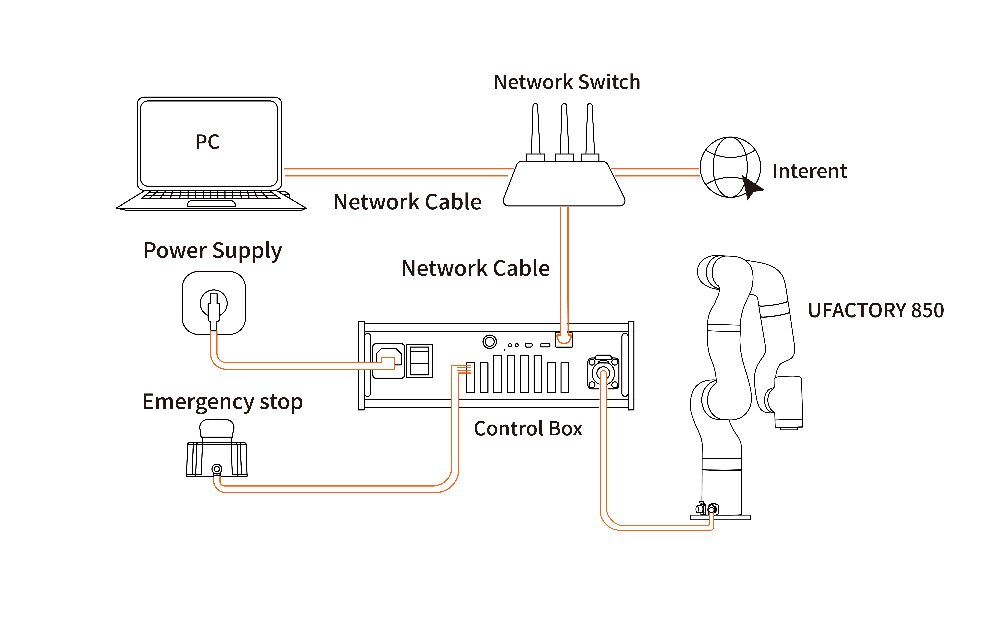
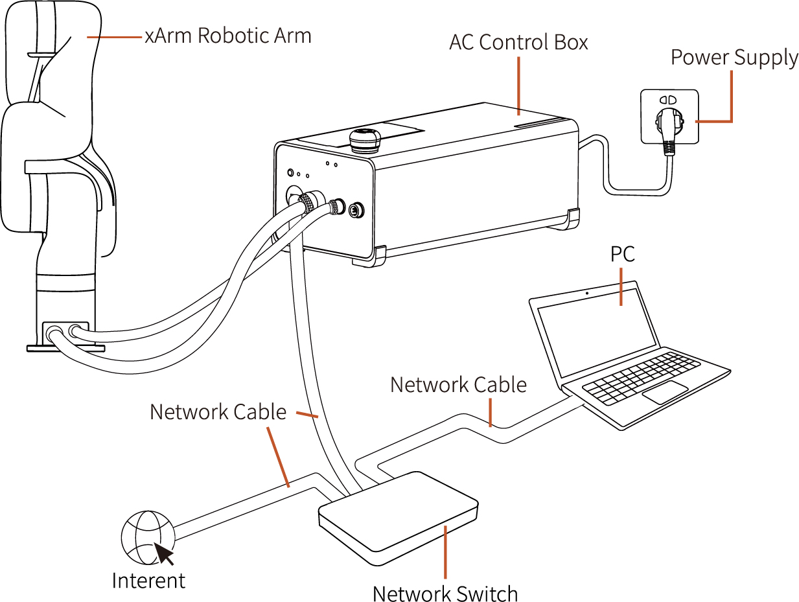

# 2. Hardware Installation
Apply to Model: XF1305, XI1305, XS1305 (1305 Model).
Controller: 1310, 8510.

## 2.1 Hardware Composition
### 2.1.1 Hardware Composition 
The composition of robotic arm hardware includes:

* xArm Robotic Arm
* AC Control Box
* DC Control Box
* AC Control Box Pro
* E-stop Button
* xArm Power Cable
* xArm Communication Cable
* Mounting Tool
* DC13 Power Adapter Cable
* DC13 Signal Adapter Cable
* Network Cable
* End Effector(FT Sensor, BIO Gripper G2, Vacuum Gripper, xArm Gripper G2).

The xArm robotic arm system consists of a base and rotary joints, and each joint represents a degree of freedom.  From the bottom to the top, in order, Joint 1, Joint 2, Joint 3, etc. The last joint is known as the tool side and can be used to connect end-effector (e. g. gripper, vacuum gripper, etc). 
### 2.1.2 Emergency Stop Button
By pressing the emergency stop button of the Control Box, a command will be sent to the Control Box for software deceleration to stop all activities of the robotic arm and clear all the cached commands in the Control Box; the power supply for the robotic arm will be removed within 300ms. The emergency stop should not be used as a risk reduction measure. When an emergency occurs during the operation of the robotic arm, users need to press the emergency stop, and the posture of the robotic arm will slightly brake and fall. The emergency stop button is shown below:

| Indicator               | Label     | Function                                |
| ----------------------- | --------- | --------------------------------------- |
| ROBOT Power             | ROBOT PWR | ON - The xArm is powered on.             |
| Controller Power Status | STATE     | Flash - The controller is powered on.   |
| Network Port            | LAN       | ON - The xArm is communicating normally. |

**Emergency Stop**  
Press the emergency stop button to power off the xArm, and the power indicator will go out.   
**Power-on**  
when the button is rotated in the direction indicated by the arrow, the button is pulled up, the xArm power indicator lights up, and the arm is powered.  

After pressing the emergency stop button, the following operations should be performed to re-start the xArm:
* Power up the xArm (Turn the emergency stop button in the direction of the arrow).
* Enable the xArm (enable the servo motor), Enable button on the UFACTOR Studio or Python SDK `motion_enable(true)`.

## 2.2 xArm Installation
### 2.2.1 Safety Guidelines
**DANGER**
* Make sure the arm is properly and safely installed in place. The mounting surface must be shockproof and sturdy. 
* To install the arm body, check that the bolts are tight. 
* The robotic arm should be installed on a sturdy surface that is sufficient to withstand at least 10 times the full torsion of the base joint and at least 5 times the weight of the arm. 

**WARNING**
* The robotic arm and its hardware composition must not be in direct contact with the liquid, and should not be placed in a humid environment for a long time. 
* A safety assessment is required each time installed.
* When connecting or disconnecting the arm cable, make sure that the external AC is disconnected. To avoid any electric shock hazard, do not connect or disconnect the robotic arm cable when the robotic arm is connecting with external AC.
* 
### 2.2.2 Define Working Space
The robotic arm workspace refers to the area within the extension of the links. The figure below shows the dimensions and working range of the robotic arm. When installing the robotic arm, make sure the range of motion of the robotic arm is taken into account, so as not to bump into the surrounding people and equipment (the end-effector not included in the working range).
* working range of xArm7, unit:mm

* working range of xArm5 and xArm6, unit:mm

### 2.2.3 Installation
Brief installation steps:
1. Define Working Space.
2. Fix the robotic arm base.
3. Connect the robotic arm with the controller.
4. Connect the controller with cable.
5. Install End-Effector.

#### 2.2.3.1 Robot Base Mounting

#### 2.2.3.2 Connect with Controller
1. Plug the connector of the Robotic Arm Power Supply Cable and the Robotic Arm Signal Cable into the interface of the Robotic Arm. The connector is a foolproof design. Please do not unplug and plug it violently.
2. Plug the Robotic Arm Power Supply Cable and the Robotic Arm Signal Cable into the Control Box.
3. Plug the Control Box Power Cable into the AC (110V-240V) interface on the Control Box and the other end into the socket (as shown in Figure below).

#### 2.2.3.3 Controller Networking
There are four ways of network settings for the robotic arm. You can choose the appropriate network setting method according to your scenario.
1. The control box is directly connected to the PC(**Recommended connection method**).

2. The control box, PC and router are connected by Ethernet cable.

3. PC and router are connected by wireless network, and control box and router are connected by Ethernet cable.
**Note:** It is not recommended because of the delay and packet loss of wireless connection.

4. The control box, PC and network switch are connected by Ethernet cable.

## 2.3 Power Supply for xArm
* Ensure the power cable and the communication wire are properly connected between the Control Box and the robotic arm.
* Ensure the network cable or RS-485 cable is properly connected.
* Ensure the power cable for the Control Box is properly connected. 
* Ensure the xArm will not hit any personnel or equipment within the working range. 

### 2.3.1 Power On
1. Turn on the OFF/ON button and ensure the indicator lights are lit.  
2. Press the power button, when the status indicator（CONTROLLER） lights up, the control box is turned on.
3. Rotate the emergency stop button in the direction indicated by the arrow and is pulled up, at which point the xArm power indicator(ROBOT PWR) lights up. 
4. Use the UFactory studio / SDK command to complete the operation of enabling the robotic arm. (enable the servo motor)

### 2.3.2 Shut Down
1. Press the EMERGENCY STOP button to power off the robotic arm, ensure the power indicator light is off. 
2. Turn off the power supply of the control box(The power switch takes about 5 seconds to turn off the power of the control box. Please do not restart the control box within 5 seconds after turning off the power supply).