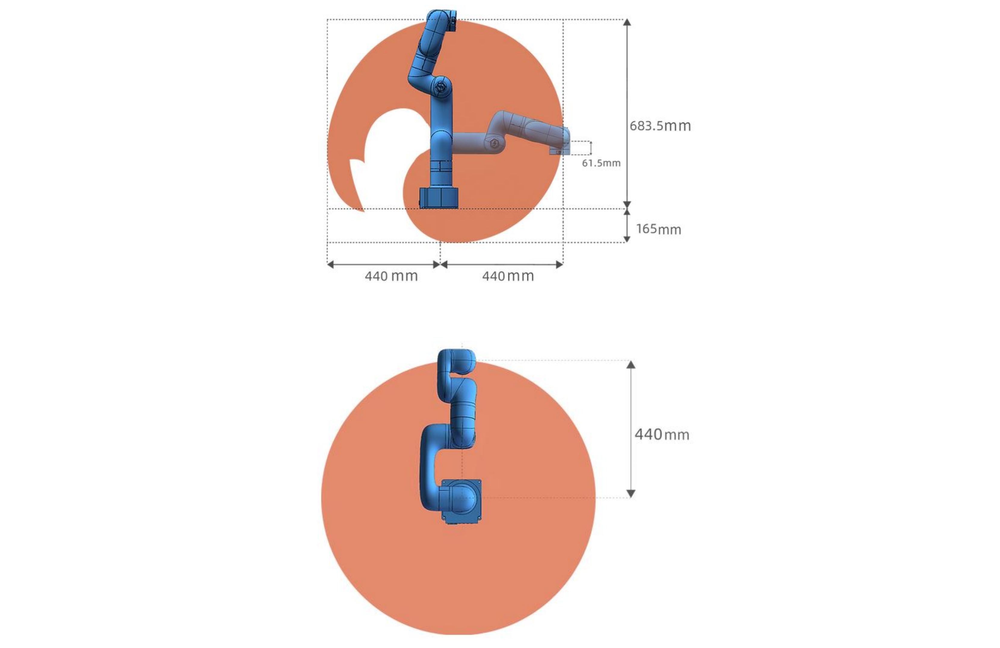

# 2. Hardware Installation

## 2.1 Hardware Composition
### 2.1.1 Hardware Composition 
The composition of robotic arm hardware includes:

* Lite6 Robotic Arm
* Power Supply
* E-stop button
* Mounting Tool
* Gripper Lite
* Vacuum Gripper Lite
  
The Lite 6 robotic arm system consists of a base and rotary joints, and each joint represents a degree of freedom.  From the bottom to the top, in order, Joint 1, Joint 2, Joint 3, etc. The last joint is known as the tool side and can be used to connect end-effector (e. g. gripper, vacuum gripper, etc). 

## 2.2 xArm Installation
### 2.2.1 Safety Guidelines
**DANGER**
* Make sure the arm is properly and safely installed in place. The mounting surface must be shockproof and sturdy. 
* To install the arm body, check that the bolts are tight. 
* The robotic arm should be installed on a sturdy surface that is sufficient to withstand at least 10 times the full torsion of the base joint and at least 5 times the weight of the arm. 

**WARNING**
* The robotic arm and its hardware composition must not be in direct contact with the liquid, and should not be placed in a humid environment for a long time. 
* A safety assessment is required each time installed.
* When connecting or disconnecting the arm cable, make sure that the external AC is disconnected. To avoid any electric shock hazard, do not connect or disconnect the robotic arm cable when the robotic arm is connecting with external AC.

### 2.2.2 Define Working Space
The robotic arm workspace refers to the area within the extension of the links. The figure below shows the dimensions and working range of the robotic arm. When installing the robotic arm, make sure the range of motion of the robotic arm is taken into account, so as not to bump into the surrounding people and equipment (the end-effector not included in the working range).
* Working range of Lite6, Unit:mm

### 2.2.3 Installation
#### 2.2.3.1 Robot Base Mounting
The robotic arm has five M5 bolts provided and can be mounted through four ∅5.5 holes in the base of the robotic arm. It is recommended to tighten these bolts with a torque of 20N·m.

#### 2.2.3.2 Connect with Power Supply
1. Plug the connector of the Robotic Arm Power Supply into the interface of the Robotic Arm. The connector is a fool proof design. Please do not unplug and plug it violently.
2. Please mark sure the voltage selector switch has been adjusted to correct gear according to the local voltage before powering on. Otherwise, the circuit lof Lite6 may be damaged.

#### 2.2.3.3 Controller Networking
Plug the network cable into the interface marked LAN of the robot, and plug the other end of the network cable into the computer.  

## 2.3 Power on the Lite6
* Ensure the network cable is properly connected.
* Ensure the Lite 6 will not hit any personnel or equipment within the working range. 

### 2.3.1 Power On
1. Release the emergency stop, the power indicator（ROBOT PWR) will on. 
2. Use the UFACTORY Studio or SDK commands to complete the operation of enabling the robotic arm. 

### 2.3.2 Shut Down
1. Press the emergency stop button.

2. Go to UFACTORY Studio-Settings-My Device- Device Info-Shut down, click Shutdown.

3. Unplug the socket.
