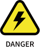
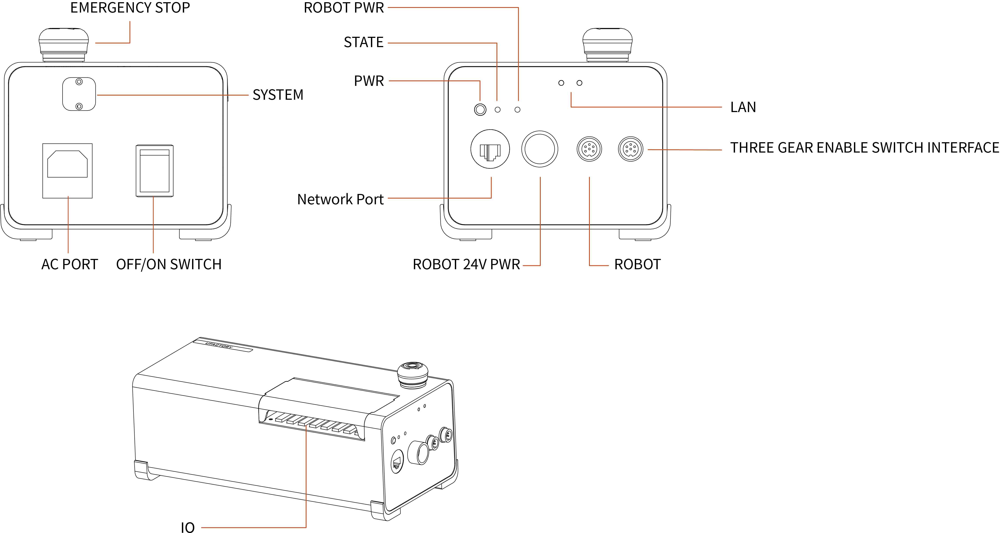
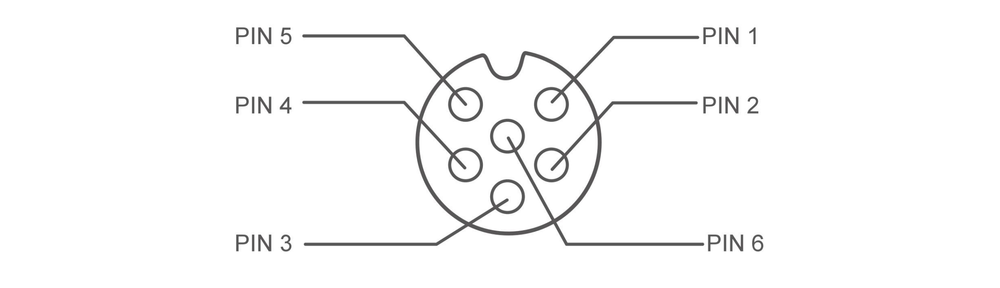
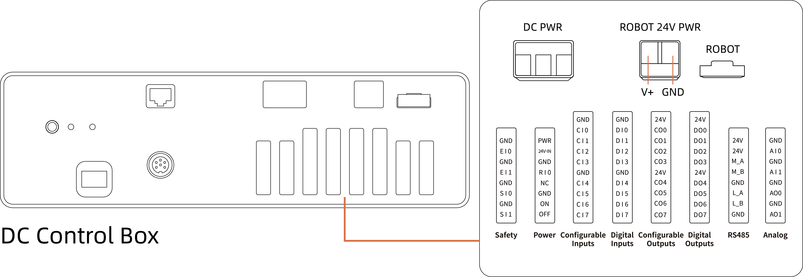
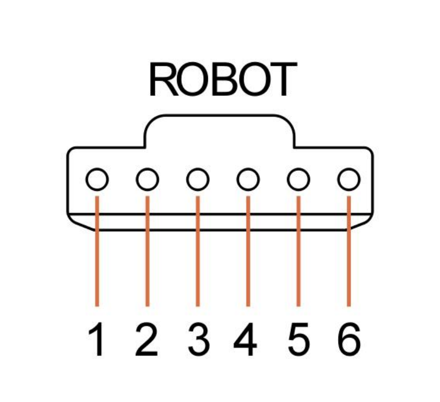
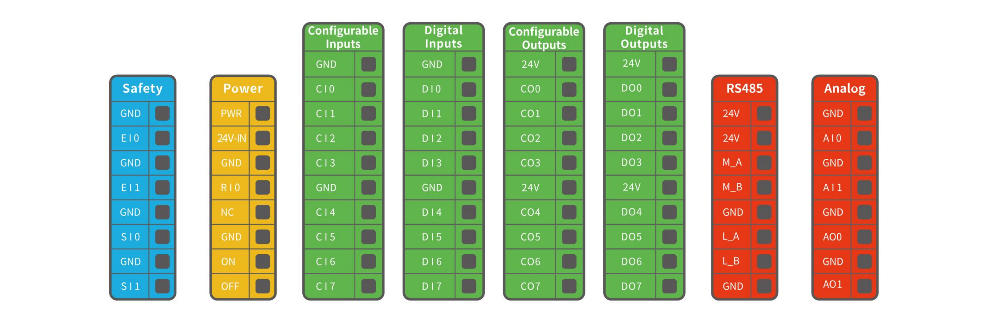
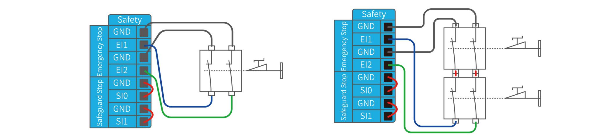
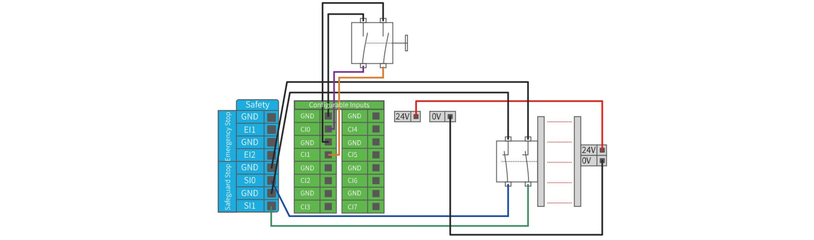
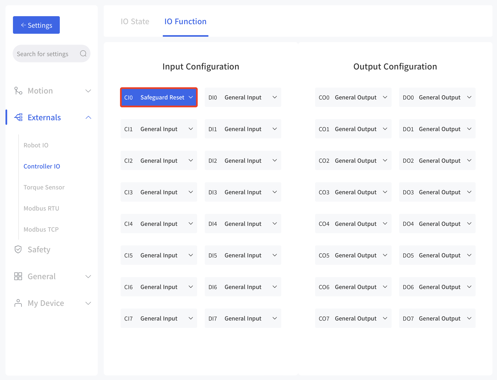
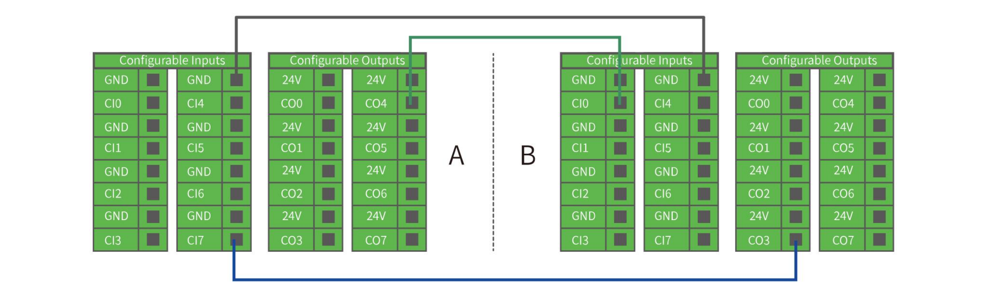

# 3. Controller Electrical Interface

## 3.1 Electrical Alarms and Cautions
Always follow the warnings and cautions below when designing and installing a robotic arm application. These warnings and cautions are also subject to the implementation of maintenance work.

| ICON |                                                                                                                                                                                                                                                                                                                                                                                                                                                                                                                                                                    |
| ---- | ------------------------------------------------------------------------------------------------------------------------------------------------------------------------------------------------------------------------------------------------------------------------------------------------------------------------------------------------------------------------------------------------------------------------------------------------------------------------------------------------------------------------------------------------------------------ |
|      | 1. Make sure that all the non-waterproof equipment is kept dry. If water enters the product, turn off the power supply, and contact your supplier.  2.	Use only the original cable of the robotic arm. Do not use the robotic arm in applications where the cable needs to be bent. If you need a longer cable or flexible cable, please contact your supplier. 3.	All GND connectors mentioned in this manual are only suitable for powering and transmitting signals.  4.	Be careful when installing the interface cable to the I/O of the robotic arm. |
|      | 1.	Interfering signals above the level specified in the IEC standard will cause abnormal behaviour of the robotic arm. Extremely high signal levels or excessive exposure can cause permanent damage to the robotic arm. UFACTORY (Shenzhen) Technology Co., Ltd. is not responsible for any loss caused by EMC problems. 2.	The length of the I/O cable that used to connect the Control Box with other mechanical and plant equipment must not exceed 30 meters unless it is feasible after the extension testing.                                            |
|      | When wiring the electrical interface of the Control Box, the Control Box must be powered off.                                                                                                                                                                                                                                                                                                                                                                                                                                                                      |
|      | Never connect a safety signal to a non-safety PLC.Failure to follow this warning may result in serious injury or death due to an invalid safety stop function.                                                                                                                                                                                                                                                                                                                                                                                                     |

## 3.2 AC Controller
### 3.2.1 Hardware Connector

### 3.2.2 Power Supply
There is a standard IEC plug at the end of the control box’s main cable.  

Connect a local dedicated main outlet or cable to the IEC plug. The control box is powered by 100V-240V AC (the input frequency is 47-63HZ) and its internal switching power supply converts 100V-240V AC into 12V, 48V DC, which supplies power to the load of the control box and the robotic arm.   

Therefore, it is necessary to check whether the connection between the robotic arm and the control box is secured before use. The hardware protection and software protection of the control box can ensure the safety of use largely. The emergency stop button of the control box allows the user to cut off the power of the robotic arm in the shortest time possible and protect the safety of both personnel and the equipment.  

To power on the robotic arm, the control box must be connected to the power supply. In this process, the corresponding IEC C19 wire must be used.  

Connect to the standard IEC C20 plug of the Control Box to complete the process, see the figure below.

### 3.2.3 Definition of Industrial Connector
Power and Signal Cable:

| 6-Pin Industrial Connector |             |     |              |
| -------------------------- | ----------- | --- | ------------ |
| 1                          | GND         | 4   | GND          |
| 2                          | RS485-A Arm | 5   | RS485-A Tool |
| 3                          | RS485-B Arm | 6   | RS485-B Tool |

## 3.3 DC Controller

### 3.3.1 Hardware Connector

### 3.3.2 Power Supply

| DC Controller    |                                                                 |
| ---------------- | --------------------------------------------------------------- |
| VP+              | 24-72V DC Input                                                 |
| PE               | Connect to the control housing (Leakage Protection), not a must |
| GND              | GND                                                             |
| Output           | 24V DC 672WMax                                                  |
| I/O power supply | 24V 1.8A(Internal power supply); 24V 3A(External power supply)  |

### 3.3.3 Definition of Industrial Connector

| PIN | Definition | PIN | Definition |
| --- | ---------- | --- | ---------- |
| 1   | GND        | 4   | GND        |
| 2   | 485-A Arm  | 5   | 485-A Tool |
| 3   | 485-B Arm  | 6   | 485-B Tool |

## 3.4 Controller Electrical IO
This chapter explains how to connect devices to the electrical I/O outside of the control box.   

The I/Os are extremely flexible and can be used in many different devices, including pneumatic relays, PLCs, and emergency stop buttons.  

The figure below shows the electrical interface layout inside the control box.

Configurable IO：

| Configurable Function | CI0-CI7 | DI0-DI7 |
| --------------------- | ------- | ------- |
| General Input         | Yes     | Yes     |
| Stop Moving           | Yes     | No      |
| Safeguard Reset       | Yes     | No      |
| Offline Task          | Yes     | Yes     |
| Manual Mode           | Yes     | Yes     |
| Reduced Mode          | Yes     | No      |
| Enable Robot          | Yes     | Yes     |

| Configurable Function     | CO0-CO7 | DO0-DO7 |
| ------------------------- | ------- | ------- |
| General Output            | Yes     | Yes     |
| Motion Stopped            | Yes     | Yes     |
| Robot Moving              | Yes     | Yes     |
| Error                     | Yes     | Yes     |
| Warning                   | Yes     | Yes     |
| Collision                 | Yes     | Yes     |
| Manual Mode               | Yes     | Yes     |
| Reduced Mode              | Yes     | Yes     |
| Offline Task Running      | Yes     | Yes     |
| Robot Enabled             | Yes     | Yes     |
| Emergency Stop is Pressed | Yes     | Yes     |

It is very important to install xArm according to the electrical specifications.   
All the I/O must comply with the specifications. The digital I/O can be powered by a internal 24V power supply or by an external power supply by configuring the power junction box. In the following figure, PWR is the internal 24V power output. The lower terminal (24V-IN) is the 24V input external power input for I/O. The default configuration is to use internal power, see below.

If larger current is needed, connect the external power supply as shown below.
  

The electrical specifications for the internal and external power supplies are as follows.

| Terminal                        | Parameter | Min. Value | Typical Value | Max. Value | Unit |
| ------------------------------- | --------- | ---------- | ------------- | ---------- | ---- |
| Built-in 24V Power Supply       |           |            |               |            |      |
| [PWR - GND]                     | Voltage   | 23         | 24            | 30         | V    |
| [PWR - GND]                     | Current   | 0          | -             | 1.8        | A    |
| External 24V  Input Requirement |           |            |               |            |      |
| [24V - 0V]                      | Voltage   | 20         | 24            | 30         | V    |
| [24V - 0V]                      | Current   | 0          | -             | 3          | A    |

The digital I/O electrical specifications are as follows(For resistive or inductive loads up to 1H).

| Terminal          | Parameter          | Min. Value | Typical Value | Max. Value | Unit  |
| ----------------- | ------------------ | ---------- | ------------- | ---------- | ----- |
| Digital Output    |                    |            |               |            |       |
| [COx]             | Current            | 0          | -             | 100        | mA    |
| [COx]             | Voltage Goes Down  | 0          | -             | 0.5        | V     |
| [COx]             | Open Drain Current | 0          | -             | 0.1        | mA    |
| [COx]             | Function           | -          | NPN (OC)      | -          | Type  |
| Digital Input     |                    |            |               |            |       |
| [EIx/SIx/CIx/RIx] | Voltage            | 0          | -             | 30         | V     |
| [EIx/SIx/CIx/RIx] | OFF Area           | 15         | -             | 30         | V     |
| [EIx/SIx/CIx/RIx] | ON Area(low level) | 0          | -             | 5          | V     |
| [EIx/SIx/CIx/RIx] | Current (0-0.5)    | 3          | -             | 8          | mA    |
| [EIx/SIx/CIx/RIx] | Function           | -          | -             | -          | Tyepe |

**CAUTION**  
There is no current protection on the digital output of the Control Box. If the specified values exceeded, permanent damage may result.

### 3.4.1 Safety IO(EISI)
All safety I/Os exist in pairs (redundancy) and must be kept in two separate branches. A single I/O failure should not result in the loss of safety features. There are two fixed safety inputs: 
* The robotic arm emergency stop input is only used for the emergency stop of the device. 
* The protective stop input is used for all types of safety protection. 

The functional differences are as follows.

|                                     | Emergency Stop           | Protective Stop |
| ----------------------------------- | ------------------------ | --------------- |
| Stops the motion of the robotic arm | Yes                      | Yes             |
| Program execution                   | Stop                     | Suspend         |
| Reset                               | Manual                   | Auto or manual  |
| Usage frequency                     | Not frequent             | No limit        |
| Need re-initiation                  | Only releasing the brake | No              |

The robotic arm has been configured by default and can be operated without any additional safety equipment, as the figure below. If there is a problem with the robotic arm, please check the following figure for the correct connection.

#### 3.4.1.1 Connect to Emergency Stop Button
Digital IO: EI1, EI2, SI0, SI1. 

In most applications, one or more additional emergency stop buttons are required. The figure below shows how to connect one or more emergency stop buttons. 

#### 3.4.1.2 Share Emergency Stop with other Machines
Digital IO: EI1, EI2, SI0, SI1.   

When a robotic arm is used with other machines, it requires to set up a common emergency stop circuit in most of the time. The following figure shows that two robotic arms share an emergency stop button (the connection method shown in the figure below also applies to multiple robotic arms sharing an emergency stop button).

#### 3.4.1.3 Automatically Recoverable Protective Stop
The door switch is an example of a basic protective stop device. When the door is open, the robotic arm stops. See the figure below.  

This configuration is only for applications where the operator is unable to close the door from behind. Configurable I/O can be used to set the reset button outside the door, as to reactivate the movement of the robotic arm. Another example of an automatic recovery is the use of a safety pad or a safety laser scanner, see the figure below.

#### 3.4.1.4 Protective Stop with Rest Button

If you use a protective interface to interact with the light curtain, you need to reset from outside the safety zone. The reset button must be a two-channel button. In the example shown below, the I/O of the reset configuration is CI0(the corresponding configuration must also be done in UFactory Studio).
  

How to realize the protection reset function with reset button:  
1. Configure "CI0" as the safeguard reset in UFactory studio. The specific steps are as follows: Enter 'Settings - External - Controller IO - IO Function', set CI0 as safeguard reset and save.

1. If xArm needs to resume motion, connect SI0 and SI1 to GND, and trigger the motion of xArm by connecting CI0 to GND; if xArm needs to pause the motion, disconnect SI0 and SI1 from GND.  

**NOTE**
DI0-DI7 are not equipped with the following three functions: stop moving, safeguard reset, and reduced mode.

### 3.4.2 Controller Digital Input&Output(CICO)
#### 3.4.2.1 Controller Digital Input(CI)
The digital input is implemented in the form of a weak pull-up resistor. This means that the reading of the floating input is always high.  

This example shows how a simple button is connected to a digital input. 

#### 3.4.2.2 Controller Digital Output(CO)
The digital output is implemented in the form of NPN. When the digital output is enabled, the corresponding connector will be driven to GND. When the digital output is disabled, the corresponding connector will be open (OC/OD).  

The following example shows how to use the digital output, as the internal output is an open-drain (OD) output, so you need to connect the resistor to the power supply according to the load. The resistance and power of the resistor depend on the specific use.

**Note**  
It is highly recommended to use a protection diode for inductive loads as shown below.

#### 3.4.2.3 Communicate with other Machines or PLCs
If general GND (0V) is established and the machine uses open-drain output technology, digital I/O and other can be used device communication, see the figure below. 

### 3.4.3 Controller Analog IO(AIAO)
This type of interface can be used to set or measure voltage (0-10V) going into or out of other devices.  

For the highest accuracy, the following instructions are recommended:
* Use the GND terminal closest to this I/O.
* The device and Control box use the same ground (GND). The analog I/O is not isolated from the control box.
* Use shielded cables or twisted pairs. Connect the shield to the GND terminal on the Power section.

| Terminal                         | Parameter  | Min. Value | Typical Value | Max. Value | Unit |
| -------------------------------- | ---------- | ---------- | ------------- | ---------- | ---- |
| Analog Input under Voltage Mode  |            |            |               |            |      |
| [AIx - AG]                       | Voltage    | 0          | -             | 10         | V    |
| [AIx - AG]                       | Resistance | -          | 10K           | -          | Ω    |
| [AIx - AG]                       | Resolution | -          | 12            | 12         | Bit  |
| Analog Output under Voltage Mode |            |            |               |            |      |
| [AOx - AG]                       | Voltage    | 0          | -             | 10         | V    |
| [AOx - AG]                       | Current    | 0          | -             | 20         | mA   |
| [AOx - AG]                       | Resistance | -          | 100K          | -          | Ω    |
| [AOx - AG]                       | Resolution | -          | 12            | -          | Bit  |

#### 3.4.3.1 Analog Input
The following example shows how to connect an analog sensor(Connect to AI0 or AI1).

#### 3.4.3.2 Analog Output
The following example shows how to use the analog speed control input to control the conveyor belt(Connect to AO0 or AO1).

### 3.4.4 Controller RS485

The Controller IO provide an RS485 interface, use can communicate it with third-party devices that supports RS485.  

The id of our controller is 10. 

  

PIN Connection:
1. M_A (RS485-A)
2. M_B (RS485-B)
3. 24v
4. GND

**NOTE**
1. L_A and L_B are reserved, without functional for now.
2. When using M_A and M_B, the robotic arm can only be considered as a master.
3. Support standard Modbus RTU or not.
* If end effector supports standard Modbus RTU, user can debug it via '[Settings-Externals-Modbus RTU](https://docs.ufactory.cc/user_manual/ufactoryStudio/7.settings.html#_7-2-5-modbus-rtu)', RS-485 port please choose as 'Control Box'.
* If end effector doesn't support standard Modbus RTU, user can send the command via [getset_tgpio_modbus_data](https://github.com/xArm-Developer/xArm-Python-SDK/blob/master/example/wrapper/common/5000-set_tgpio_modbus.py), please set is_transparent_transmission to True, the host_id=10.
