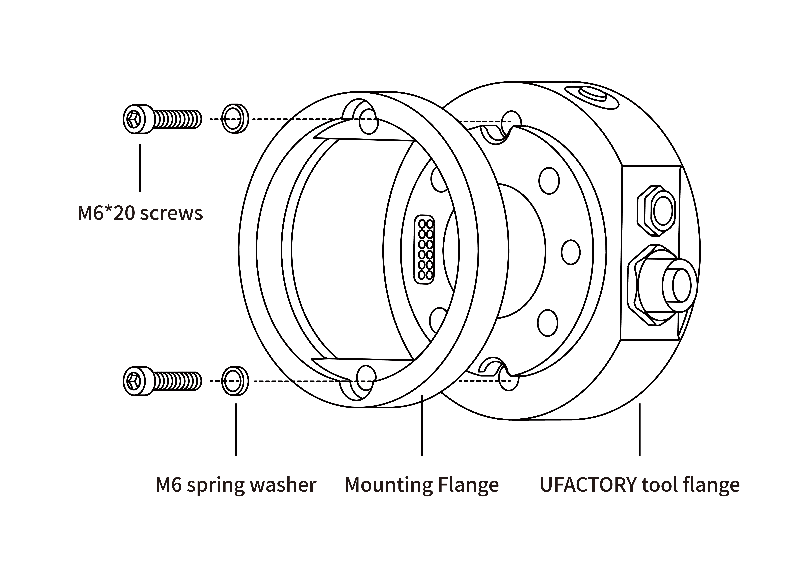
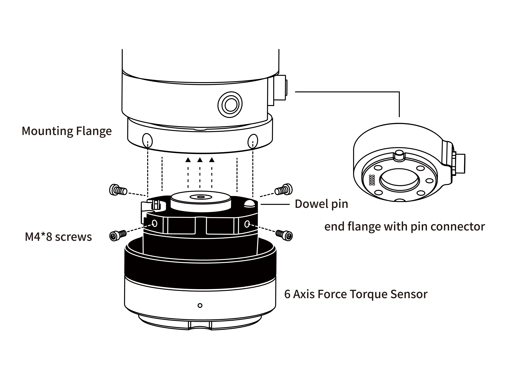
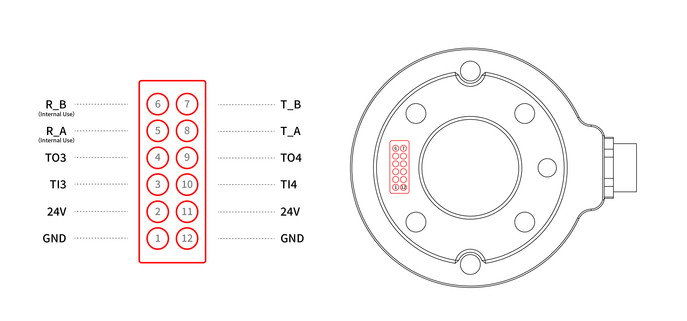

---
title: 2.Installation
---

# 2.Installation

Applicable products: xArm1305 series, UFactory 850

This article uses UFactory 850 as an example

The following subsections will guide you through the installation and general setup of 6 Axis Force Torque Sensor.

(1)The Scope of Delivery section

(2)The Mechanical Installation section

(3)Electrical settings

**Warning**

Before installing:

Read and understand the safety instructions related to the 6 Axis Force Torque Sensor.

Verify your package according to the Scope of delivery and your order info.

Have the required parts, equipment and tools listed in the requirements readily available.

Installing:

Satisfy the environmental conditions.

Do not operate the 6 Axis Force Torque Sensor, or even turn on the power supply, before it is firmly anchored and the danger zone is cleared.

## 2.1 **Scope of Delivery**

The 6 Axis Force Torque Sensor Kit generally includes these items:

1\) 6 Axis Force Torque Sensor \*1

2\) Mounting Flange \*1

3\) M3\*8 Head hexagon socket screws (6) and M3 spring washer (6)

4\) M6\*8 Head hexagon socket screws (6) and M6 spring washer (6)

5\) 2.5MM L type wrench\*1

6\) 5MM L type wrench\*1
   
## 2.2 **Mechanical Installation**

1\) Press down the E stop button on the control box.

2\) Install the Mounting Flange on the end flange using 4 M6\*8 screws (spring washer must be used together).

3\) Install the 6 Axis Force Torque Sensor on the Mounting Flange using 4 M3\*8 screws (spring washer must be used together).

4\) Press up E stop button on the control box.

## 2.3 Electrical settings

Through the end of the robotic arm 24v DC power supply and IO control, the specific pin
function please refer to the following figure

