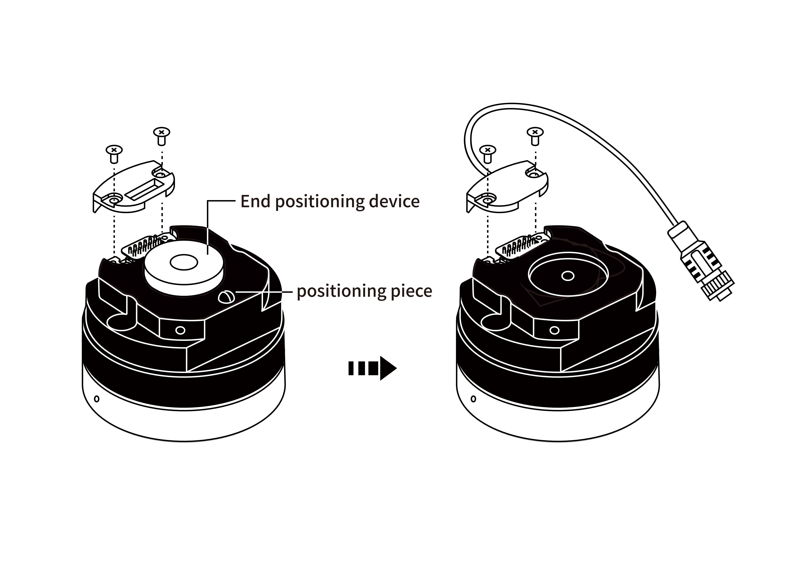
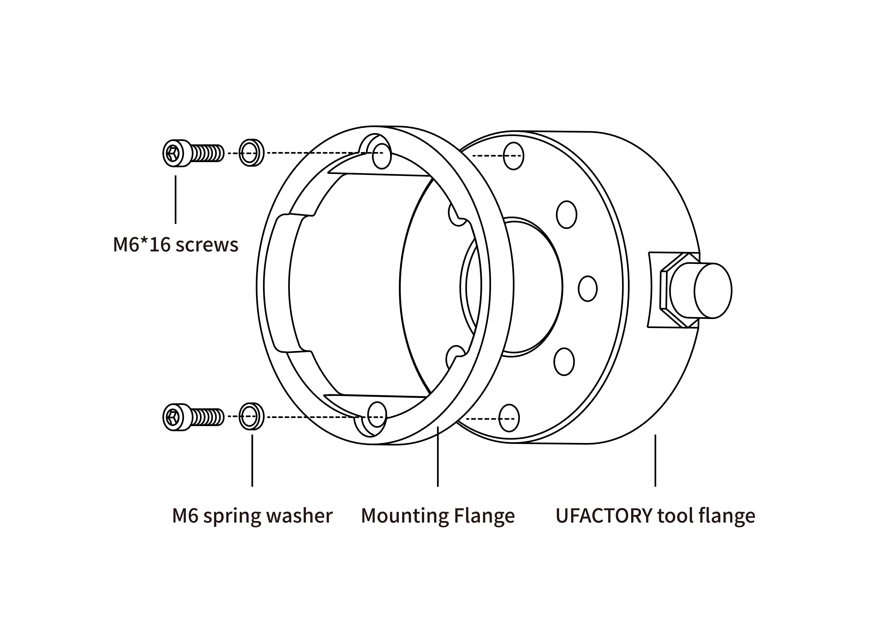
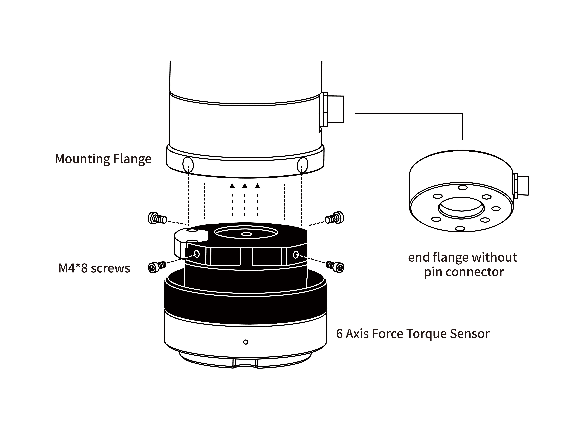
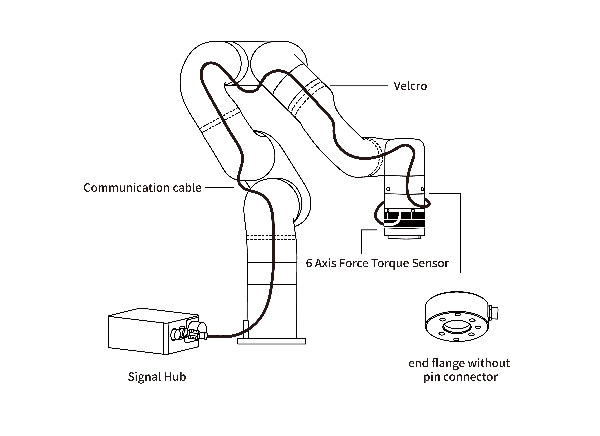
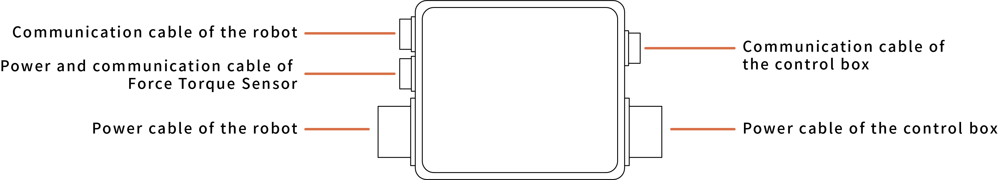

# 2.Installation

## 2.1 Delivery List

The 6 Axis Force Torque Sensor Kit generally includes these items:  
(Please refer to the packing list for the actual items shipped)
* 6 Axis Force Torque Sensor *1
* Mounting Flange *1
* 1300 Mounting Flange *1
* Ft sensor communication cable *1
* Signal Hub *1
* Power cable for the Robotic Arm *1
* Communication cable for the Robotic Arm *1
* M6\*16 Head hexagon socket screws(2pcs) & M6 spring washer(2pcs)
* M6\*20 Head hexagon socket screws(2pcs) & M6 spring washer(2pcs)
* M4\*8 Head hexagon socket screws(4pcs) & M4 spring washer(4pcs)
* Velcro(3 meters)
* 2.5MM(1pcs) & 5MM(1pcs) L type wrench
   
## 2.2 Mechanical Installation

### 2.2.1 For pin contact(pogo pins) connection(UF850,XX1305)

1. Press down the E stop button on the control box.
2. Install the Mounting Flange on the end flange using 4 M6\*20 screws(spring washer must be used together).

3. Install the 6 Axis Force Torque Sensor on the Mounting Flange using 4 M4\*8 screws(spring washer must be used together).

4. Press up E stop button on the control box.

### 2.2.2 For Plug-in connection(XX1304 or below)
1. Press down the E stop button on the control box.
2. Remove the 2 screws on the force sensor flange, take off the black cover, and replace it with the one that have a signal cable.  
Take off the positioning dowel and positioning piece.
   
3. Install the Mounting Flange on the end flange using 4 M6\*16 screws(spring washer must be used together).
   
4. Install the 6 Axis Force Torque Sensor on the Mounting Flange using 4 M4\*8 screws(spring washer must be used together).
   
5. Connect the 6 Axis Force Torque Sensor communication cable to the signal hub.
   

## 2.3 Electrical settings

### 2.3.1 Pin Contact End Flange
The 6 Axis force torque sensor operates at 24V, GND, R_A, R_B, with a power consumption of less than 2.5W.

### 2.3.2 Signal hub
For the robotic arm 1304 or below version, need to use the signal hub to build the communication.
