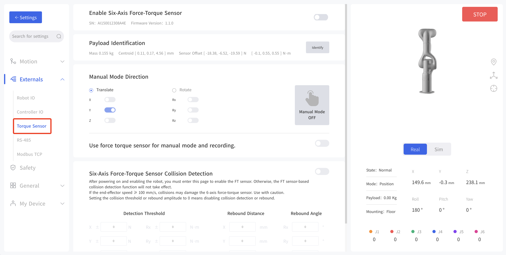
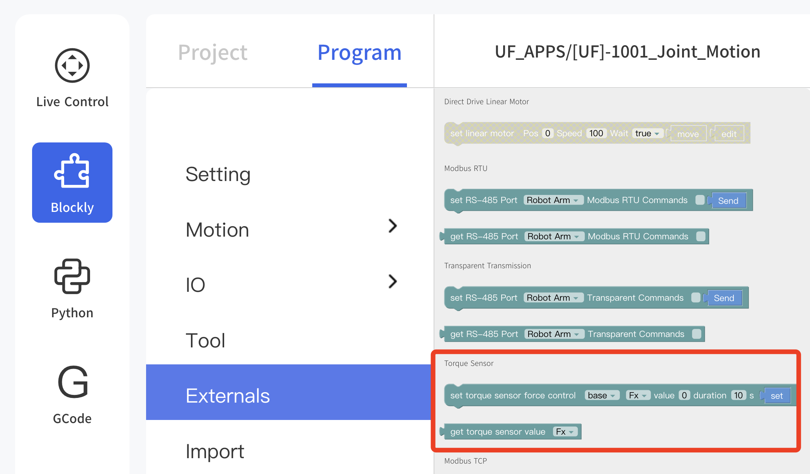
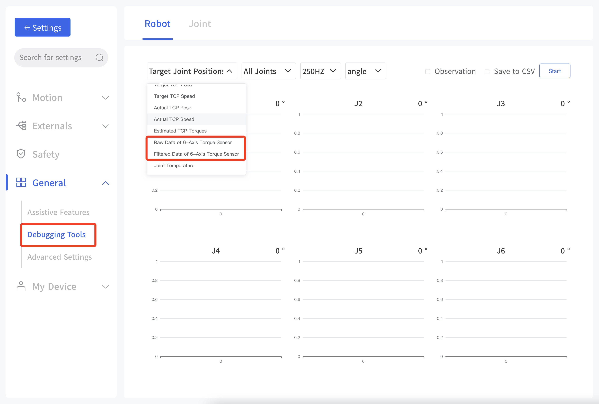


# 3.Control

## 3.1 UFACTORY Studio

### 3.1.1 Settings

* Enable Six-Axis Force-Torque Sensor: Enable, obtain and display SN and Firmware Version.
* Payload Identification: During this process, the robotic arm will perform a series of actions, it will take around 5 minutes. It will get mass, centroid and sensor offset.
* Manual Mode Direction: The direction of translation or rotation can be selected. After activation, the torque manual mode will be enabled.
* Use force torque sensor for manual mode and recording
* Six-Axis Force-Torque Sensor Collision Detection: Set Detection Threshold, Rebound Distance, Rebound Angle.

### 3.1.2 Blockly

* set torque sensor force control: Programmable parameters are as below.
  coordinate Frame: base, tool  
  direction: Fx, Fy, Fz, Tx, Ty, Tz  
  value: -105~105N(Fx,Fy,Fz); -2.8~2.8N(Tx,Ty,Tz)  
  duration: 0-9999s

* get torque sensor value: Programmable parameters are as below.
  direction: Fx, Fy, Fz, Tx, Ty, Tz  

### 3.1.3 Data Observation
  
Enter Settings - General - Debugging Tools - Robot, check  'Observation' or 'save to CSV' box, click start, and obtain data via TCP port for plotting.

* Item: Raw Dat of 6-Axis Torque Sensor, Filtered Data of 6-Axis Torque Sensor.
* Joint: All joints, single joint
* Frequency: 200HZ, 5HZ
* Unit: angle, radian

## 3.2 Python SDK
For details on controlling 6 Axis Force Torque Sensor with python-SDK, please refer to the link below:
https://github.com/xArm-Developer/xArm-Python-SDK/tree/master/example/wrapper/common

Refer to example 8000-8010.

Common Interface:
`ft_sensor_enable`: Enable or disable the force torque sensor.
`iden_ft_sensor_load_offset`: Identify the load of the force torque sensor.
`set_ft_sensor_load_offset`: Set the load identification result as the zero point of the force torque sensor.
`set_ft_sensor_mode`: Set the force control application type (0: non-force control, 1: admittance control, 2: force-position hybrid control).
`get_ft_sensor_data`: Get the compensated and filtered force torque sensor data.
`set_ft_sensor_admittance_parameters`: Set admittance control parameters (M, B, K), coordinate system and compliant axes.
`set_ft_collision_detection`: Set collision detection based on the force torque sensor
`set_ft_collision_rebound`: Set whether to rebound after a collision

## 3.3 C++ SDK
For details on controlling 6 Axis Force Torque Sensor with C++ SDK, please refer to the link below.  
https://github.com/xArm-Developer/xArm-CPLUS-SDK/blob/master/example

Refer to example 8000-8010.

