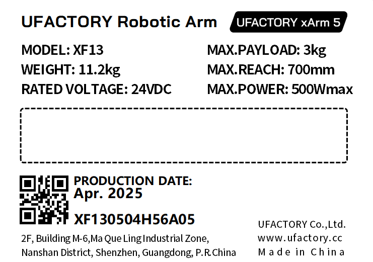
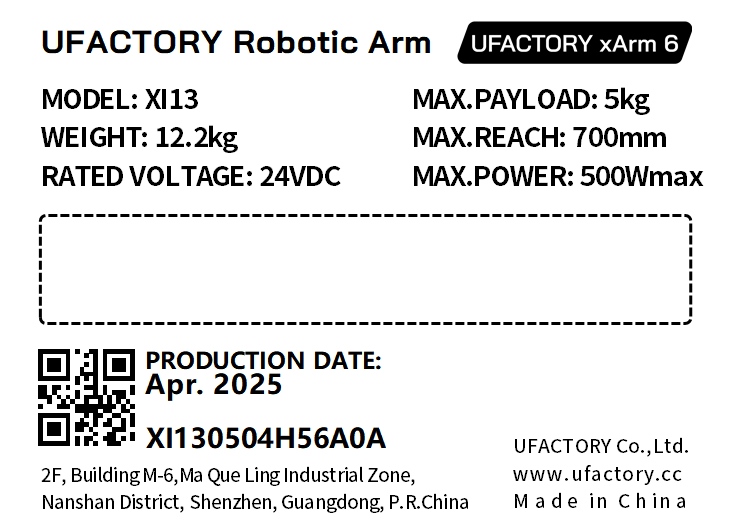
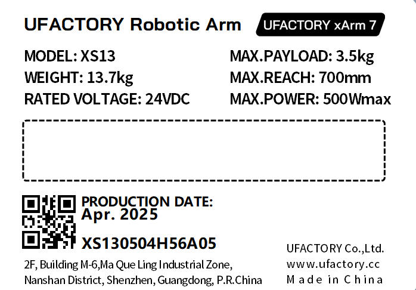
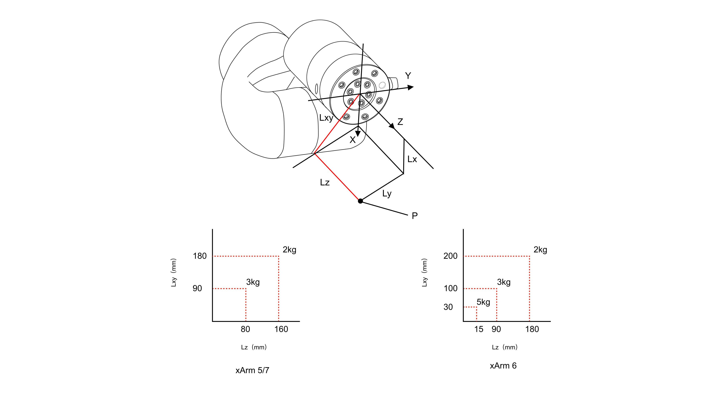

# 7. Production Information

## 7.1 Product Label
* Robotic Arm
xArm5:

xArm6:

xArm7：

* Controller

## 7.2 Applied Standards
The xArm 6 robot is certified and tested by SGS, and has passed the EU CE certification. The product meets the relevant requirements of the EU CE directive:
* MD 2006/42/EC
* EMC 2004/108/EC
* EN ISO 10218-1:2011
* EN 60204-1:2018
* EN ISO 12100:2010
* EN 61000-6-2:2005
* EN 61000-6-4:2007+A1:2011

## 7.3 EMC(Electromagnetic Compatibility)
* IEC 61000-6-2:2005
* IEC 61000-6-4/A1:2010
* EN 61000-6-2:2005 [2004/108/EC]
* EN 61000-6-4/A1:2011 [2004/108/EC]  

Electromagnetic compatibility (EMC)  
Part 6-2: Generic standards - Immunity for industrial environments. 
Part 6-4: Generic standards - Emission standard for industrial environments.  

These standards define requirements for the electrical and electromagnetic disturbances. Conforming to these standards ensures that the xArm robots perform well in industrial environments and that they do not disturb other equipment.
* EN 61000-6-4:2019
* EN 61000-6-2:2019   

Electrical equipment for measurement, control and laboratory use - EMC requirements.  
Part 3-1: Immunity requirements for safety-related systems and for equipment intended to perform safety-related functions (functional safety) - General industrial applications.  

This standard defines extended EMC immunity requirements for safety-related functions. Conforming to this standard ensures that the safety functions of xArm robots provide safety even if other equipment exceeds the EMC emission limits defined in the IEC 61000 standards.

## 7.4 Disposal and Environment
* Low humidity (25%-85% non-condensing)
* Altitude: <2000m
* Ambient temperature: 0°C ~ 50°C
* Avoid direct sunlight (indoor use)
* No corrosive gas or liquid.
* No flammable materials.
* No oil mists.
* No salt sprays.
* No dust or metal powder.
* No mechanical shock, vibration.
* No electromagnetic noise.
* No radioactive materials.

## 7.5 Transportation
* Move the robot to the zero position by UFactory studio, then put the xArm robot and Control Box in the original packaging. 
* Transport the robot in the original packaging.
* Lift both tubes of the robot arm at the same time when moving it from the packaging to the installation place. Hold the robot in place until all mounting bolts are securely tightened at the base of the robot.
* The controller box shall be lifted by the handle.
* Save the packaging material in a dry place, you may need to pack down and move the robot in the future.

## 7.6 Controller Placement Height
The controller should be placed at a height of 0.6m to 1.5m.

## 7.7 Power Supply
The power cut-off method of this product is a plug/socket connection, so when using this product, it is recommended to equip with a suitable switching device with sufficient breaking capacity (such as an air switch; insulation voltage: 400V AC; rated current: 10A)

## 7.8 Special Consumables
Fuse Specifications：15A 250V 5×20mm Time-Lag glass body cartridge fuse.

## 7.9 Stop Categories
**Stop Category 1** and **Stop Category 2** decelerates the robot with drive power on, which enables the robot to stop without deviating from its current path.

| Safety Input                             | Description     |
| ---------------------------------------- | --------------- |
| Emergency Stop Button of the Control Box | Stop Category 1 |
| Emergency Input of the Control Box(EI)   | Stop Category 1 |
| Safeguard Stop of Control Box(SI)        | Stop Category 2 |

## 7.10 Stop Time and Stop Distance
Stop Category 1 stopping distances and times.  
The table below includes the stopping distances and times measured when a Stop Category 1 is triggered. These measurements correspond to the following configuration of the robot:
* Extension: 100% (the robot arm is fully extended horizontally).
* Speed: 100% (the general speed of the robot is set to 100% and the movement is performed at a joint speed of 180 °/s).
* Payload: maximum payload handled by the robot attached to the TCP (5 kg).  

The test on the Joint 1 was carried out by performing a horizontal movement, the axis of rotation was perpendicular to the ground. 
During the tests for Joint 2 and 3 the robot followed a vertical trajectory, i.e. the axes of rotation were parallel to the ground, and the stop was performed while the robot was moving downwards.

|        | Stop Distance(rad) | Stop Time(ms) |
| ------ | ------------------ | ------------- |
| Joint1 | 0.62               | 521           |
| Joint2 | 1.12               | 885           |
| Joint3 | 0.67               | 577           |

## 7.11 Max Payload
The payload is related to the tcp offset.

## 7.12 Certification
[DSS_GZEM2403001755MDVR-1.pdf](http://www.ufactory.cc/wp-content/uploads/2025/04/DSS_GZEM2403001755MDVR-1.pdf)
[DSS_MD-GZES2403005468MD-1.pdf](http://www.ufactory.cc/wp-content/uploads/2025/04/DSS_MD-GZES2403005468MD-1.pdf)
[DTIBW20220028-RoHS-CE.pdf](http://www.ufactory.cc/wp-content/uploads/2025/04/DTIBW20220028-RoHS证书-CE.pdf)

## 7.13 DH Parameters
[DH Parameters](https://docs.supportarticle.ufactory.cc/support_articles/developer/kinematic-and-dynamic-parameters/ufactory-850.html)
The 1305 model of xArm series is model 4.

