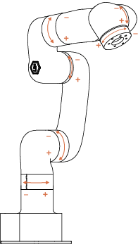

# 8. Technical Specifications

| Lite6                               |                                                              |
| ----------------------------------- | ------------------------------------------------------------ |
| Robot Type                          | Lite6                                                        |
| Cartesian Range                     | X: ±440mm; Y: ±440mm; Z: -165~683.5mm; Roll/Pitch/Yaw: ±180° |
| Weight(robotic only)                | 8KG                                                          |
| Maximum Joint Speed                 | 180°/s                                                       |
| Maximum Speed of End-Effector       | 500mm/s                                                      |
| Repeatability                       | ±0.5mm                                                       |
| Ambient Temperature Range           | 0-50℃                                                        |
| Power Consumption                   | Typical 150W, 300W Power is recommended.                     |
| Input Power Supply                  | 24V DC, 14.66A                                               |
| ISO Class Cleanroom                 | 5                                                            |
| Mounting Way                        | Any Direction                                                |
| Materials                           | Aluminium, Carbon Fiber                                      |
| Footprint                           | 130×140 mm                                                   |
| End Flange                          | DIN ISO 9409-1-A50/63（M5*6）                                  |
| Robotic Arm Communication Protocol  | Private TCP(custom)                                          |
| End Effector Communication Protocol | Modbus RTU                                                   |
| Programming                         | UFACTORY Studio, Python/C++/ROS                              |
| Joint Rotation Direction            |                                                              |
