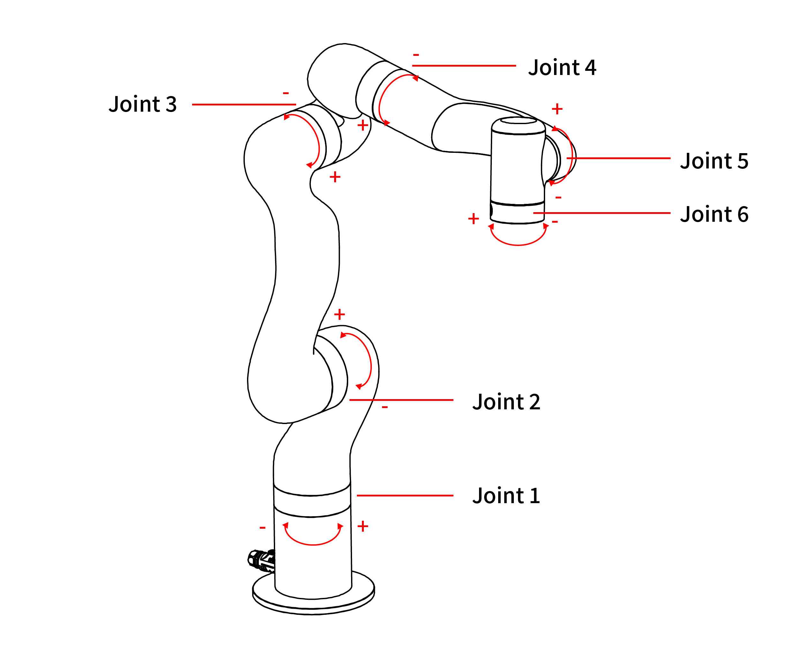

# 8. Technical Specifications

| UFACTORY 850                        |                                                             |
| ----------------------------------- | ----------------------------------------------------------- |
| Robot Type                          | UFACTORY 850                                                |
| Robot Weight                        | 20KG(body only)                                             |
| Maximum Payload                     | 5kg                                                         |
| Cartesian Range                     | X: ±850mm, Y: ±850mm, Z: -400~1214mm, Roll/Pitch/Yaw: ±180° |
| Joint Range                         | J1~J6 (±360°, ±132°, -242~3.5°, ±360°, ±124°, ±360°)        |
| Maximum Speed of End-Effector       | 1m/s                                                        |
| Maximum Joint Speed                 | 180°/s                                                      |
| Repeatability                       | ±0.02mm                                                     |
| Ambient Temperature Range           | 0-50℃                                                       |
| Power Consumption                   | Typical 240W,  Max 1000W, 500W Power is recommended.        |
| Input Power Supply                  | 48V DC, 20.8A                                               |
| ISO Class Cleanroom                 | 5                                                           |
| Mounting Way                        | Any Direction                                               |
| Materials                           | Aluminium, Carbon Fiber                                     |
| Footprint                           | Ø 190mm                                                     |
| End Flange                          | DIN ISO 9409-1-50-4-M6（M6*6）                                |
| Robotic Arm Communication Protocol  | Private TCP(custom)                                         |
| End Effector Communication Protocol | Modbus TCP                                                  |
| Programming                         | UFACTORY Studio, Python/C++/ROS                             |
| Joint Rotating Direction            |                                                             |

|                        | AC Controller                                                                                                  | DC Controller                                                                                                |
| ---------------------- | -------------------------------------------------------------------------------------------------------------- | ------------------------------------------------------------------------------------------------------------ |
| Input                  | 100-240V AC 50/60 Hz                                                                                           | 48-72V DC                                                                                                    |
| Output                 | 48V DC  1000Wmax                                                                                               | 48V DC   960Wmax                                                                                             |
| Communication Protocol | Private TCP(custom)                                                                                            | Private TCP(custom)                                                                                          |
| Communication Method   | Ethernet                                                                                                       | Ethernet                                                                                                     |
| I/O Interface          | 8×CI+8×DI(Digital In)     8×CO+8×DO(Digital Out)  2×AI(Analog In)   2×AO(Analog Out) 1×RS-485 Master  | 8×CI+8×DI(Digital In)   8×CO+8×DO(Digital Out)  2×AI(Analog In)   2×AO(Analog Out) 1×RS-485 Master  |
| Weight                 | 4.8kg                                                                                                          | 2.8kg                                                                                                        |
| Dimension(L×W×H)       | 345×135×101mm                                                                                                  | 262×160×76mm                                                                                                 |

| Gripper                                     |            |                                  |                 |
| ------------------------------------------- | ---------- | -------------------------------- | --------------- |
| Nominal Supply Voltage                      | 24V DC     | Absolute Maximum Supply Voltage  | 28V DC          |
| Quiescent Power (Minimum Power Consumption) | 1.5W       | Peak Current                     | 1.5A            |
| Working Range                               | 84mm       | Maximum Clamping Force           | 30N             |
| Weight                                      | 802g       | Communication Mode               | RS-485          |
| Communication Protocol                      | Modbus TCP | Programmable Gripping Parameters | Position, Speed |
| Feedback                                    | Position   |                                  |                 |

| Vacuum Gripper(AS1200)        |                             |                                 |                            |
| --------------------- | --------------------------- | ------------------------------- | -------------------------- |
| Rated Supply Voltage  | 24V DC                      | Absolute Maximum Supply Voltage | 28V DC                     |
| Vacuum                | -55kPa                      | Vacuum Flow (L/min)             | ＞4L/min                    |
| Weight                | 610g                        | Dimensions (L×W×H)              | 122.5×91.6×75 mm           |
| Payload               | ≤5kg                        | Noise Level(30cm away)          | ＜60dB                      |
| Quiescent Current(mA) | 20mA                        | Peak Current(mA)                | 500mA                      |
| Communication Mode    | Digital IO                  | State Indicator                 | Power State, Working State |
| Feedback              | Air Pressure(Low or Normal) |                                 |                            |
