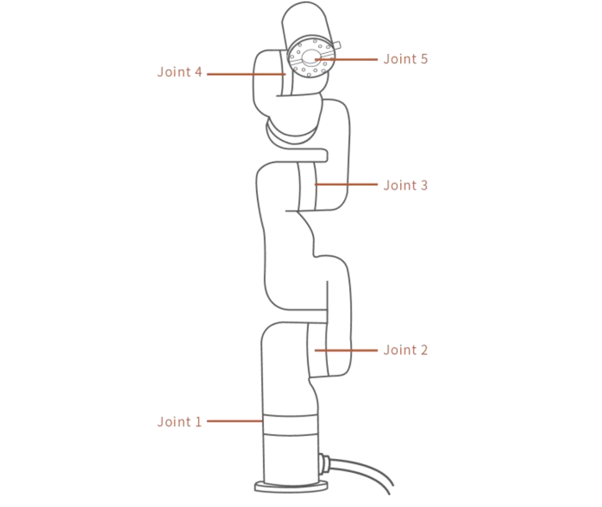
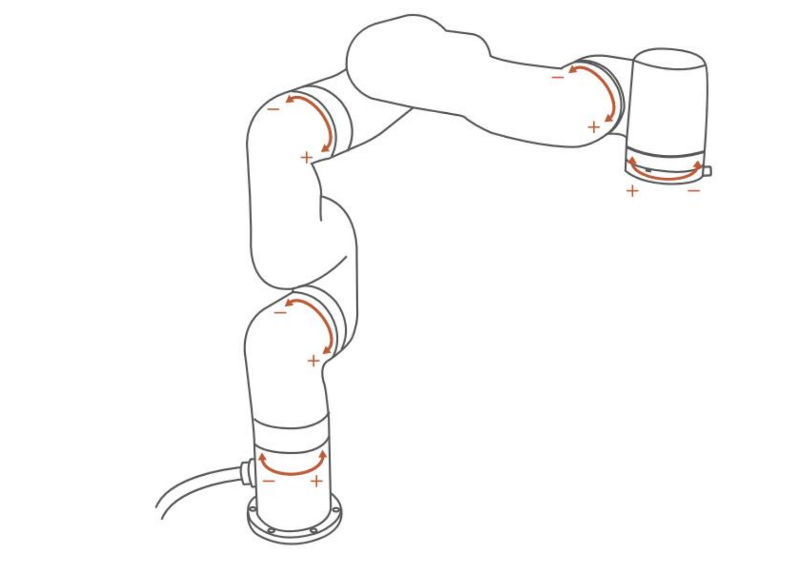
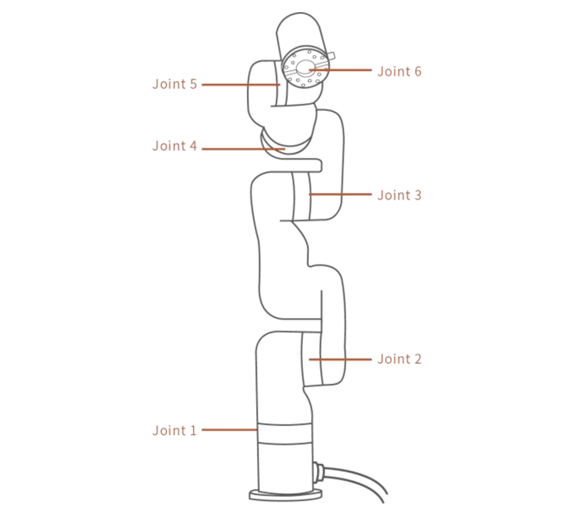
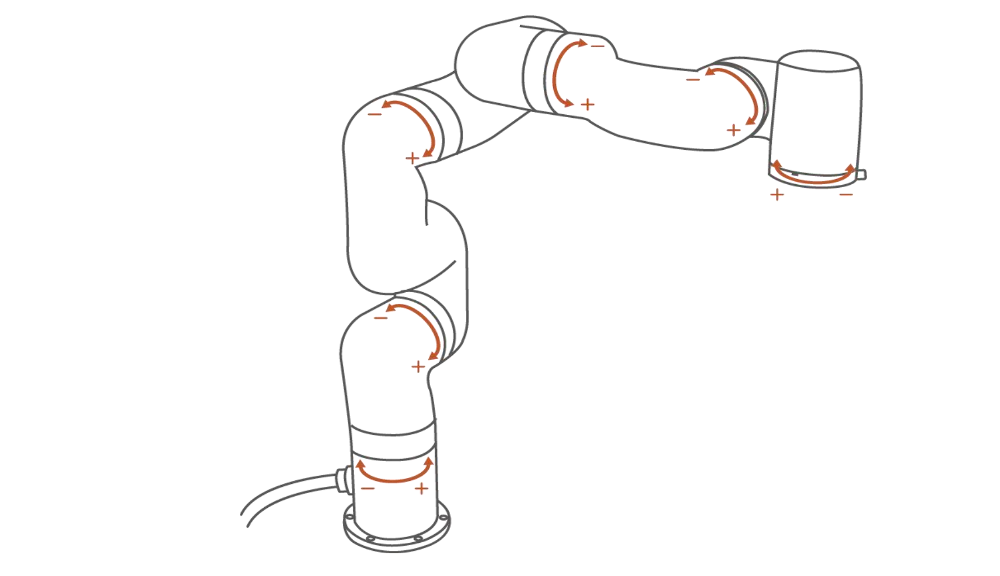
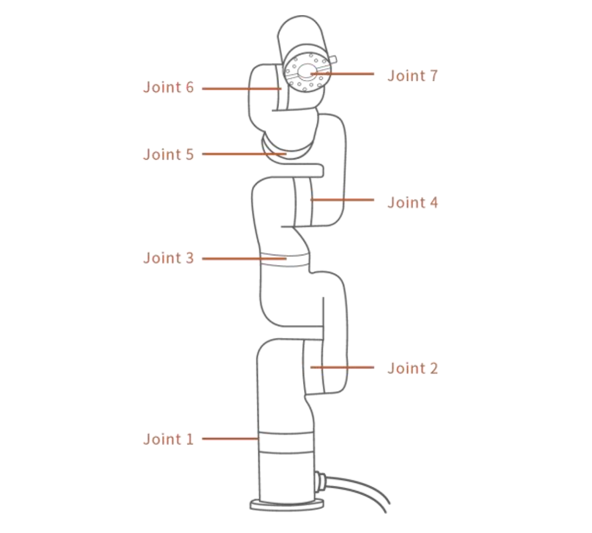
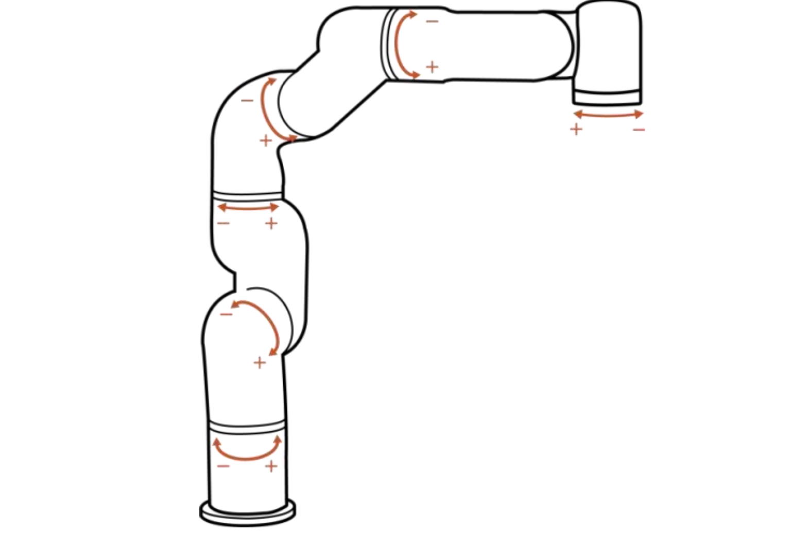

# 8. Technical Specifications

## 8.1 xArm5/xArm6/xArm7 Common Specifications
| xArm Series                         |                                                              |
| ----------------------------------- | ------------------------------------------------------------ |
| Robot Type                          | xArm                                                         |
| Cartesian Range                     | X: ±700mm; Y: ±700mm; Z: -400~951.5mm; Roll/Pitch/Yaw: ±180° |
| Maximum Joint Speed                 | 180°/s                                                       |
| Maximum Speed of End-Effector       | 1m/s                                                         |
| Repeatability                       | ±0.1mm                                                       |
| Ambient Temperature Range           | 0-50℃                                                        |
| Power Consumption                   | Min 8.4W, Typical 200W, 500W Power is recommended.           |
| Input Power Supply                  | 24V DC, 20.8A                                                |
| Mounting Way                        | Any Direction                                                |
| Materials                           | Aluminium, Carbon Fiber                                      |
| Footprint                           | Ø 126 mm                                                     |
| End Flange                          | DIN ISO 9409-1-A50/63（M5*6）                                  |
| Robotic Arm Communication Protocol  | Private TCP(custom)                                          |
| End Effector Communication Protocol | Modbus TCP                                                   |
| Programming                         | UFACTORY Studio, Python/C++/ROS                              |

|                        | AC Controller(1310)                                                                                                  | DC Controller(1310)                                                                                                 |
| ---------------------- | -------------------------------------------------------------------------------------------------------------- | ------------------------------------------------------------------------------------------------------------- |
| Input                  | 100-240V AC 47/63 Hz                                                                                           | 24-72V DC                                                                                                     |
| Output                 | 24V DC , 20.8A                                                                                                 | 24V DC   672Wmax                                                                                              |
| Communication Protocol | Private TCP(custom)                                                                                            | Private TCP(custom)                                                                                           |
| Communication Method   | Ethernet                                                                                                       | Ethernet                                                                                                      |
| I/O Interface          | 8×CI+8×DI(Digital In)     8×CO+8×DO(Digital Out)  2×AI(Analog In)   2×AO(Analog Out) 1×RS-485 Master 1×RS-485 Slaver  | 8×CI+8×DI(Digital In)   8×CO+8×DO(Digital Out)  2×AI(Analog In)   2×AO(Analog Out) 1×RS-485 Master 1×RS-485 Slaver  |
| Weight                 | 3.4kg                                                                                                          | 2.5kg                                                                                                         |
| Dimension(L×W×H)       | 269×178×86mm                                                                                                  | 209×176×82mm                                                                                                  |

| Gripper G2(AG1200)                                    |            |                                  |                 |
| ------------------------------------------- | ---------- | -------------------------------- | --------------- |
| Nominal Supply Voltage                      | 24V DC     | Absolute Maximum Supply Voltage  | 28V DC          |
| Quiescent Power (Minimum Power Consumption) | 1W       | Payload                     | 5kg            |
| Weight                              | 800g       | Clamping Force           | 10-50N             |
| Working Range                                      |  84±1mm      | Speed               | 15-225mm/s          |
| Finger Type                               | Replaceable       | Cycle Life           | >2,000,000 cycles             |
| Communication Method                      | RS485 | Communication Protocol | Modbus RTU |
| Programmable Gripping Parameters                      | Position, Speed, Force | Feedback | Position |
| Protection Rating                                    | IP40   |    Operating Temperature                              |       50℃          |

| Vacuum Gripper(AS1200)        |                             |                                 |                            |
| --------------------- | --------------------------- | ------------------------------- | -------------------------- |
| Rated Supply Voltage  | 24V DC                      | Absolute Maximum Supply Voltage | 28V DC                     |
| Vacuum                | -55kPa                      | Vacuum Flow (L/min)             | ＞4L/min                    |
| Weight                | 610g                        | Dimensions (L×W×H)              | 122.5×91.6×75 mm           |
| Payload               | ≤5kg                        | Noise Level(30cm away)          | ＜60dB                      |
| Quiescent Current(mA) | 20mA                        | Peak Current(mA)                | 500mA                      |
| Communication Mode    | Digital IO                  | State Indicator                 | Power State, Working State |
| Feedback              | Air Pressure(Low or Normal) |                                 |                            |

## 8.2 xArm5 Specifications

| xArm5                     |                                                     |
| ------------------------- | --------------------------------------------------- |
| Joint Range               | J1~J5 (±360°, -117~116°, -219~10°, -97~180°, ±360°) |
| Max Payload               | 3kg                                                 |
| Degress of Freedom        | 5                                                   |
| Wight(robotic arm only)   | 11.3kg                                              |
|  |                            |

## 8.3 xArm6 Specifications

| xArm6                     |                                                            |
| ------------------------- | ---------------------------------------------------------- |
| Joint Range               | J1~J6 (±360°, -117~116°, -219~10°, ±360°, -97~180°, ±360°) |
| Max Payload               | 5kg                                                        |
| Degress of Freedom        | 6                                                          |
| Wight(robotic arm only)   | 12.5kg                                                     |
|  |                                  |

## 8.4 xArm7 Specifications

| xArm7                     |                                                                  |
| ------------------------- | ---------------------------------------------------------------- |
| Joint Range               | J1~J7 (±360°, -117~116°, ±360°, -6~225°, ±360°, -97~180°, ±360°) |
| Max Payload               | 3.5kg                                                            |
| Degress of Freedom        | 7                                                                |
| Wight(robotic arm only)   | 14.3kg                                                           |
|  |              |
