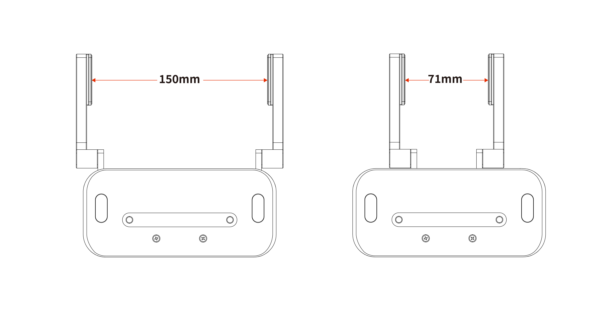
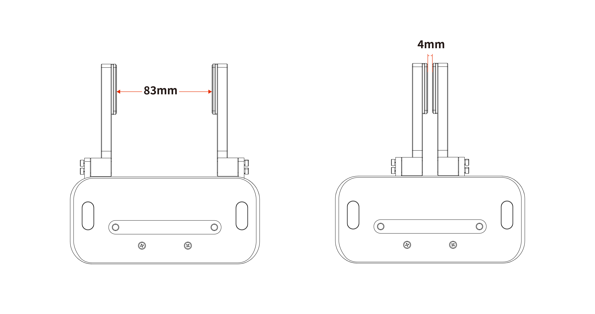

# 1.Introduction

The BIO  Gripper G2 is a parallel gripper designed for the handling of liquid plates, characterized by quick installation and simple application. The fingers provide excellent gripping power and flexibility.  

The fingers of the BIO Gripper G2 can be freely customized for handling different shapes of tubes and plates.

## 1.1 Work range
BIO Gripper G2 default range: 71-150mm.

  

BIO Gripper G2 finger reverse range: 4-83mm

## 1.2 Setup and Control  

The BIO  Gripper G2 is powered and controlled directly via a cable for 24V DC power supply and RS-485 based Modbus RTU communication.
## 1.3 Safety

**Waring**  

* The operator must have read and understood all instructions in the manual before using the BIO Gripper.
* The Gripper needs to be properly secured before operating the robot.
* Do not install or operate a Gripper that is damaged or lacking parts.
* Never supply the Gripper with an alternative current (AC) source.
* Make sure all cord sets are always secured at both ends,Gripper end & Robot end
* Always satisfy the recommended keying for electrical connections.
* Be sure no one is in the robot and/or gripper path before initializing the robot's routine.
* Always satisfy the gripper payload.
* Set the gripper speed accordingly, based on your application.
* Keep fingers and clothes away from the gripper while the power is on.
* Do not use the gripper on people or animals.
* Gripper are not suitable for applying force to objects or surfaces.

**Note** 

The term "operator" refers to anyone responsible for any of the following operations on the BIO Gripper:
 
* Installation
* Control
* Maintenance
* Inspection
* Calibration
* Programming
* Decommissioning

This document describes the general operation of the BIO Mechanical Gripper G2  its life cycle, from installation to operation to use.  
The graphics and photographs in this document are representative examples and there may be differences between them and the delivered product.

The BIO Gripper G2 is meant to be used on an industrial robot. The robot, gripper and any other equipment used in the final application must be evaluated with a risk assessment. The robot integrator must ensure that all local safety measures and regulations are respected. Depending on the application, there may be risks that need additional protection/safety measures, for example, the work-piece the gripper is manipulating may be inherently dangerous to the operator.

**Info**

Always comply with local and/or national laws, regulations and directives on automation safety and general machine safety

The unit may be used only within the range of its technical data. Any other use of the product is deemed improper and unintended use.

UFACTORY will not be liable for any damages resulting from any improper or unintended use.
