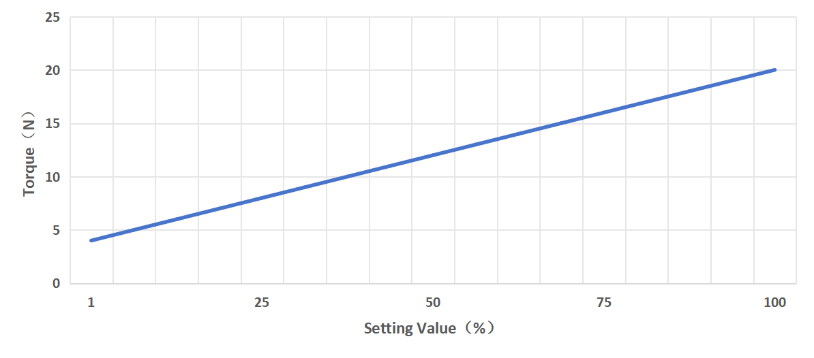

# 3. Control


The BIO Gripper G2 offers two control modes. After switching modes, the gripper needs to be re-enabled.

**Mode 0:** Open-close mode. (Default mode for BIO  Gripper G2)  
**Mode 1:** Position mode. It supports position, force, and speed control.
* Position: 71-150
* Speed: 0-4000
* Force: 1-100 (percentage),  The force setting value is expressed as a percentage, so refer to the following chart for the corresponding actual force.




## 3.1 UFactory Studio Control 

**Set up BIO Gripper G2**

Enter Settings-Motion-TCP. Select the end effector: xArm BIO G2 Gripper


### 3.1.1 Live Control 
   
Enter the live control interface and select BIO Gripper G2 for enable, speed, force and position control.

Click the upper right button to turn off the position and force control (switching mode).


### 3.1.2 Blockly  Control 

Blockly provides 3 blocks to control the BIO  Gripper G2:

* Initialize the BIO gripper G2. 
* Setting up the BIO Gripper G2, parameters: position, speed, force, wait or not.
* Detect that BIO Gripper G2 has clamped an object, parameter: timeout time.


* Control the BIO Gripper G2 through Blockly programming.
[blockly example](https://www.ufactory.cc/wp-content/uploads/2025/03/blockly-Bio_Gripper_G2.tar.gz.zip)


### 3.1.3 Modbus RTU Control

Enter to Set-Externals -Modbus RTU page and send the corresponding Modbus RTU commands for control.

For Modbus communication protocol, please refer to [Modbus-RTU Communication Protocol  Control ](4.modbus_rtu_control.md)


### 3.1.4  Private TCP  Control

Enter to Set-Externals -Modbus TCP,select the "UFACTORY Private TCP",Send the appropriate private TCP commands for control

For Modbus communication protocol, please refer to [UFACTORY Private TCP protocol control
](8.appendiex.md)


## 3.2  Python-SDK  Control 

### 3.2.1 Mode 0:Open-Close Mode(default)

Common interfaces are listed below:  

`set_bio_gripper_enable` ：Enable BIO  Gripper G2 

`set_bio_gripper_speed` ：Set BIO Gripper G2 Speed

`open_bio_gripper` ：Open BIO Gripper  G2

`close_bio_gripper` ：Close BIO Gripper G2

For details on controlling Gripper with Python-SDK, please refer to the link below:

[Python-SDK Example](https://github.com/xArm-Developer/xArm-Python-SDK/blob/master/example/wrapper/common/5009-set_bio_gripper.py)

### 3.2.2 Mode 1:Position Mode

Common interfaces are listed below:   
`set_bio_gripper_enable` ：Enable BIO Gripper G2

`set_bio_gripper_control_mode(mode=1)` ：Switch to  Position Mode

`set_bio_gripper_position` ：Controls the position, force and speed of the BIO Gripper G2

**Python  Example:**
```python
import os
import sys
import time
sys.path.append(os.path.join(os.path.dirname(__file__), '../../..'))

from xarm.wrapper import XArmAPI

arm = XArmAPI('192.168.1.204')
arm.motion_enable(True)
arm.clean_error()
arm.set_mode(0)
arm.set_state(0)
time.sleep(1)

code = arm.set_bio_gripper_control_mode(mode=1)
print('set_bio_gripper_mode,code={}'.format(code))

code = arm.set_bio_gripper_enable(True)
print('set_bio_gipper_enable,code={}'.format(code))

while True:
    code = arm.set_bio_gripper_position(150, speed=3000, force=50)
    print('set_bio_gripper_position,code={}'.format(code))
    time.sleep(0.2)
    code = arm.set_bio_gripper_position(71, speed=3000, force=100)
    print('set_bio_gripper_position,code={}'.format(code))
    time.sleep(0.2)
```


