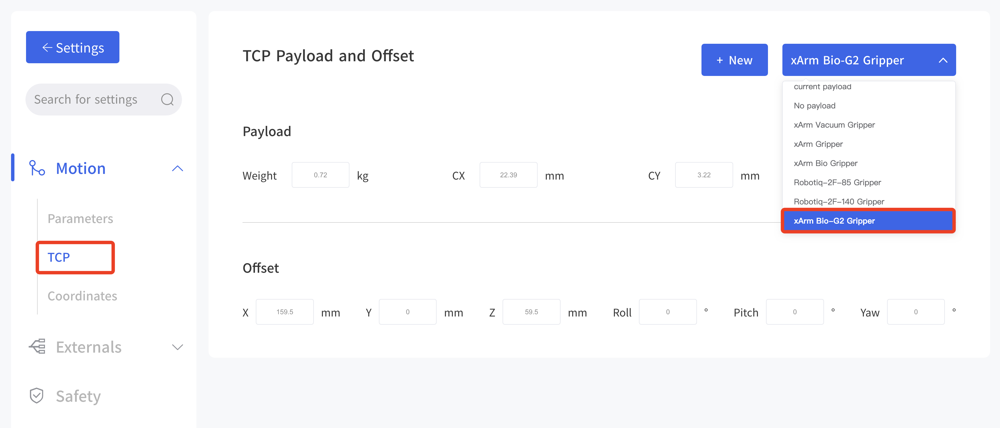
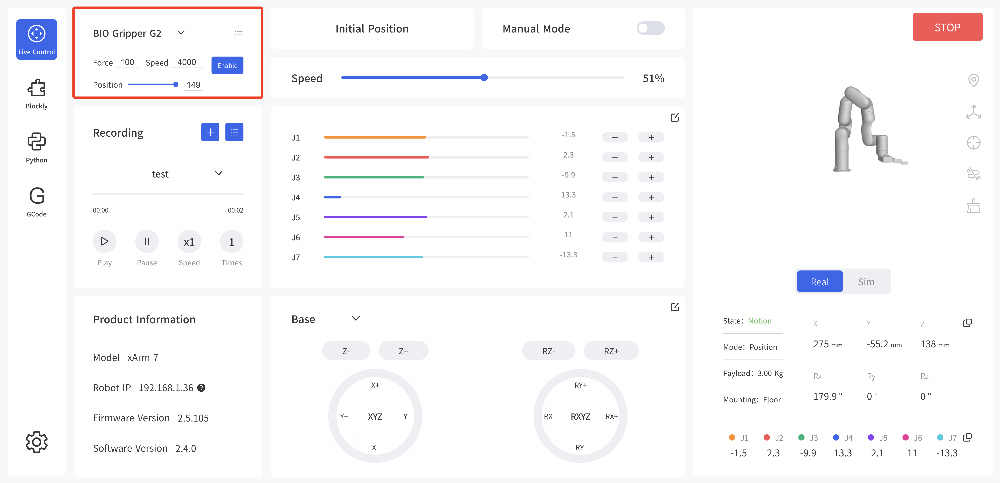
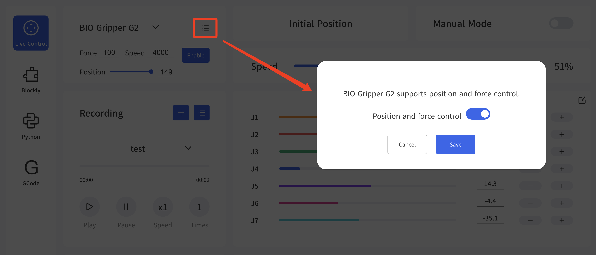
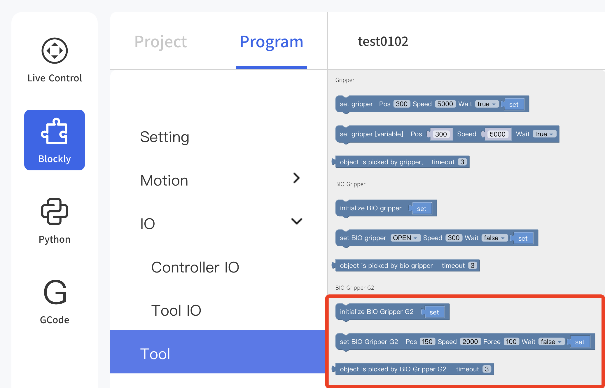
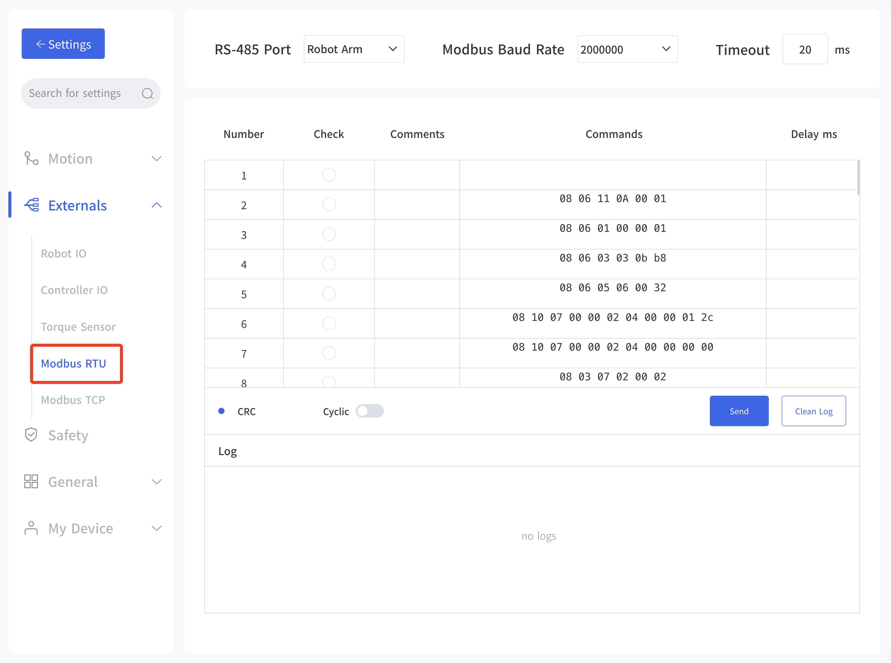
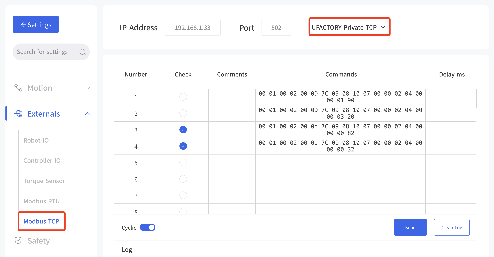
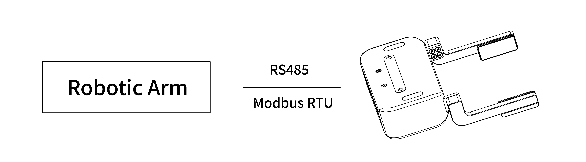

# 3. Control


The BIO Gripper G2 offers two control modes. After switching modes, the gripper needs to be re-enabled.

**Mode 0:** Opening and closing mode. (Default mode for BIO  Gripper G2)  
**Mode 1:** Position mode. It supports position, force, and speed control.
* Position: 71-150
* Velocity: 0-4500
* Force: 0-100 (percentage)


## 3.1 Use xArm Studio To Control 

1. **Set up BIO Gripper G2**
   - Enter Settings-Motion-TCP
   - Select the end effector: xArm BIO G2 Gripper




### 3.1.1 Use live Control Interface To Control
   
Enter the live control interface and select BIO Gripper G2 for enable, speed, force and position control.  
Click the upper right button to turn off the position and force control (switching mode).






### 3.1.2 Use  Blockly To Control 

Blockly provides 3 blocks to control the BIO  Gripper G2:

* Initialize the BIO gripper G2. 
* Setting up the BIO Gripper G2, parameters: position, speed, force, wait or not.
* Detect that BIO Gripper G2 has clamped an object, parameter: timeout time.



* Control the BIO Gripper G2 through Blockly programming.
[blockly example](https://drive.google.com/file/d/10xdPUxzaUGVj24iXkveFBxIOV2s3ryDV/view?usp=drive_link)


### 3.1.3 Use Modbus RTU Interface To Control

Enter to Set-Externals -Modbus RTU page and send the corresponding Modbus RTU commands for control.

For Modbus communication protocol, please refer to [3.3.1 Register Address Description](#331register-address-description)




### 3.1.4 Use Modbus TCP Interface To Control

Enter to Set-Externals -Modbus TCP,select the "UFACTORY Private TCP",Send the appropriate private TCP commands for control

For Modbus communication protocol, please refer to [3.3.1 Register Address Description](#331register-address-description)




## 3.2 Use Python-SDK To Control 

### 3.2.1 Mode 0 (default)

Common interfaces are listed below:  

`set_bio_gripper_enable` ：Enable BIO  Gripper G2 

`set_bio_gripper_speed` ：Set BIO Gripper G2 Speed

`open_bio_gripper` ：Open BIO Gripper  G2

`close_bio_gripper` ：Close BIO Gripper G2

For details on controlling Gripper with Python-SDK, please refer to the link below:

[Python-SDK Example](https://github.com/xArm-Developer/xArm-Python-SDK/blob/master/example/wrapper/common/5009-set_bio_gripper.py)

### 3.2.2 Mode 1

Common interfaces are listed below:   
`set_bio_gripper_enable` ：Enable BIO Gripper G2

`set_bio_gripper_control_mode(mode=1)` ：Switch to  Position Mode

`set_bio_gripper_position` ：Controls the position, force and speed of the BIO Gripper G2

**Python  Example:**
```python
import os
import sys
import time
sys.path.append(os.path.join(os.path.dirname(__file__), '../../..'))

from xarm.wrapper import XArmAPI

arm = XArmAPI('192.168.1.204')
arm.motion_enable(True)
arm.clean_error()
arm.set_mode(0)
arm.set_state(0)
time.sleep(1)

code = arm.set_bio_gripper_control_mode(mode=1)
print('set_bio_gripper_mode,code={}'.format(code))

code = arm.set_bio_gripper_enable(True)
print('set_bio_gipper_enable,code={}'.format(code))

while True:
    code = arm.set_bio_gripper_position(150, speed=3000, force=50)
    print('set_bio_gripper_position,code={}'.format(code))
    time.sleep(0.2)
    code = arm.set_bio_gripper_position(71, speed=3000, force=100)
    print('set_bio_gripper_position,code={}'.format(code))
    time.sleep(0.2)
```


## 3.3 Use Modbus-RTU Communication Protocol To Control 

### 3.3.1Register Address Description



The gripper defaults to the standard Modbus RTU protocol at a default baud rate is 2Mbps and the slave ID is 0x08. The currently supported function codes are: 0x03 / 0x10. In this article, data analysis is big-endian analysis.


* 0x03: Read registers
* 0x06: Write Single Register
* 0x10: Write multiple registers 


Read：

| Address | description           |
|---------|-----------------------|
| 0x0000  | motion state          |
| 0x0001  | speed（r/min）          |
| 0x0002  | percentage of current |
| 0x0003  | current               |
| 0x0004  | command position      |
| 0x0006  | motor position        |
| 0x0008  | position error        |
| 0x000F  | current alarm code    |


Write：


| Address | Description                   | Range                                                                              | Unit  | Factory Setting |
|---------|-------------------------------|------------------------------------------------------------------------------------|-------|-----------------|
| 0x0100  | Enable                        | 0-1；                                                                               |       | 0               |
| 0x010A  | Mode                          | 0-2；</br>0：opening and closing modes</br>1：position mode。                          |       | 0               |
| 0x0303  | Speed                         | 0-4500                                                                             | r/min | 1000            |
| 0x0505  | Clip Detection Threshold      | 30-100                                                                             | 0.01A | 50              |
| 0x0506  | Holding Current Limit (force) | 10-100                                                                             | 0.01A | 50              |
| 0x0508  | Drop Detection Threshold      | 500-2000                                                                           | r/min | 1000            |
| 0x0601  | Baud Rate                     | 0: 4800 </br>1: 9600 </br>2: 19200</br>8: 921600</br>9: 1M</br>10: 1.5M</br>11: 2M | bps   | 11              |
| 0x0700  | Position Command High         | 0-0xFFFF                                                                           | -     | 0               |
| 0x0701  | Position Command low          | 0-0xFFFF                                                                           | -     | 0               |
| 0x0702  | Position Feedback High        | 0-0xFFFF                                                                           | -     | read-only       |
| 0x0703  | Position Feedback Low         | 0-0xFFFF                                                                           | -     | read-only       |


motion state（0x0000）

| bit1:0 | 00：stop state                       | bit3:2 | 00：not enable   |
|--------|-------------------------------------|--------|-----------------|
|        | 01： motion state                    |        | 10：enable state |
|        | 10：clamping state                   |        |                 |
|        | 11: there's an error in the gripper |        |                 |


### 3.3.2 Read BIO Gripper Register

**Register Function**

|  |      **Read Register**                     |                 |           |
| ----------------- | ------------------------- |-----------------| --------- |
| **Request**       |                           |                 |           |
| Modbus RTU Data   | Slave ID (Gripper)        | 1 Byte          | 0x08      |
|                   | Function Code             | 1 Byte          | 0x03      |
|                   | Register Starting Address | 2 Bytes         | **Address** |
|                   | Quantity of Register      | 2 Bytes         | **N\***   |
|                   | Modbus CRC16              | 2 Bytes         | **CRC\*** |
| **Response**      |                           |                 |           |
| Modbus RTU Data   | Slave ID                  | 1 Byte          | 0x08      |
|                   | Function Code             | 1 Byte          | 0x03      |
|                   | Byte Count                | 1 Byte          | **N\*x2** |
|                   | Registers Value           | **N\*x2** Bytes | **Value** |
|                   | Modbus CRC16              | 2 Bytes         | **CRC\*** |

N* = Quantity of Registers	

Address = Register Starting Address

CRC* = Cyclic Redundancy Check 

**Resgister**

|                             | **Resgister Starting Address** | **Register Value** |                                                                                                                                                                                                               |
| --------------------------- | ------------------------------ | ------------------ |---------------------------------------------------------------------------------------------------------------------------------------------------------------------------------------------------------------|
| Get Gripper status Register | 0x0000                         | 2 Bytes            | **Disabled:** 0x0000 </br> **Enabling:** 0x0004 </br>**Enabling completed:** 0x0008</br>**Stop status**: 0x0008 </br> **Motion status:** 0x0009</br>**Clipping status:** 0x000A </br>**Error status:** 0x000B |
| Get Gripper Error Register  | 0x000F                         | 2 Bytes            | **An error occurs:** all other return values indicate an error(except 0)</br>**No error occurred:** 0x0000                                                                                                    |

### 3.3.3 Write BIO Gripper Register

**Register Function**

|  |          **Write Register**                 |                 |           |
| ------------------ | ------------------------- |-----------------|-----------|
| **Request**        |                           |                 |           |
| Modbus RTU Data    | Slave ID (Gripper)        | 1 Byte          | 0x08      |
|                    | Function Code             | 1 Byte          | 0x10      |
|                    | Register Starting Address | 2 Bytes         | **Address** |
|                    | Quantity of Register      | 2 Bytes         | **N\***   |
|                    | Byte Count                | 1 Byte          | **N\*x2** |
|                    | Registers Value           | **N\*x2** Bytes | **Value** |
|                    | Modbus CRC16              | 2 Bytes         | **CRC\*** |
| **Response**       |                           |                 |           |
| Modbus RTU Data    | Slave ID                  | 1 Byte          | 0x08      |
|                    | Function Code             | 1 Byte          | 0x10      |
|                    | Register Starting Address | 2 Bytes         | **Address** |
|                    | Quantity of Registers     | 2 Bytes         | **N\***   |
|                    | Modbus CRC16              | 2 Bytes         | **CRC\*** |

N* = Quantity of Registers

Address = Register Starting Address

CRC* = Cyclic Redundancy Check 


**Resgister:**


|                                 | **Resgister Starting Address** | **Register Value** |                                                                                    |
|---------------------------------| ------------------------------ | ------------------ |------------------------------------------------------------------------------------|
| Enable/Disable Gripper Register | 0x0100                         | 2 Bytes            | **Enable :** 0x0001  **Disable :** 0x0000                                          |
| Set Gripper Position Register   | 0x0700                         | 4 Bytes            | **Open the Gripper :** 0x0000 0x0082 </br>   **Close the Gripper :** 0x0000 0x0032 |
| Set Gripper Speed Register      | 0x0303                         | 2 Bytes            | 0x0000-0x0BB8 **unit**: r/min                                                      |
| Clear  Error Register           | 0x000F                         | 2 Bytes            | 0x0000                                                                             |


### 3.3.4 Modbus RTU Example

Use Modbus RTU to control BIO Gripper G2 opening and closing, mode 1.

1. Set the Bio Gripper G2 mode 1. Address: 0x010A. Last two digits are CRC: 6D AD, still effective after power off.

```
Send：08 06 11 0A 00 01 6D AD
Response：08 06 11 0A 00 01 6D AD
```
2. Enable the Gripper。Address：0x0100。
```
Send：08 06 01 00 00 01 49 6F
Response：08 06 01 00 00 01 49 6F
```
3. Open the Gripper.  Position:150，Speed: 3000，Force:50。
```
Set speed:3000
Send：08 06 03 03 0b b8 7E 55
Response：08 06 03 03 0b b8 7E 55

Set force:50（percentage）
Send：08 06 05 06 00 32 E8 4B
Response：08 06 05 06 00 32 E8 4B

Open Bio gripper G2 to 150, The location of the send needs to be converted：（150-70）*3.75=(OCT)100=(HEX)01 2c
Send：08 10 07 00 00 02 04 00 00 01 2c FB 4E
Response：08 10 07 00 00 02 40 25
```
4. Close the Gripper. Position:71。
```
Send：08 10 07 00 00 02 04 00 00 00 00 FB 03
Response：08 10 07 00 00 02 40 25
```

5. Read the Bio Gripper G2 position。
```
position:71
Send：08 03 07 02 00 02 64 26
Response：08 03 04 00 00 00 00 63 33
```
6.  Read Error Codes. Address：0x000F
```
Send：08 03 00 0F 00 01 B4 90
Response：08 03 02 00 00 64 45
```


## 3.4 Use Private Modbus-TCP Communication Protocol To Control 


This section mainly explains how to control the BIO Gripper by using the Modbus-TCP protocol through xArm control box.

### 3.4.1 Register Address Description

Refer to [3.3.1 Register Address Description](#331register-address-description)

**Modbus-TCP:**

Modbus protocol is an application layer message transmission protocol, including three message types: ASCII, RTU, and TCP. The standard Modbus protocol physical layer interface includes RS232, RS422, RS485 and Ethernet interfaces, and adopts master / slave communication.

The BIO Gripper G2 supports the private TCP protocol, which is similar but not identical to the standard Modbus TCP.

**Private Modbus TCP Communication Process:**

1. Establish a TCP connection
2. Prepare Modbus messages
3. Use the send command to send a message
4. Wait for a response under the same connection
5. Use the recv command to read the message and complete a data exchange
6. When the communication task ends, close the TCP connection

**Parameter:**

- Default TCP Port: 502
- Protocol: 0x00 0x02

On the problem of users using communication protocols to organize data in big endian and little endian:

In this article, data analysis is **big-endian** analysis.

### 3.4.2 Read BIO Gripper Register

**Register Function**

| **Read Register** |                           |                 |             |
| ----------------- | ------------------------- |-----------------|-------------|
| **Request**       |                           |                 |             |
| MBTP Header       | Transaction Identifier    | 2 Bytes         | 0x0001      |
|                   | Protocol Identifier       | 2 Bytes         | 0x0002      |
|                   | Length                    | 2 Bytes         | **6+N\*x2** |
|                   | Unit Identifier           | 1 Byte          | 0x7C        |
| Internal Use      | Internal Use              | 1 Byte          | 0x09        |
| Modbus RTU Data   | Slave ID (Gripper)        | 1 Byte          | 0x08        |
|                   | Function Code             | 1 Byte          | 0x03        |
|                   | Register Starting Address | 2 Bytes         | **Address** |
|                   | Quantity of Registers     | **N\*x2** Bytes | **N\***     |
| **Response**      |                           |                 |             |
| MBTP Header       | Transaction Identifier    | 2 Bytes         | 0x0001      |
|                   | Protocol Identifier       | 2 Bytes         | 0x0002      |
|                   | Length                    | 2 Bytes         | **6+N\*x2** |
|                   | Unit Identifier           | 1 Byte          | 0x7C        |
|                   | Status Value              | 1 Byte          | 0x00        |
| Internal Use      | Internal Use              | 1 Byte          | 0x09        |
| Modbus RTU Data   | Slave ID                  | 1 Byte          | 0x08        |
|                   | Function Code             | 1 Byte          | 0x03        |
|                   | Byte Count                | 1 Byte          | **N\*x2**   |
|                   | Registers Value           | **N\*x2** Bytes | **Value**   |

N* = Quantity of Registers

Address = Register Starting Address


**Register Function**


|                             | **Resgister Starting Address** | **Registers Value** |                                                                                                                                                                                                                       |
| --------------------------- | ------------------------------ | ------------------- |-----------------------------------------------------------------------------------------------------------------------------------------------------------------------------------------------------------------------|
| Get Gripper status Register | 0x0000                         | 2 Bytes             | **Disabled\:** 0x0000</br>   **Enabling:** 0x0004 </br>**Enabling completed:** 0x0008</br>  **Stop status**: 0x0008 </br> **Motion status:** 0x0009 </br>  **Clipping status:** 0x000A </br> **Error status:** 0x000B |
| Get Gripper Error Register  | 0x000F                         | 2 Bytes             | **An error occurs:** all other return values indicate an error(except 0)</br>**No error occurred:** 0x0000                                                                                                            |


### 3.4.3 Write BIO Gripper Register

|  |   **Write Register**                        |                 |             |
| ------------------ | ------------------------- |-----------------|-------------|
| **Request**        |                           |                 |             |
| MBTP Header        | Transaction Identifier    | 2 Bytes         | 0x0001      |
|                    | Protocol Identifier       | 2 Bytes         | 0x0002      |
|                    | Length                    | 2 Bytes         | **9+N\*x2** |
|                    | Unit Identifier           | 1 Byte          | 0x7C        |
| Internal Use       | Internal Use              | 1 Byte          | 0x09        |
| Modbus RTU Data    | Slave ID (Gripper)        | 1 Byte          | 0x08        |
|                    | Function Code             | 1 Byte          | 0x10        |
|                    | Register Starting Address | 2 Bytes         | **Address** |
|                    | Quantity of Registers     | 2 Bytes         | **N\***     |
|                    | Byte Count                | 1 Byte          | **N\*x2**   |
|                    | Registers Value           | **N\*x2** Bytes | **Value**   |
| **Response**       |                           |                 |             |
| MBTP Header        | Transaction Identifier    | 2 Bytes         | 0x0001      |
|                    | Protocol Identifier       | 2 Bytes         | 0x0002      |
|                    | Length                    | 2 Bytes         | 0x0009      |
|                    | Unit Identifier           | 1 Byte          | 0x7C        |
|                    | Status Value              | 1 Byte          | 0x00        |
| Internal Use       | Internal Use              | 1 Byte          | 0x09        |
| Modbus RTU Data    | Slave ID                  | 1 Byte          | 0x08        |
|                    | Function Code             | 1 Byte          | 0x10        |
|                    | Register Starting Address | 2 Bytes         | **Address** |
|                    | Quantity of Registers     | 2 Bytes         | **N\***     |


N* = Quantity of Registers

Address = Register Starting Address

**Resgister:**

|                                 | **Resgister Starting Address** | **Register Value** |                                                                               |
| ------------------------------- | ------------------------------ | ------------------ |-------------------------------------------------------------------------------|
| Enable/Disable Gripper Register | 0x0100                         | 2 Bytes            | **Enable :** 0x0001  **Disable :** 0x0000                                     |
| Set Gripper Position Register   | 0x0700                         | 4 Bytes            | **Open the Gripper :** 0x0000 0x0082    **Close the Gripper :** 0x0000 0x0032 |
| Set Gripper Speed Register     | 0x0303                         | 2 Bytes            | 0x0000-0x0BB8                                                                 |
| Clear  Error Register   | 0x000F                         | 2 Bytes            | 0x0000                                                                        |


### 3.4.4 Private TCP Example


Use private TCP to control BIO Gripper G2 opening and closing, mode 0.

1. Set the Bio Gripper G2 mode 0. Address: 0x010A, still effective after power failure.

```
Send：00 01 00 02 00 08 7C 09 08 06 11 0A 00 00
Response：00 01 00 02 00 09 7C 50 09 08 06 11 0A 00 00
```
2. Enable the Gripper.  Address: 0x0100

```
Send：00 01 00 02 00 0B 7C 09 08 10 01 00 00 01 02 00 01
Response：00 01 00 02 00 09 7C 50 09 08 10 01 00 00 01
```

3. Open the Gripper

```
Mode 0 has no position control, sending position > 90, then opens the Bio Gripper G2. (OCT)130=(HEX)0082

Send：00 01 00 02 00 0d 7C 09 08 10 07 00 00 02 04 00 00 00 82
Response：00 01 00 02 00 09 7C 50 09 08 10 07 00 00 02
```

4. Close the Gripper


```
Mode 0 has no position control and sends a position ≤ 90,then closes the Bio Gripper G2. (OCT)50=(HEX)0032

Send：00 01 00 02 00 0d 7C 09 08 10 07 00 00 02 04 00 00 00 32
Response：00 01 00 02 00 09 7C 50 09 08 10 07 00 00 02
```
