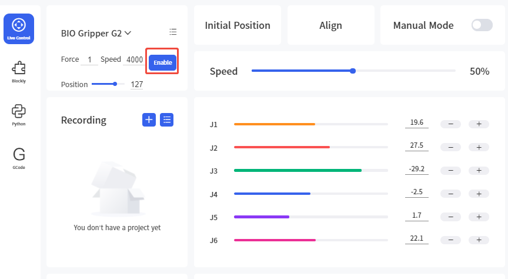

# 5. Error Handing

## 5.1 Error Code

| Error code | Description             | Error handling                                                                                                                                           |
|----------|-------------------------|----------------------------------------------------------------------------------------------------------------------------------------------------------|
| BG01 | FOC Run Timeout         | BIO  Gripper FOC run timeout, please clear the error and retry.                                                                                |
| BG02 | Over Pressure Protection | BIO  gripper over pressure, please contact technical support.                                                                                  |
| BG03 | Undervoltage protection | BIO gripper gripper undervoltage, please contact technical support.                                                                                      | 
| BG04 | Overheating Protection  | BIO Gripper overheating, please contact technical support.                                                                                               | 
| BG05 | Startup Failure         | BIO Gripper startup failure, please contact technical support.                                                                                           
| BG06 | Speed Feedback Failure  | BIO gripper speed feedback fault, please contact technical support.                                                                                      |
| BG07 | Overcurrent Protection  | BIO gripper overcurrent, please contact technical support.                                                                                               
| BG08 | MCSDK Software Error    | BIO gripper MCSDK software error, please contact technical support.                                                                                      | 
| BG09 | Drive Protection        | BIO Gripper drive protection, please contact technical support.                                                                                          | .
| BG11 | Gripper Overcurrent     | BIO Gripper current is too high. Please click 'Confirm' to re-enable the gripper. If the error is reported repeatedly, please contact technical support. | 
| BG12 | Gripped Object Slipped  | BIO Gripper Error. the BIO gripper gripped object slipped, please clear the error and retry.                                                             | 

## 5.2 Error Handing

### 5.2.1 Cleaning errors with UFACTORY Studio


1. Re-powering therobotic arm via the emergency stop button on the control box.

2. Enable robotic arm. xArm Studio enable mode: Click the guide button of the error pop-up window or the ‘STOP’ red button in the upper right corner.
3. Re-enable the gripper: Select the BIO gripper G2 and click 'Enable'.




### 5.2.2 Cleaning errors with xArm-Python-SDK


When designing the robotic arm motion path with the Python library, if the robotic arm error (see Appendix for Alarm information) occurs, then it needs to be cleared manually. After clearing the error, the robotic arm should be motion enabled. 
Python library error clearing steps: (Please check GitHub for details on the following interfaces)

Clear the error step:

1. Re-powering the robotic arm via the emergency stop button on the control box.
2. Error clearing: `clean_error()`
3. Re-enable the robotic `arm: motion_enable(true)`
4. Set the motion state: `set_state(0)`
5. Set the motion mode: `set_mode(0)`
6. Enable BIO Gripper G2:`set_bio_gripper_enable(enable=True)`

Python Example:
```python
import os
import sys
import time

sys.path.append(os.path.join(os.path.dirname(__file__), '../../..'))

from xarm.wrapper import XArmAPI

arm = XArmAPI('192.168.1.75')
arm.clean_error() #clean error
arm.motion_enable(enable=True) #re-enable the robotic
arm.set_mode(0) #set motion mode
arm.set_state(0) #set motion state
arm.set_bio_gripper_enable(enable=True) #enable bio gripper G2

```
