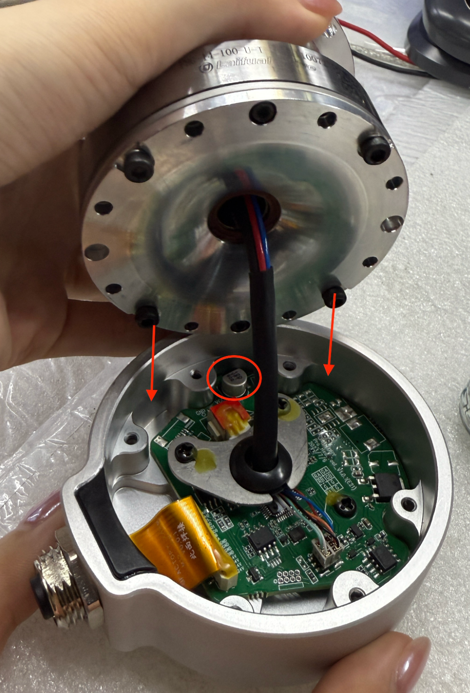
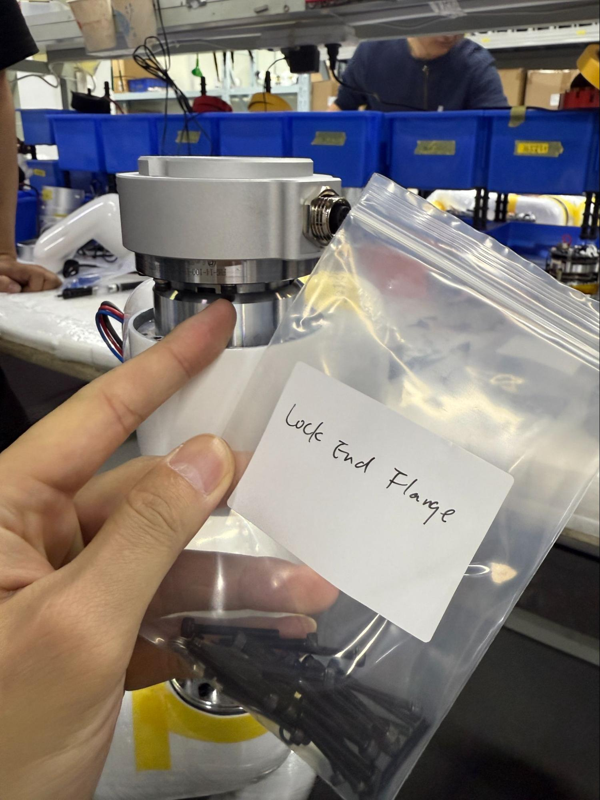
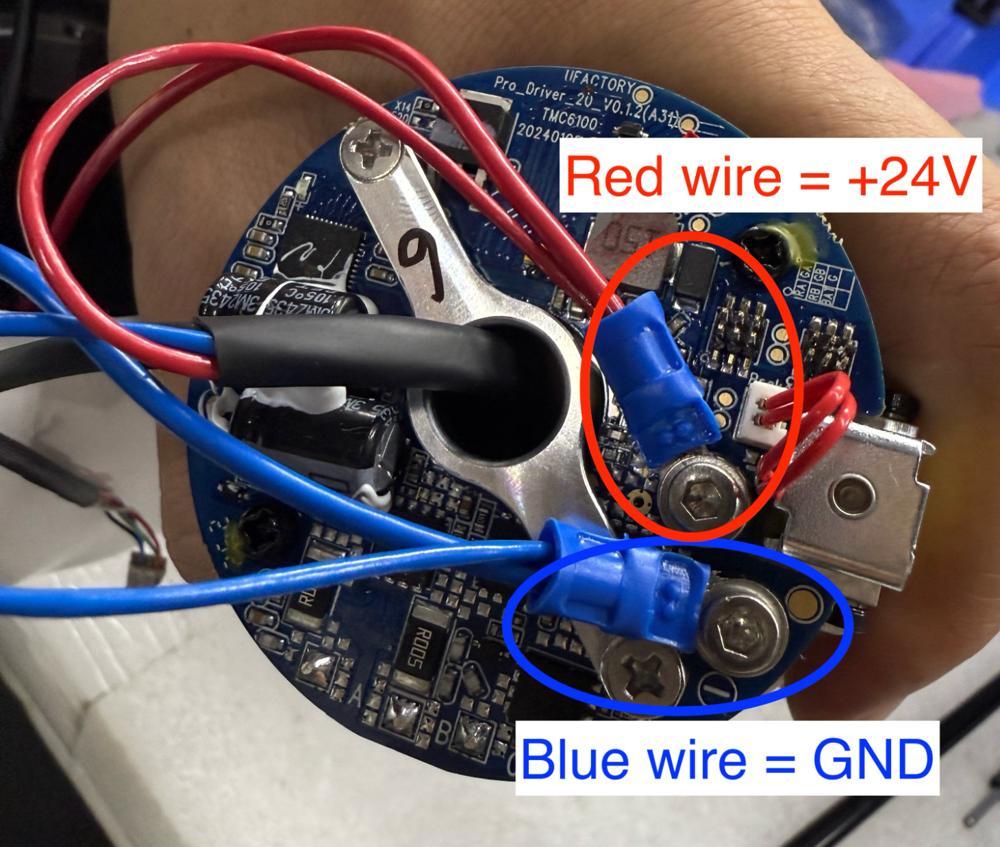
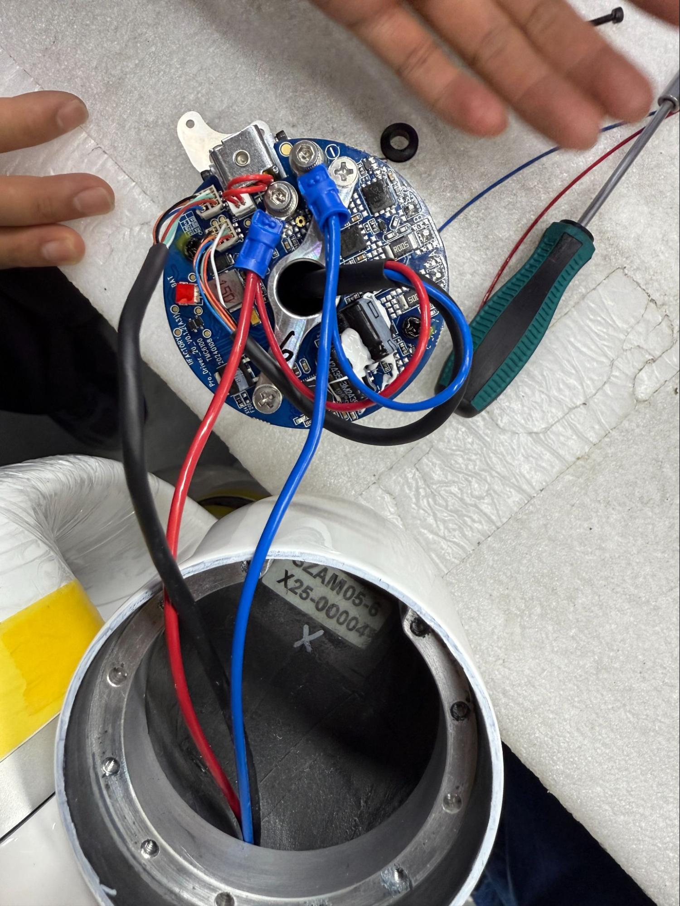
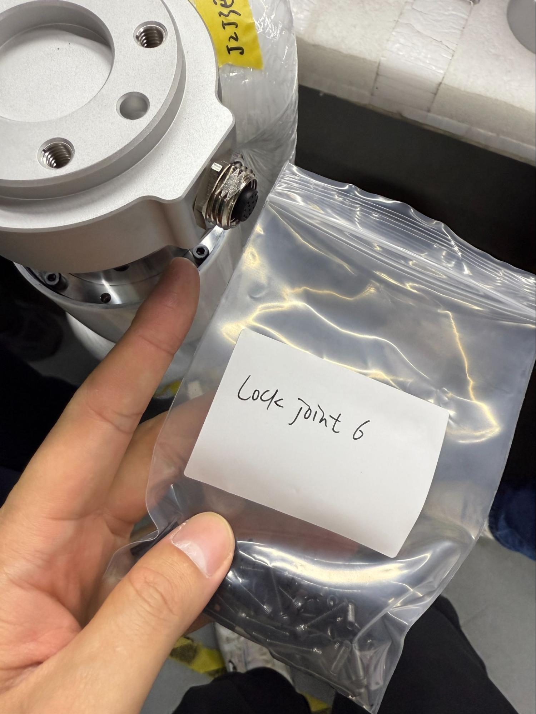

1. Mark the 0 position of the last joint using tape and a marker  
2. E-Stop, turn off, and unplug robot  
3. Unscrew silver joint cover to last joint. Will need to pop through sticker covering bolts.  
4. LEAVE WHITE PAINTED BOLTS. Unscrew all other bolts that connect joint to link inside of arm.

5. Cut red and blue wires at screw terminal (blue crimped piece). Unplug comm port, scraping off yellow glue if needed

6. Unscrew bolts holding tool flange, noting that the middle bolts on either side have two washers while outer bolts have one

7. Note where the bolts go when pulling this piece apart. The bolts must not touch the capacitor, and instead go on either side of the grooves around the capacitor.

8. Disconnect tool flange by unscrewing two bolts on metal boomerang-looking piece and unplugging comm wire at terminal and black power wire

9. Connect new tool flange, noting that the red wire in the comm terminal needs to connect at the half circle mark. Plug the black power wires in as well

10. Screw in the metal boomerang-looking piece to secure wires. Coat screws with yellow glue  
11. Align bolts where they need to go

12. Use two washers on middle bolts and one washer on outer bolts to secure flange to joint. Coat bolt with blue locktite

  

13. Re-crimp red and blue wires. Red is \+24V and blue is GND. \~1cm needs to be stripped from wires for crimping. Make sure metal wire is poking out from blue crimp, close to the circular hole for the bolt. Secure them to the board using the screws

14. Plug comm terminals into corresponding locations. Note again that red wire needs to line up with half circle on circuit board

15. What everything looks like connected:

16. Zip tie wires together, securing them tightly.

17. Take rubber UF logo off and pull wires through to bolt joint back together

  
 

18. Bolt joint back together, lightly coating bolts with blue locktite. Make sure end effector port is on UF rubber logo side.

19. Before reattaching joint covers, reset the 0 position of the last joint. Command:   
    1. H101D0104V1I\* to unlock brake (\* refers to joint ID)  
    2. D13 I\* to reset 0 (\* refers to joint ID)  
    3. Hit E-Stop  
20. Use gray glue and bolt joint cover into place. 