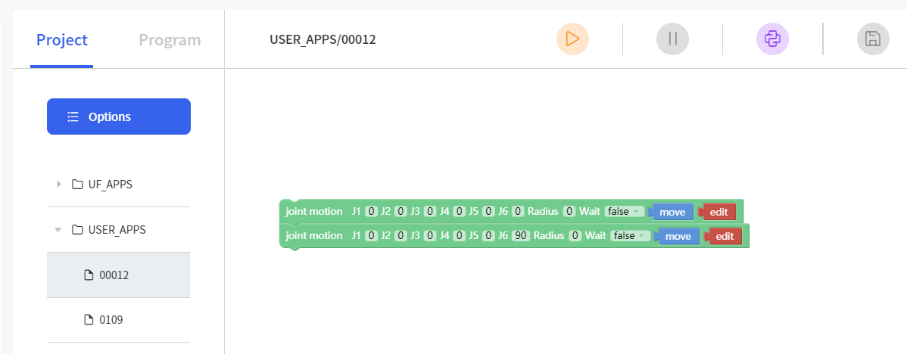

# Modbus RTU Slave: How to trigger Blockly project

## 1. Scenario Description

- Device: xArm Controller (AC1310 or later, AC8510 or later)
- Firmware: V2.7.104 or later
- Communication: Modbus RTU
- Device Role: Slave
- Target Function:
  Trigger an Blockly project named 00012.



## 2. Mapping Between Coils and CO

| Modbus Holding Registers Address | Description | Other |
| ------------------- | ------- | ----------- |
| 0030 | Blockly Project | The value stands for the project name |


## 3. Modbus RTU Command Examples (Function Code 0x10)

### Raw Command Frame (HEX)
```text
01 10 00 30 00 01 02 00 0C A3 A5
```

Command Structure Breakdown
```text
Slave Address: 01 (1)
Function Code: 10
Start Address: 00 30 (0030)
Number of Registers: 00 01 (1)
Byte Count: 02 (2)
Data Field:
  Address 00 30: 00 0C(UINT16: 12)
CRC: A3 A5
```

### Response Frame (HEX)
```text
01 10 00 30 00 01 01 C6
```

Command Structure Breakdown
```text
Slave Address: 01 (1)
Function Code: 10
Start Address: 00 30 (48)
Number of Registers: 00 01 (1)
CRC: 01 C6
```

