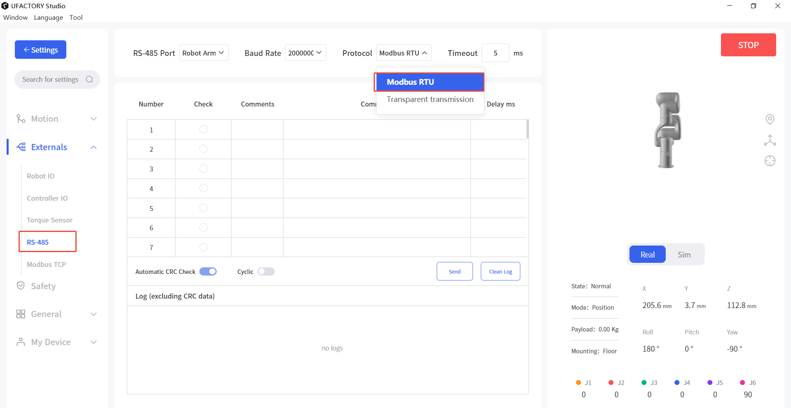

# xArm Controller RS-485 (Modbus RTU) User Guide

## 1. Overview

This manual describes the RS-485 communication capabilities of the UFACTORY xArm controller and how to use them under the Modbus RTU protocol.

The controller currently supports:
- Modbus RTU Master
- Modbus RTU Slave (Controller AC1310 or later, firmware V2.7.104 or later)

## 2. Modbus RTU Master

In Master mode, xArm actively communicates with external RS-485 slave devices.

### 2.1 Interface Definition

| Terminal | Description | Note |
| ------- | ----------- | ---- |
| M_A | RS-485 A / D+ | Master |
| M_B | RS-485 B / D- | Master |
| GND | Signal Ground | |

### 2.2 Communication Parameters

| Parameter | Default | Range |
| --------- | ------- | ----- |
| Baud Rate | 2000000 | 4800, 9600, 19200, 38400, 57600, 115200, 230400, 460800, 921600, 1000000, 1500000, 2000000, 2500000 |
| Data Bits | 8 | |
| Stop Bits | 1 | 1, 2 |
| Parity | None | None (N), Odd (O), Even (E) |
| Timeout | 50 ms | 1–9999 ms |

### 2.3 Control Methods

#### 2.3.1 UFACTORY Studio

RS-485 Port: Control Box
Protocol: Modbus RTU  

CRC will be appended automatically after the input command.

#### 2.3.2 Python SDK

1. Set controller baud rate
```python
arm.set_rs485_baudrate(200000, target='control_box')
```

2. Set timeout
```python
arm.set_rs485_timeout(1000, target='control_box')
```

3. Send data
```python
arm.set_rs485_data([0x08, 0x06, 0x01, 0x00, 0x00, 0x01], target='control_box')
```

## 3. Modbus RTU Slave

In Slave mode, xArm can be accessed by a PLC or host computer.

### 3.1 Interface Definition

| Terminal | Description | Note |
| ------- | ----------- | ---- |
| L_A | RS-485 A / D+ | Slave |
| L_B | RS-485 B / D- | Slave |
| GND | Signal Ground | |

### 3.2 Communication Parameters

| Parameter | Default | Range |
| --------- | ------- | ----- |
| Slave ID | 1 | 1–247 |
| Baud Rate | 9600 | 4800, 9600, 19200, 38400, 57600, 115200, 230400, 460800, 921600, 1000000, 1500000, 2000000; (0-12) |
| Data Bits | 8 | |
| Stop Bits | 1 | 1, 2 |
| Parity | None | None (N), Odd (O), Even (E); (0-2) |

### 3.3 Parameter Configuration

Set parameters:
```python
arm.set_modbusrtu_params(slave_id=1, baudrate=9600, stopbits=1, parity=0)
```

Get parameters:
```python
arm.get_modbusrtu_params()
```

Example output:
```text
(0, [1, 9600, 1, 0])
```

## 3.4 Register Mapping Examples

### 3.4.1 Function Code
* Discrete input register
  * 0x02: Read multiple discrete input registers
* Input register
  * 0x04: Read multiple input registers
* Coil register
  * 0x01: Read multiple coil registers
  * 0x05: Write single coil register
  * 0x0F: Write multiple coil registers
* Holding register
  * 0x03: Read multiple holding registers
  * 0x06: Write single holding register
  * 0x10: Write multiple holding registers
  * 0x16: Mask write single holding register
  * 0x17: Read and Write multiple holding registers

### 3.4.2 Status Registers (Read Only)

#### Discrete Input Registers (1 bit, READ only)

| Address (Dec) | Address (Hex) | Description |
| ------------- | ------------- | ----------- |
| 0–31 | 0x00–0x1F | Controller digital input IO (16 valid) |
| 32–39 | 0x20–0x27 | Tool digital input IO (2 valid) |
| 40–127 | 0x28–0x7F | Reserved |

#### Input Registers (16 bit, READ only)

|Address(Dec)|Address(Hex)|Description|
|---|---|---|
|0 ~ 1|0x00 ~ 0x01|32 controller Digital Inputs (Now only 16 effective)|
|2|0x02|8 tool Digital Inputs (Now only 2 effective)|
|3 ~ 6|0x03 ~ 0x06|4 controller analog inputs (now only 2 effective), it is 1000 times the real value|
|7 ~ 10|0x07 ~ 0x0A|4 tool analog inputs (now only 2 effective), it is 1000 times the real value|
|11 ~ 31|0x0B ~ 0x1F|Reserved|
|32|0x20|Robot Error code|
|33|0x21|Robot Warning code|
|34 ~ 35|0x22 ~ 0x23|Counter value (0x22 stores the higher 16-bit, 0x23 stores the lower 16-bit)|
|36 ~ 63|0x23 ~ 0x3F|Reserved|
|64 ~ 72|0x40 ~ 0x48|Current TCP coordinate of x/y/z/roll/pitch/yaw/rx/ry/rz values, register values are 10 times the real numbers (unit: mm, degree)|
|73 ~ 76|0x49 ~ 0x4C|TCP payload mass(1000x)/center_x(10x)/center_y(10x)/center_z(10x) (unit: kg, mm)|
|77 ~ 82|0x4D ~ 0x52|TCP Offset, register values are 10 times the real numbers(unit: mm, degree)|
|83 ~ 88|0x53 ~ 0x58|User/world coordinate offset, register values are 10 times the real numbers(unit: mm, degree)|
|89 ~ 95|0x59 ~ 0x5F|joint (J1-J7) angles, register values are 10 times the real numbers(unit: degree)|
|86 ~ 102|0x60 ~ 0x66|joint (J1-J7) temperature (unit: degree Celsius)|
|103 ~ 109|0x67 ~ 0x6D|joint (J1-J7) speed, register values are 10 times the real numbers(unit: degree/s)|
|110|0x6E|Robot TCP linear speed, register values are 10 times the real numbers(unit: mm/s)|
|111 ~ 127|0x6F ~ 0x7F|Reserved|


### 3.4.3 Control Registers (Read / Write)

#### Coil Registers (1 bit, READ/WRITE)


| Address(Dec) | Address(Hex)  | Description                                                                           |
| ------------ | ------------- | ------------------------------------------------------------------------------------- |
| 0 ~ 31       | 0x00 ~ 0x1F   | 32 controller Digital Output (Now only 16 effective)                                  |
| 32 ~ 39      | 0x20 ~ 0x27   | 8 tool Digital Output (Now only 2 effective)                                          |
| 40 ~ 127     | 0x28 ~ 0x7F   | Reserved                                                                              |
| 128 ~ 134    | 0x80 ~ 0x86   | joint (J1-J7) brake states                                                            |
| 135 ~ 141    | 0x87 ~ 0x8D   | joint (J1-J7) enable states                                                           |
| 142          | 0x8E          | Reduced mode (0: OFF, 1: ON)                                                          |
| 143          | 0x8F          | Digital Fence (0: OFF, 1: ON)                                                         |
| 144          | 0x90          | isPaused (0: False, 1: True)                                                          |
| 145          | 0x91          | isStopped (0: False, 1: True)                                                         |
| 146 ~ 159    | 0x92 ~ 0x9F   | Robot Mode (14 bits for mode 0-13 respectively, 0: not in this mode, 1: in this mode) |
| 160 ~ 255    | 0xA0 ~ 0xFF   | Reserved                                                                              |
| 256 ~ 511    | 0x100 ~ 0x1FF | General purpose, user defined                                                         |

#### Holding Registers (16 bit, READ/WRITE)

| Address (Dec) | Address (Hex) | Description                                                                                                                                                                                                                                                                                                                                  |
| ------------- | ------------- | -------------------------------------------------------------------------------------------------------------------------------------------------------------------------------------------------------------------------------------------------------------------------------------------------------------------------------------------- |
| 0-1           | 0x00-0x01     | 32 controller Digital Outputs (Now only 16 effective), each bit correspond to one IO in order                                                                                                                                                                                                                                                |
| 2             | 0x02          | 8 tool Digital Outputs (Now only 2 effective), each bit correspond to one IO in order                                                                                                                                                                                                                                                        |
| 3-6           | 0x03-0x06     | 4 controller analog outputs (now only 2 effective), it is 1000 times the real value                                                                                                                                                                                                                                                          |
| 7-10          | 0x07-0x0A     | 4 tool analog outputs (currently NOT EFFECTIVE), it is 1000 times the real value                                                                                                                                                                                                                                                             |
| 11            | 0x0B          | Modbus RTU slave ID                                                                                                                                                                                                                                                                                                                          |
| 12            | 0x0C          | Modbus RTU slave baud rate                                                                                                                                                                                                                                                                                                                   |
| 13            | 0x0D          | Modbus RTU slave stop bit                                                                                                                                                                                                                                                                                                                    |
| 14            | 0x0E          | Modbus RTU slave parity                                                                                                                                                                                                                                                                                                                      |
| 15-31         | 0x0F-0x1F     | Reserved                                                                                                                                                                                                                                                                                                                                     |
| 32            | 0x20          | Robot Mode                                                                                                                                                                                                                                                                                                                                   |
| 33            | 0x21          | Robot State                                                                                                                                                                                                                                                                                                                                  |
| 34-47         | 0x22-0x2F     | Reserved                                                                                                                                                                                                                                                                                                                                     |
| 48-63         | 0x30-0x3F     | Offline (Blockly) Task (**only effective by writing multiple (max 16) holding registers to address 0x30 via function code 0x10, each register value correspond to one Blockly project with specific naming convention, for example: value 1 for project '00001', 12 for project '00012', projects will be executed automatically in order**) |
| 64            | 0x40          | Gcode(Firmware≥2.4.0), trigged the gcode file under modbus_tcp folder.                                                                                                                                                                                                                                                                       |
| 65-255        | 0x41-0xFF     | Reserved                                                                                                                                                                                                                                                                                                                                     |
| 256-511       | 0x100-0x1FF   | General purpose, user defined                                                                                                                                                                                                                                                                                                                |
