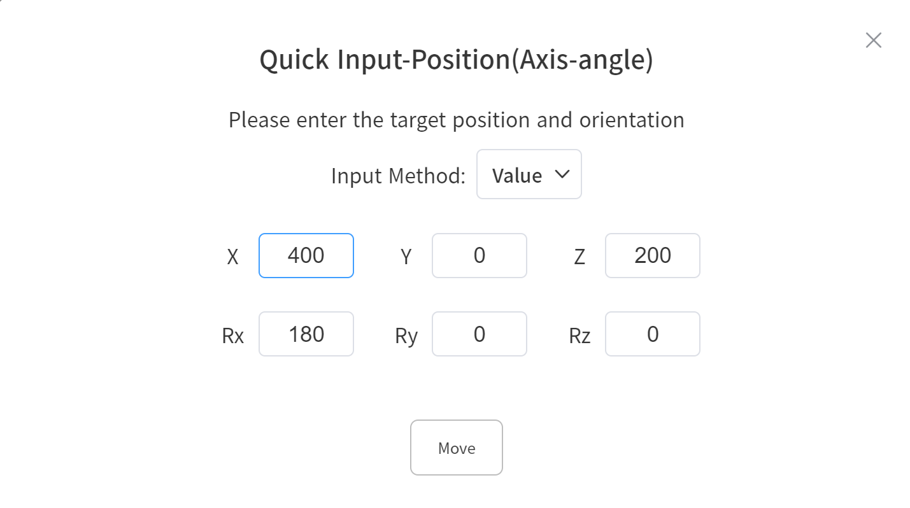
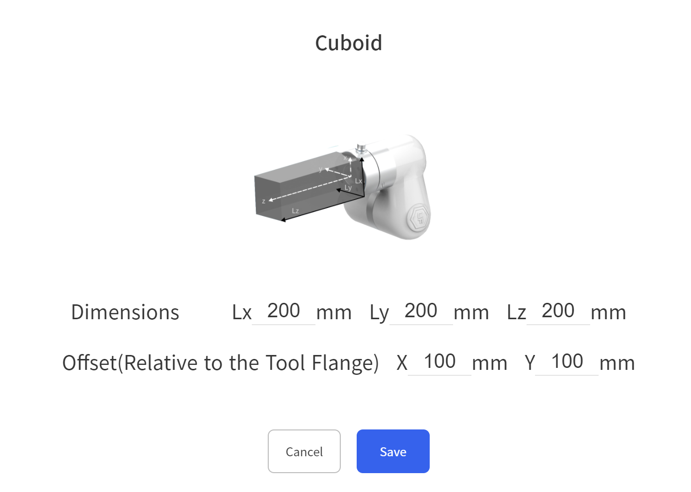

# V2.6.0 New Feature

## Live Control - Quick Input
Feature Description
* Used for quickly inputting joint angles or TCP pose data, supporting both numerical and array inputs.
* After input, press and hold to move to the target position.

## Live Control - End Collision Model Offset
Feature Description
* Used to set the X and Y direction offsets of the custom end collision model relative to the tool coordinate system, for adjusting the position of the collision model.

* After setting the offset, the effect is as follows

## Blockly Programming - IO - Digital Output Asynchronous Parameter

Feature Description
* Used to set the synchronous/asynchronous logic for digital and analog outputs.
* When set to synchronous, IO instructions will enter the instruction sequence and execute in order. When set to asynchronous, IO instructions will execute immediately.
* The default value is synchronous.

The following Blockly program is used to observe the difference between synchronous and asynchronous logic. DO 0 will be pulled high after the motion instruction is executed, while DO 1 will be pulled high immediately when the program starts.

## Blockly Programming - Get Joint Angles or TCP Pose
Feature Description
* Used to get the position or joint angles of the robotic arm, for printing or variable assignment.
The following Blockly program demonstrates the simplest use of getting the TCP position. It gets the current X value of the position and moves 10 mm in the positive X direction each time until X is greater than or equal to 500 mm, then stops the loop.

## Settings - Advanced Settings - Read-only Mode
Feature Description
* Read-only mode is used for robotic arm management, preventing others from modifying or deleting Blockly/Python IDE/Gcode files when enabled.
* In read-only mode, users cannot modify or delete Blockly/Python IDE/Gcode files.
* Read-only mode needs to be set in the administrator interface.
