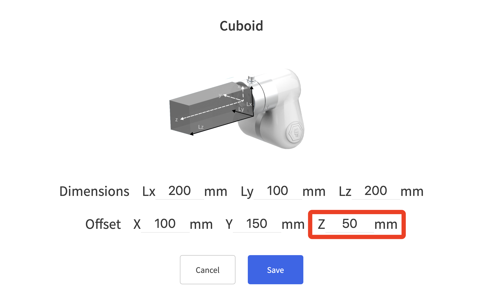
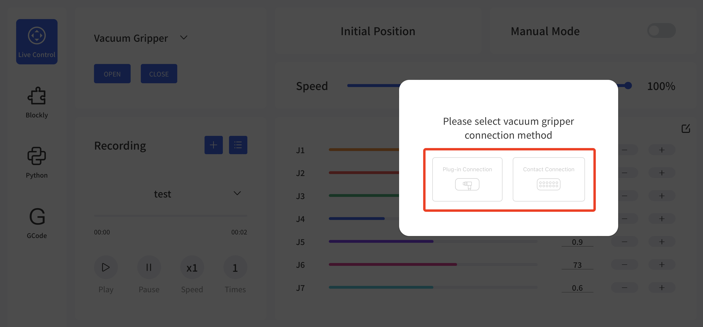
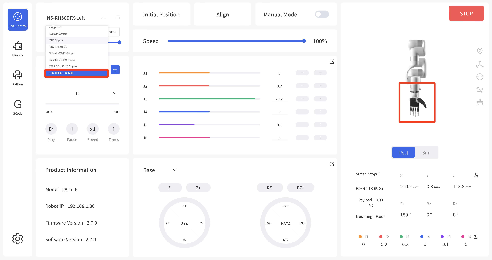
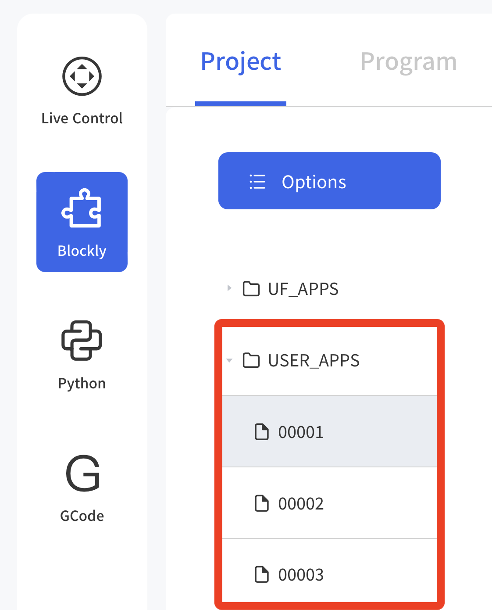
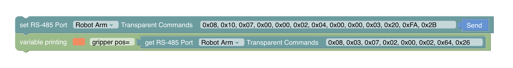
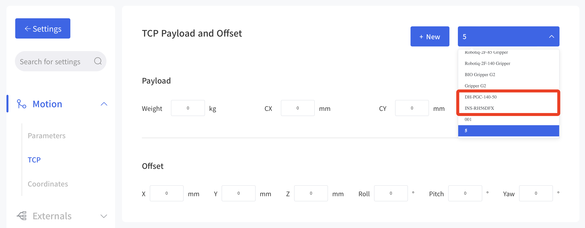
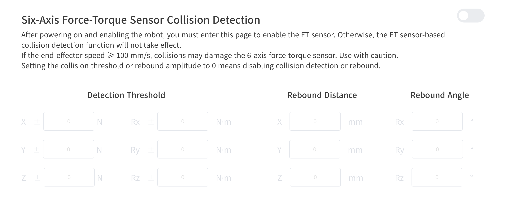
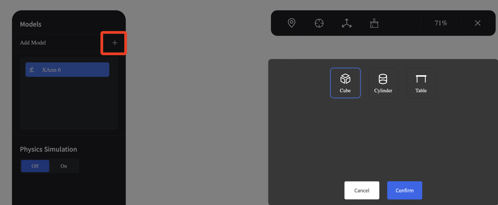
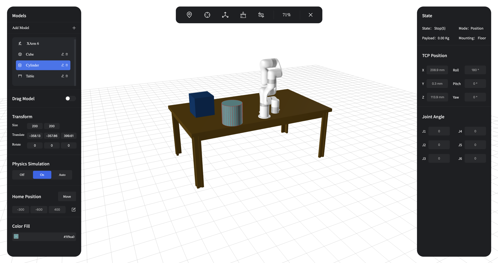
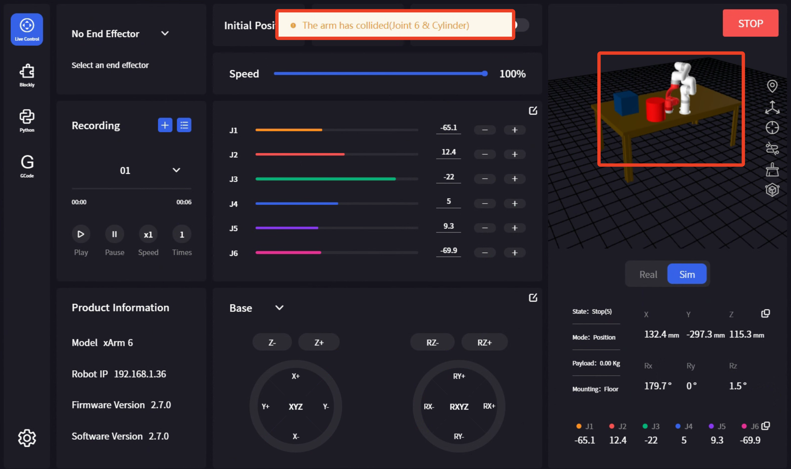

# V2.7.0 New Feature

## Live Control - End Collision Model Offset
Feature Description
* Used to set the Z-direction offset of a custom end collision model relative to the tool coordinate system, for adjusting the position of the collision model.

* After setting the offset, the effect is as follows:

## Live Control - End-effector - Vacuum Gripper
Feature Description
* Added connection options: plug-in connection, contact connection
* Only available for 850, xArm (≥1305)
  

## Live Control - End-effector Models
Feature Description
* Compatible with UFACTORY Gripper G2, RH56DFX dexterous hand and DH-PGC-140-50 gripper. Supports control and adding self-collision models.

## Blockly Programming - File Name
Feature Description
* Added sorting logic for file names. For example, if projects are created in the order 003, 002, 001, they will be displayed as shown below.

## Blockly Programming - External Devices - Transparent Transmission
Feature Description
* Used for RS485 communication between the robotic arm and the end-effector or controller. The robotic arm only forwards the data without processing it.
* Optional parameters: Robot Arm, Control Box
  
The following program opens the UFACTORY Gripper G2 and obtains its position.
  

## Settings - Motions - TCP
Feature Description
* Added TCP payload and offset parameters for RH56DFX and  DH-PGC-140-50 gripper.
  

## Settings - Externals - Torque Sensor
Feature Description
* Added torque sensor collision detection.
* Configurable parameters: Detection Threshold, Rebound Distance, Rebound Angle.
* When the end speed ≥100mm/s, the sensor may be damaged by collision. Please enable with caution.
  

## Settings - Assistive Features - Environment Simulation (Beta)
Feature Description
* Enable the environment simulation option in Settings - General. (This feature is still in testing)
* You can add models into the environment: cube, cylinder, table.
* After selecting a model, you can enable drag mode to move the model to the desired position. You can also enable physics simulation to consider real gravity and collision.

* If a collision occurs, the software will pop up a warning message, as shown below:
  
