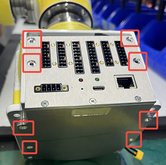
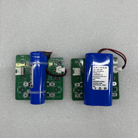

# How to replace the base battery?

Base battery: The base battery powers the encoders of each joint of the robotic arm. If the battery is dead or damaged, the encoder data will be lost, and the joints will not be able to remember the zero position.

Model: 18650, 2 cells or 1 cell, 6400mAh.

## 1. Disassemble the base
Taking Lite6 as an example:
* Tear off the sticker on the base; unscrew the 8 screws and remove the base;
* Disconnect the two connecting cables;

## 2. Replace the battery
Unscrew the 4 screws and replace the battery. Either 1 or 2 cells can be used.

## 3. Rewrite data
1. Download and run [xarm-tool-gui-2.17.12](
https://drive.google.com/drive/folders/1kiMC-bzNIDVRCvKWzA12MLJ7jVp3EqKb?usp=sharing), enter the <u>controller IP</u>, and click <u>Connect</u>;
2. Click <u>0.关闭关节限位</u>;
3. Click <u>多圈归零</u>;
4. Press the emergency stop button, **wait for 10 seconds**, and release the emergency stop button;
5. Click <u>6.零点校准（写入）</u>;
6. Click <u>7.打开关节限位</u>.

