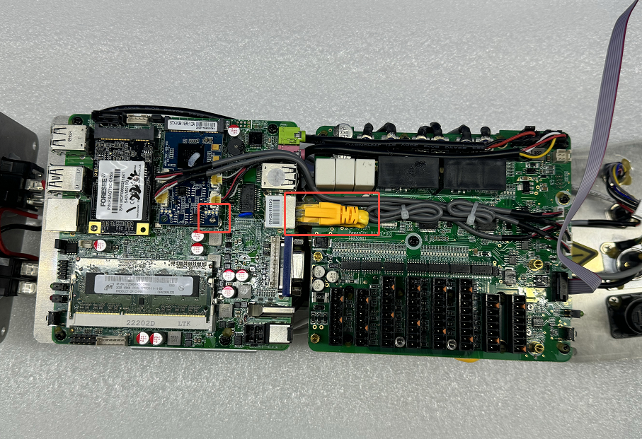
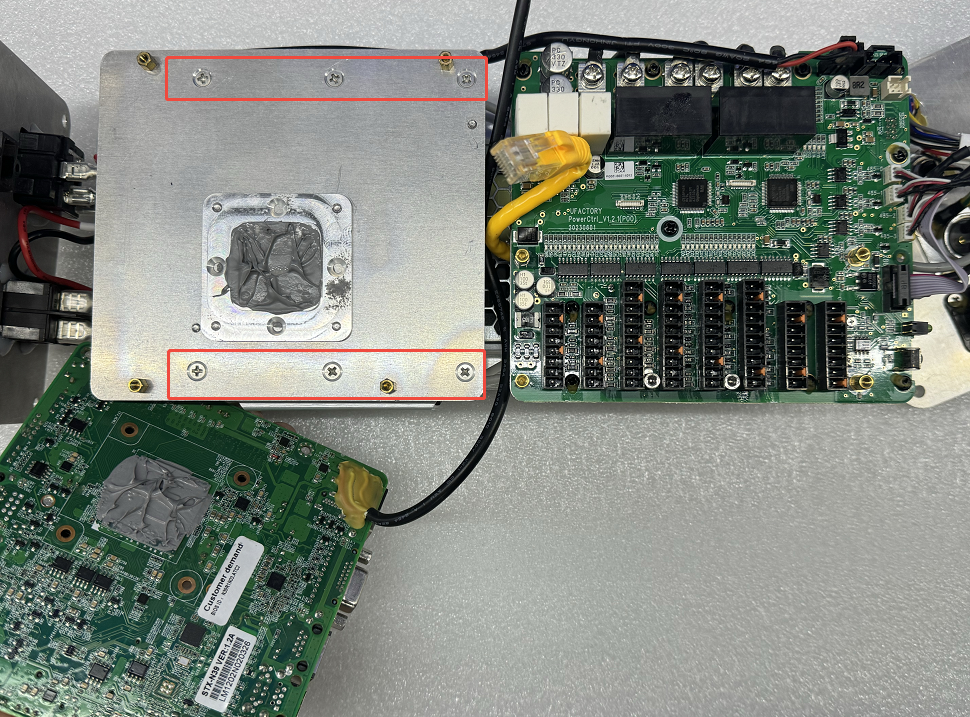

# How to replace 12V power of AC Controller?

The model of 12v Power: MEAN WELL LRS-50-12 

1. Follow the video to disassemble the controller.
[How to disassemble the controller?](https://drive.google.com/drive/folders/1LiDyIoOXd-MtC4zW8miXUTSSDuxyNhir?usp=sharing)

2. Remove 1 screw and unplug RJ45 netport cable.

3. Remove 4 screws.

4. Remove 6 screws.

5. Remove 2 screws and 5 cables, replace a new 12V power.

