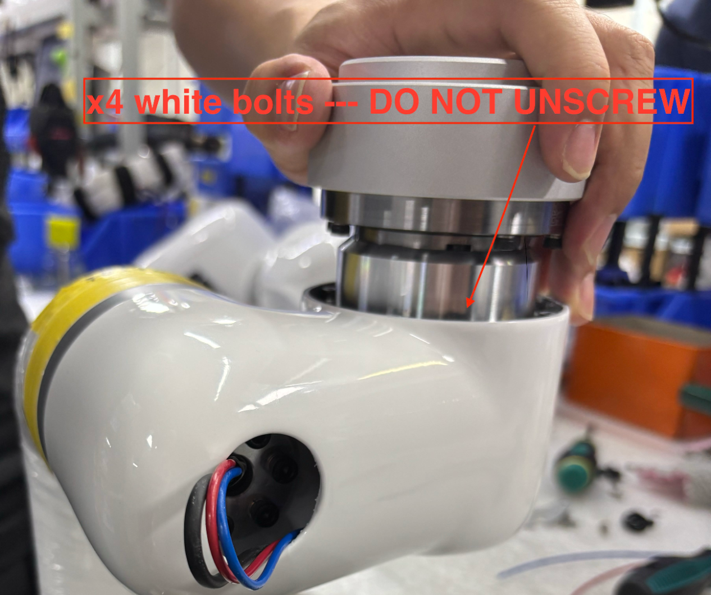
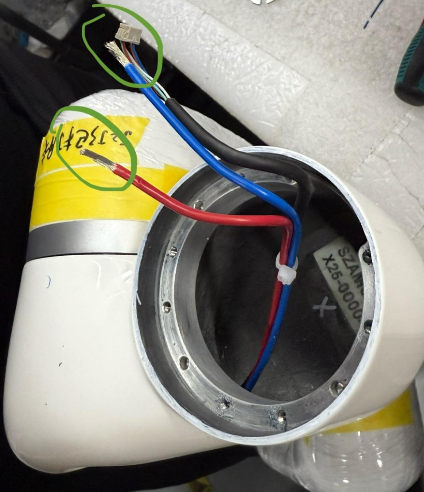
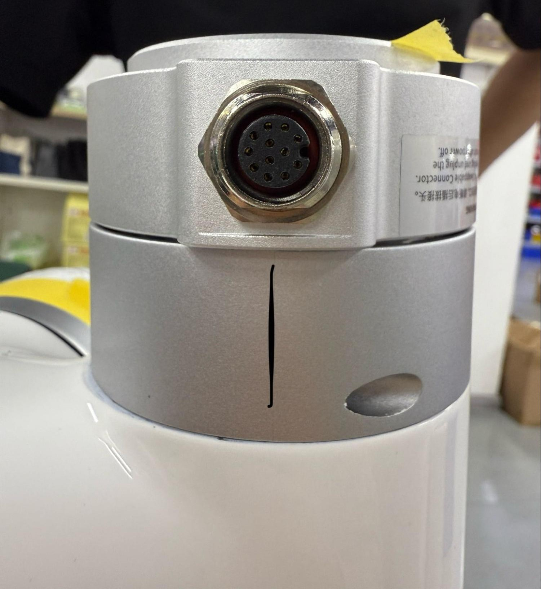

# How to Replace the End Flange in the xArm 1305

### 1. Send the robot to 0 position and mark the last joint

The 0 position of the last joint will be lost and reset in this process. Before removing anything, mark where the port of the end flange lines up at 0 so this position will not be lost- it should be on the same side as the rubber UF logo.

### 2. E-Stop, turn off, and unplug robot

### 3. Remove the silver cover on the last joint

The bolts on the joint cover are hidden by stickers. Either unstick these with tweezers by pulling them back, or use an allen key to pop through them and remove the cover.

### 4. Unscrew bolts that connect joint to link inside of arm

Ignore the white painted bolts; these should never be unbolted. Unscrew all other bolts that connect the joint to the link inside of the arm, skipping and bolts painted white.

### 5. Disconnect the end of arm

Cut red and blue wires at screw terminal (blue crimped piece). Unplug comm port, scraping off yellow glue if needed.

### 6. Remove the end tool flange

Unscrew bolts holding tool flange, noting that the middle bolts on either side have three washers while outer bolts have one.

### 7. Take note of how piece comes apart

When pulling this piece apart, notice that the bolt heads must not touch the capacitor between the metal housing. Instead, they should go on either side of these grooves.

### 8. Disconnect tool flange

Unscrew the two bolts on the metal boomerang-looking piece and unplug the colorful comm wires as well as the black power cable.

### 9. Connect the new tool flange

Plug the black power cable into the corresponging terminal. Connect the colorful comm wires, noting that the red wire must line up with the half circle on the circuit board.

### 10. Secure these wires

Screw in the metal boomerang-looking piece to secure wires. Coat screws with yellow glue. 

### 11. Align bolts of joint with tool head

As noted in step 7, align the bolt heads around the metal groove so that the capacitor will not be touched.

### 12. Secure flange to joint

Coat bolt with blue locktite and use three washers on middle bolts and one washer on outer bolts to secure flange to joint. Be sure to use the correct longer bolts.

  

### 13. Re-crimp red and blue wires to blue screw terminals 

Red is +24V and blue is GND. ~1cm needs to be stripped from wires for crimping. For best results, ensure that the metal wire is poking out from blue crimp, close to the circular hole for the bolt. Secure them to the board.

### 14. Plug comm terminals in

Note that the red wire in the comm terminals must allign with teh half circle on the circuit board.

### 15. Correctly connected, everything should look like this:

### 16. Zip tie wires together, securing them tightly.

### 17. Allign joint with link

Take rubber UF logo off and pull wires through while lining the joint with link. Note how the port aligns with the 0 position marked in step 1.

  
 

### 18. Bolt joint together

Lightly coat the bolts with blue loctite and bolt the joint into place. Again, double check that the end effector port lines up with the 0 position previously marked- this should be on the UF rubber logo side.

### 19. Before reattaching joint covers, reset the 0 position of the last joint. 

Navigate to "Settings - General - Debugging Tools - Joint" and send the commands:   
    1. H101D0104V1I* to unlock brake (* refers to joint ID)  
    2. D13 I* to reset 0 (* refers to joint ID)  
    3. Hit E-Stop  

### 20. Reattach joint cover

Use the gray glue to reattach joint cover and bolt into place.