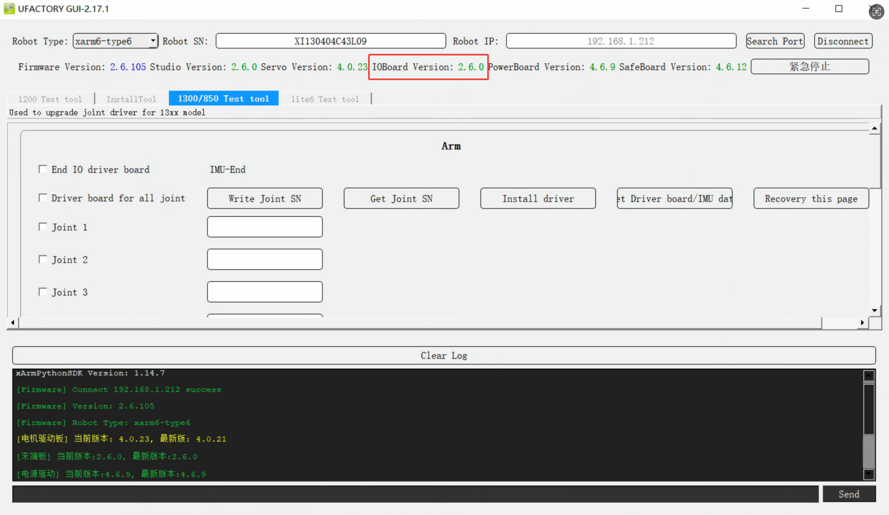
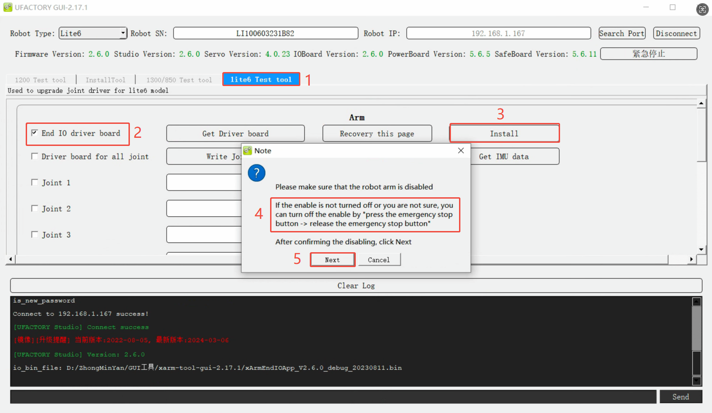

# How to update the end IO board firmware?

## How to check the end IO board version?
Launch xarm-tool-gui, enter the <u>Robot IP</u> and click <u>Connect</u>.
As shown in the figure below, the IO Board version is V2.6.0.

## Mapping of end IO firmware

| Robot Arm Model            | End IO Board File                      | Version Number |
| -------------------------- | -------------------------------------- | -------------- |
| xArm12xx or lower version  | io_board_app_1.2.0.bin                 | V1.2.x         |
| xArm1300~xArm1304 or Lite6 | xArmEndIOApp_V2.6.0_debug_20230811.bin | V2.6.x         |
| xArm1305 or 850            | xArmEndIOApp_V3.1.2_debug_20240927     | V3.1.x         |

## Download
- Windows: [xarm-tool-gui-win-amd64-2.17.1](https://drive.google.com/drive/folders/19qFJlldeSs_SH1UTjnMnNToeXC-BqS-N?usp=sharing)

## How to update the end IO firmware?
1. Connect with xarm-tool-gui.
2. Switch to the corresponding test tool, choose <u>End IO driver board</u>,click <u>install driver</u>, choose the corresponding bin file. Press down the Emergency stop button and release, click <u>Next</u>.
* **1305 or 850:** 1300/850 Test tool

* **Lite6:** Lite6 Test tool

* **xArm12xx or lower version:** 1200 Test tool

3. Wait for 1-2 minutes, it will prompt 'Installation Success'. The arm will reboot automatically. Wait for 1-2 minutes, re-connect with xarm-tool-gui, enable the robot, and check the end io board version.

