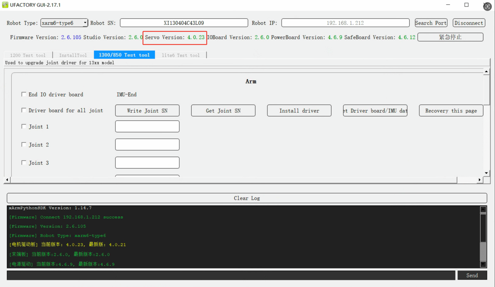
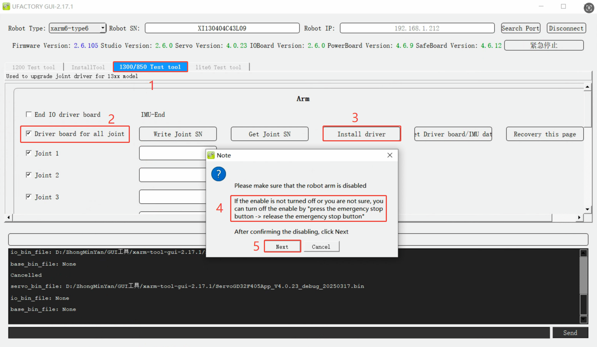
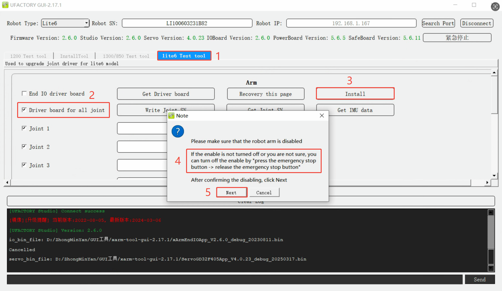

# How to update the joint firmware?

## How to check the joint firmware version?
Launch xarm-tool-gui, enter the <u>Robot IP</u> and click <u>Connect</u>.
As shown in the figure below, the servo(joint) version is V4.0.23.

### Mapping of joint firmware to robot

| Robot Arm Model           | Servo Firmware File                         | Version Number |
| ------------------------- | ------------------------------------------- | -------------- |
| xArm1303 or lower version | uf_servo_stm32f4xx_app_2.7.13.bin           | V2.7.x         |
| xArm1304 or Lite6         | ServoGD32F405App_V4.0.23_debug_20250317.bin | V4.0.x         |
| xArm1305 or 850           | ServoGD32F425App_V5.0.9_debug_20241224      | V5.0.x         |

## how to update the joint firmware?
1. Connect with xarm-tool-gui.
2. Switch to the corresponding test tool, choose <u>driver board for all joints</u>,click <u>install driver</u>, choose the corresponding bin file. Press down the Emergency stop button and release, click <u>Next</u>.
* **1305 or 850:** 1300/850 Test tool

* **Lite6:** Lite6 Test tool

* **xArm12xx or lower version:** 1200 Test tool

3. Wait for 2-3 minutes, it will prompt 'Installation Success'. The arm will reboot automatically. Wait for 1-2 minutes, re-connect with xarm-tool-gui, enable the robot, and check the joint firmware version.

