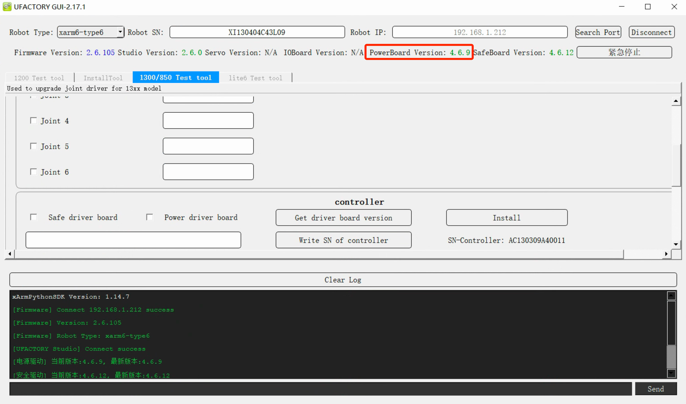
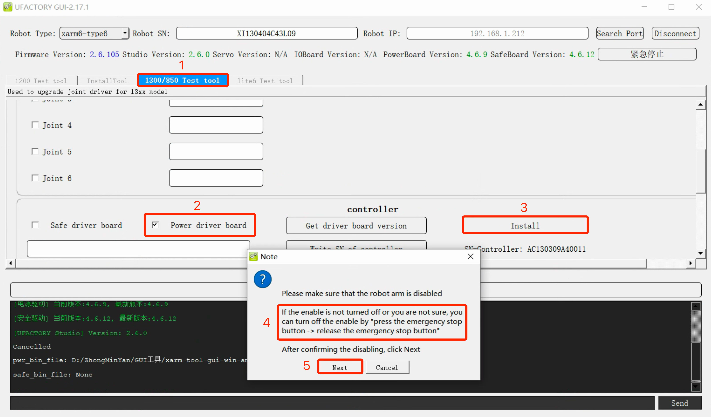

# How to update the PowerBoard of the controller?

## How to check the PowerBoard Version?
The PowerBoard is on the controller, not the robotic arm.  

Launch xarm-tool-gui, enter the <u>Robot IP</u> and click <u>Connect</u>.  
As shown in the figure below, the powerboard is V4.6.9.

## Mapping of PowerBoard

| Robot Arm Model | Controller Model                       | PowerBoard File                        | Version |
| --------------- | -------------------------------------- | -------------------------------------- | ------- |
| xArm            | AC1300~AC1302(EOF)                     | xArmPwrApp_V3.3.0_release_20210918.bin | V3.3.0  |
| xArm or 850     | AC1303, AC1304, DC13xx, AC8500, DC8500 | xArmPwrApp_V4.6.9_debug_20240729.bin   | V4.6.x  |
| Lite6           | DL1000                                 | xArmPwrApp_V5.6.5_debug_20230517.bin   | V5.6.x  |

## Download
- Windows: [xarm-tool-gui-win-amd64-2.17.1](https://drive.google.com/drive/folders/1DlFYdzB7ARn-aMWK96mjEsWmGnob2RIk?usp=sharing)

## Bug Fix

| Robot Arm Model | Controller Model                    | PowerBoard Version | Issue                      | Update |
| --------------- | -------------------------------------- | ------------------ | -------------------------- | ------ |
| xArm            | AC1300~AC1302(EOF)                     | V3.3.0             | You may meet C33 error     | V3.3.3 |
| xArm or 850     | AC1303, AC1304, DC13xx, AC8500, DC8500 | V4.6.5             | You may meet C1, C33 error | V4.6.9 |

## How to update the PowerBoard Version?
1. Connect with xarm-tool-gui.
2. Switch to <u>Test tool</u>, choose <u>Power driver board</u>, click <u>Install</u>.
* DL1000(Lite6) - Switch to <u>Lite6 Test tool</u>
* Others(xArm or 850) - Switch to <u>1300/850 Test tool</u>

3. Choose the bin file, press down the Emergency stop button and release, click <u>Next</u>.
4. Wait for 15 seconds, it will prompt ‘Installation Success’. The arm will reboot automatically.
3. **Power off the controller** and Power it on.
4. Enter the Robot IP and click Connect again, check the Powerboard Version.
