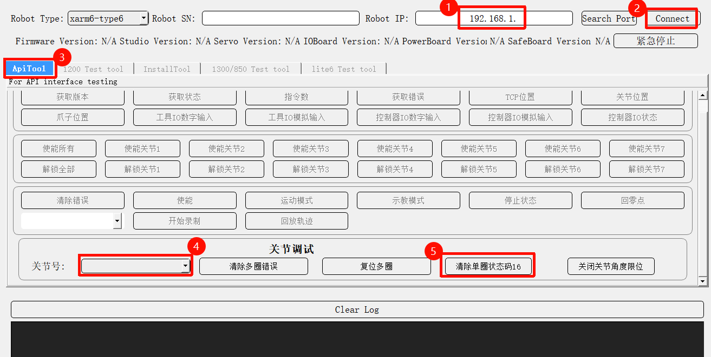

# How to solve S17 error?

S17: Single-turn Encoder Error

Product: xArm series, UF 850, Lite6

UFactory version: V2.4.0+

## Status code=16

### xArm ≤1303 version

Code:S17  , Joint ID: \*(can be 1\~7)   , status code:16

1. press down the E-stop button and then release.
2. Enter 'Settings-General-Debugging Tools-Joing', send `H101 D0104 V1 I*` to unlock joint\*, manually move joint\* a little bit (Note: For Lite6, it is recommended to rotate joints 4, 5, or 6 by at least 45°), and then send `H101D0813V2I*` , press down E-stop button. (This step will reset the zero position, so you need to mark the original position of joint\* before moving)
3. release the E-stop button, move Joint\* to the original position, send `D13 I*` , press down E-stop button.
4. Try to enable the robot again.

### 850,Lite6, xArm ≥1304 version

Code:S17  , Joint ID: \*(can be 1\~7)   , status code:16, **the joint firmware version ≥ 4.0.18**

1. According to the documentation, verify if the joint firmware version is ≥ 4.0.18. If the version is ≤ 4.0.18, follow the guide to update the firmware. Reference: [How to check/update the joint firmware? | UFactory Docs](https://docs.supportarticle.ufactory.cc/support_articles/hardware/how-to-update-the-joint-firmware.html)

2. Enter the controller IP address and click Connect.
3. Switch to the ApiTool tab, select the faulty Joint ID, and click Clear Single-turn Status Code 16.
4. Press the Emergency Stop (E-Stop) button, wait for 5 seconds, then release it. Try to enable the robotic arm again.

