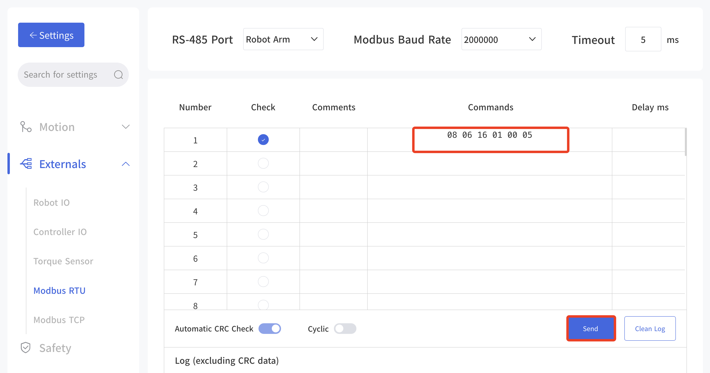
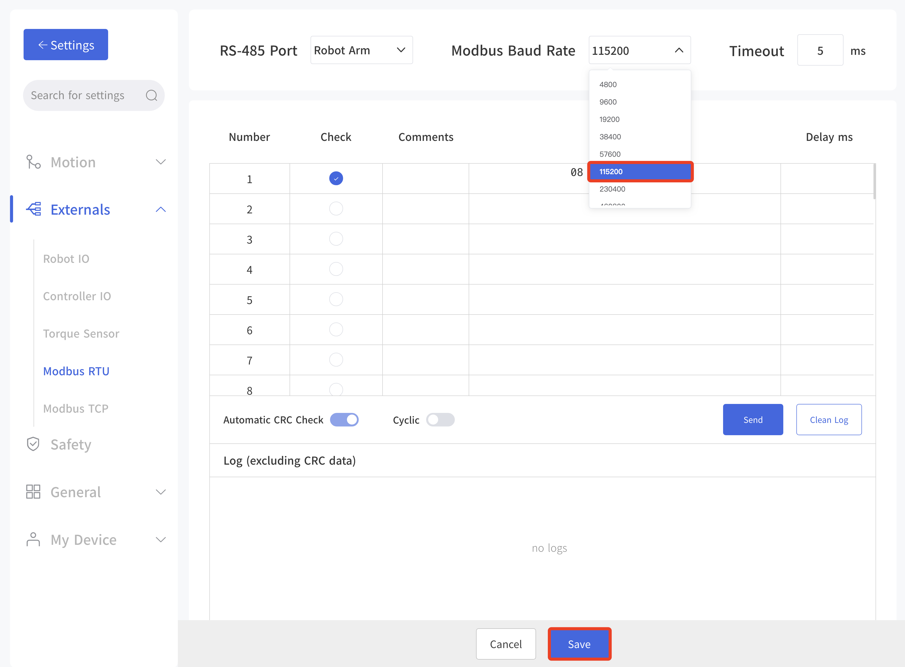
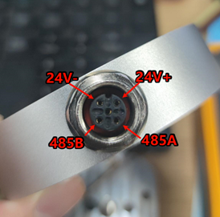
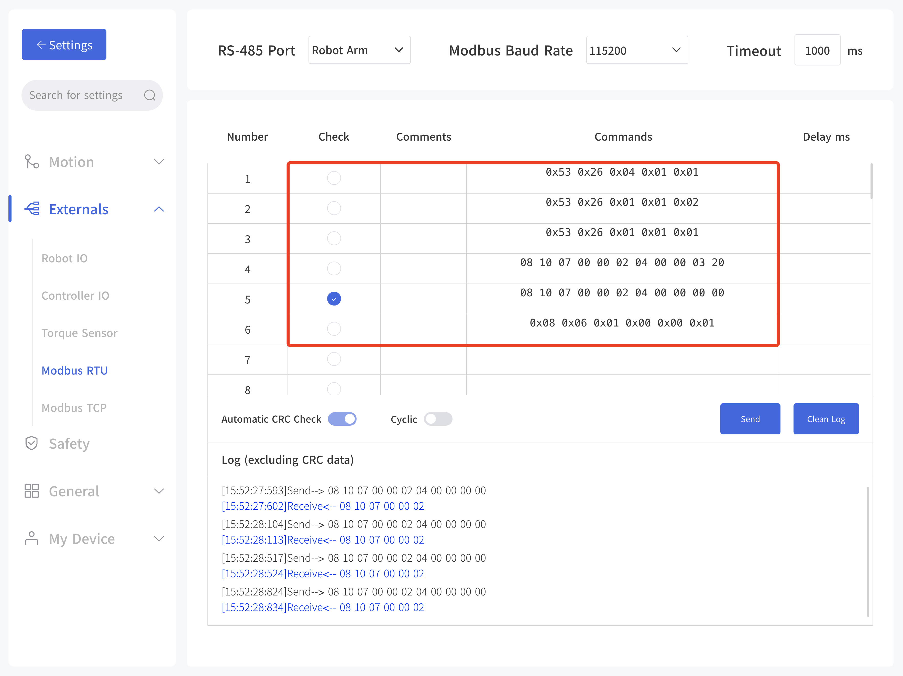

# How to use Quick Link with xArm Gripper

## 1. Modify the Baud Rate of xArm Gripper

* **xArm Gripper** ：[User Manual](https://docs.accessories.ufactory.cc/xArm_Gripper/1.Introduction.html)
* **Quick Link** 

Quick Link is installed at the end of the xArm robotic arm, and the xArm gripper connects to the Quick Link quick-change head. 

NOTE:
* The hardware/cable connection is correct.
* The baud rate of xArm Gripper, Quick Link, xArm tool end should be same.
  

## 1. Modify Gripper's Baud Rate
The baud rate of xArm Gripper is 2M by default, the baud rate of Quick Link is 115200.
The below steps showing how to modify the baud rate of xArm Gripper to 115200.

1. Install xArm Gripper to xArm tool end, and make sure you can control the gripper.
2. Enter 'Setting-External-ModbusRTU', enter '`08 06 16 01 00 05`' and send.
3. Press down the E stop button and release to take effect. 

（05 stands for 115200，0B stands for 2000000）
| Baud Rate of xArm Gripper |           |     |            |
| ------- | --------- | --- | ---------- |
| 0       | 4800bps   | 7   | 460800bps  |
| 1       | 9600bps   | 8   | 921600bps  |
| 2       | 19200bps  | 9   | 1000000bps |
| 3       | 38400bps  | 10  | 1500000bps |
| 4       | 57600bps  | 11  | 2000000bps |
| 5       | 115200bps | 12  | 2500000bps |
| 6       | 230400bps |     |            |

4. Verify if the baud rate has been modified successfully. Enter 'ModbusRTU', set baud rate to 115200 and save. Enter into 'Live Control' page, and see if you can control the xArm Gripper.

## 2. Cable Connection
**xArm Gripper PIN Sequence:**
Need to connect 2×24V, 2×GND, RS485A, RS485B.
| Color | Singal      | Color  | Singal  |
| ----- | ----------- | ------ | ------- |
| Brown | +24V(Power) | White  | 0V(GND) |
| Blue  | +24V(Power) | Green  | 0V(GND) |
| Pink  | RS485-A     | Yellow | RS485-B |

**Quick Link PIN Sequence:**

## 3. Software Control
* Enter 'Settings-External-Modbus RTU', set the baud rate to 115200, timeout to 1000ms, and save.
* Power the Quick Link
* Lock the Quick Link and xArm Gripper
* Enable the xArm Gripper
* Control the xArm Gripper

| Operation                | Command                                                       | Response                     |
| -------------------- | ---------------------------------------------------------- | ------------------------ |
| Quick Link: Power on | 0x53 0x26 0x04 0x01 0x01 CRC                               | 53 26 04 01 01 2A D5 CRC |
| Quick Link: Lock                | 0x53 0x26 0x01 0x01 0x01 CRC                               | 53 26 01 01 01 CRC       |
| xArm Gripper: Enable         | 0x08 0x06 0x01 0x00 0x00 0x01 CRC                          | 08 06 01 00 00 01 CRC    |
| xArm Gripper: open to 800       | 0x08 0x10 0x07 0x00 0x00 0x02 0x04 0x00 0x00 0x03 0x20 CRC | 08 10 07 00 00 02 CRC    |
| xArm Gripper: close to 0         | 0x08 0x10 0x07 0x00 0x00 0x02 0x04 0x00 0x00 0x00 0x00 CRC | 08 10 07 00 00 02 CRC    |

## How to make sure the cable connection is correct?
Remove 6 screws on the xArm Gripper, remove the cover.  
Use a multimeter to test the ON/OFF between the contacts pin of Quick Link and xArm Gripper PCB.  

xArm Gripper: 
* Brown/Blue-24V
* White/Green-GND
* Pink-485A
* Yellow-485B.

