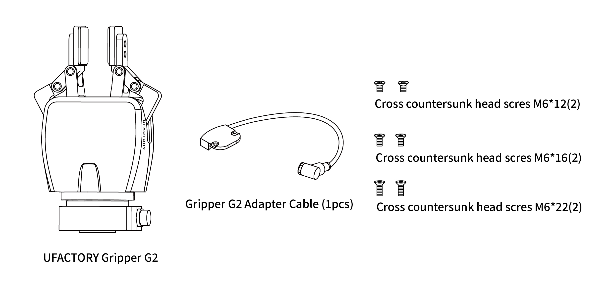
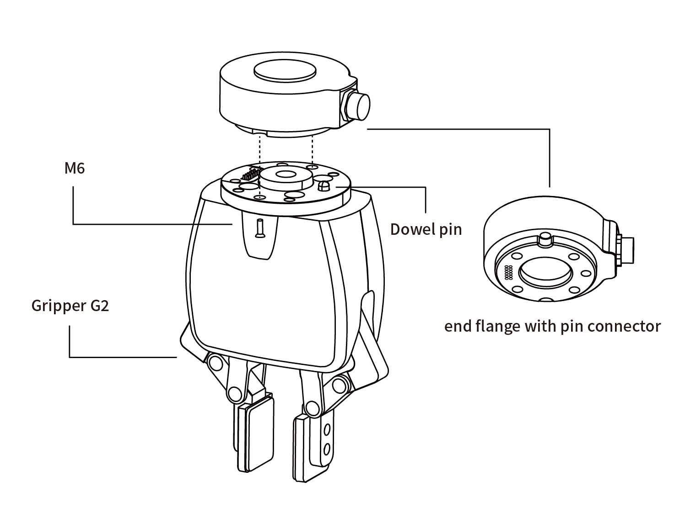
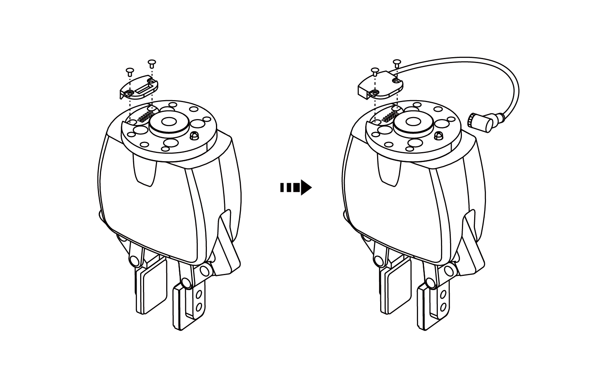
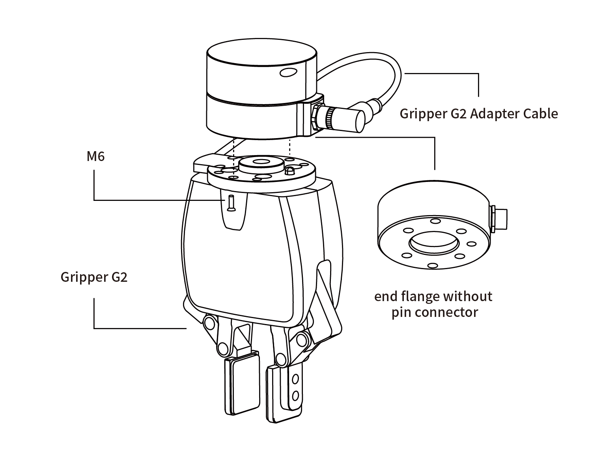

# 2. Installation

**WARNING**

Before installation:
* Read and understand all safety instructions related to Gripper G2.
* Verify the package contents against the packing list and purchase order.
* Prepare all required parts listed in the requirements.  

During installation:
* Meet the environmental conditions.
* Do not operate the gripper or power it on until it is securely mounted and the hazard area is cleared.
The gripper fingers may move and cause injury or damage.

## 2.1. Packing List

The Gripper G2 kit typically includes the following items (as shown in the figure below):
* UFACTORY Gripper G2 (1 unit)
* Gripper G2 adapter cable (spare)
* Cross recessed head screw M6*12 (2 pcs)
* Cross recessed head screw M6*16 (2 pcs)
* Cross recessed head screw M6*22 (2 pcs)

## 2.2. Mechanical Installation

### 2.2.1 Installation Preparation
1. Move the robotic arm to a safe position (avoid contact with the installation surface or other equipment);
2. Power off the robotic arm (press the emergency stop button on the controller);

### 2.2.2 Installation

* **For contact-type arm ends (UF850, XX1305):**  
  Secure the gripper to the robotic arm end using 2 M6 screws.  
  

* **For non-contact-type arm ends (XX1304 or below):**  
  1. Remove the two screws on the Gripper G2 flange, take off the black cover, and replace it with the silver cover and Gripper G2 adapter cable;  
    
  2. Secure Gripper G2 to the robotic arm end using 2 M6 screws;  
  3. Connect the Gripper G2 adapter cable to the robotic arm end.  
  

**CAUTION:**  
1. Always power off the robotic arm during Gripper G2 installation. Ensure the emergency stop button is pressed and the power indicator is off to prevent failures caused by hot-plugging.  
2. When connecting Gripper G2 to the robotic arm, ensure alignment of positioning holes on both interfaces. The male pins on the Gripper G2 cable are delicate – avoid bending them during installation/removal.  

## 2.3. Electrical Setup

### 2.3.1 Contact-Type Interface
Contact-type interface definition:  
  
Signals used by Gripper G2: Two 24V, two GND, T_A, T_B.

### 2.3.2 Aviation Plug Interface
The Gripper G2 aviation plug interface is shown below.  
  

The 12 wires inside the cable have different colors representing different functions. Refer to the table below:  

| Pin | Color    | Signal               |
|-----|----------|----------------------|
| 1   | Brown    | +24V (Power)        |
| 2   | Blue     | +24V (Power)        |
| 3   | White    | 0V (GND)            |
| 4   | Green    | 0V (GND)            |
| 5   | Pink     | User 485-A          |
| 6   | Yellow   | User 485-B          |
| 7   | Black    | Tool Output 0 (TO0) |
| 8   | Gray     | Tool Output 1 (TO1) |
| 9   | Red      | Tool Input 0 (TI0)  |
| 10  | Purple   | Tool Input 1 (TI1)  |
| 11  | Orange   | Analog Input 0 (AI0)|
| 12  | Light Green| Analog Input 1 (AI1)|

Signals used by Gripper G2: 24V (PIN1 and PIN2), GND (PIN3 and PIN4), 485A (PIN5), 485B (PIN6).