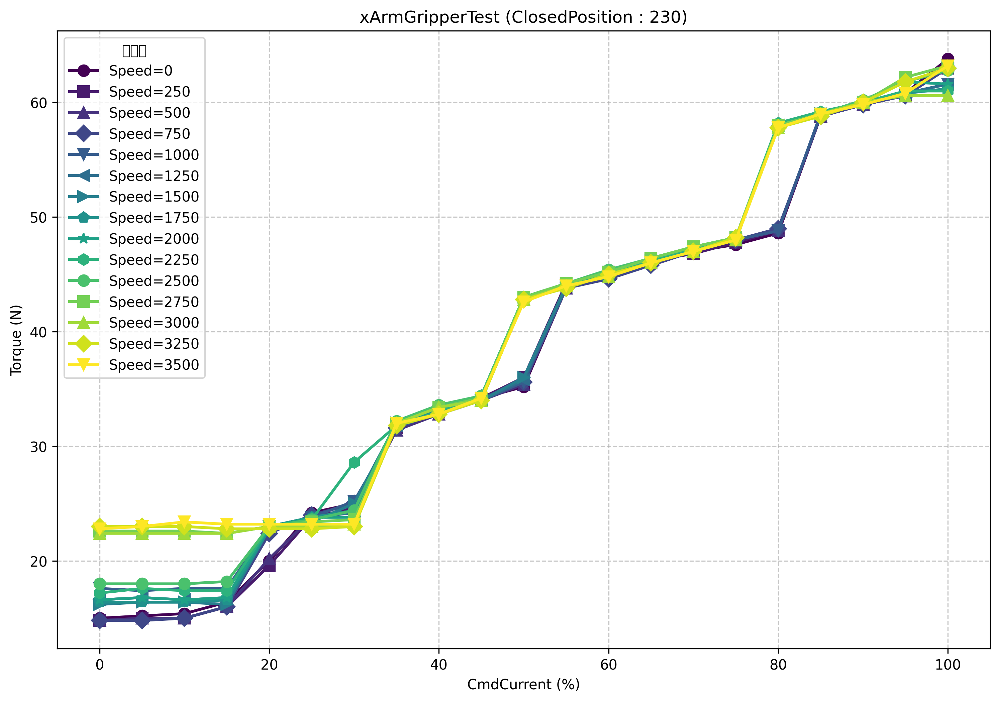
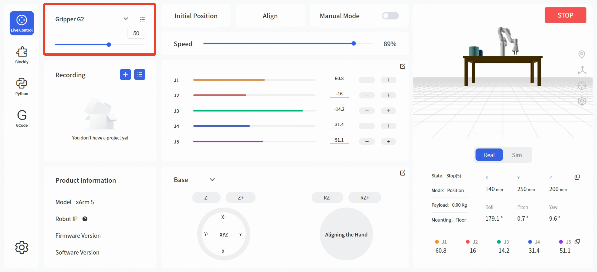
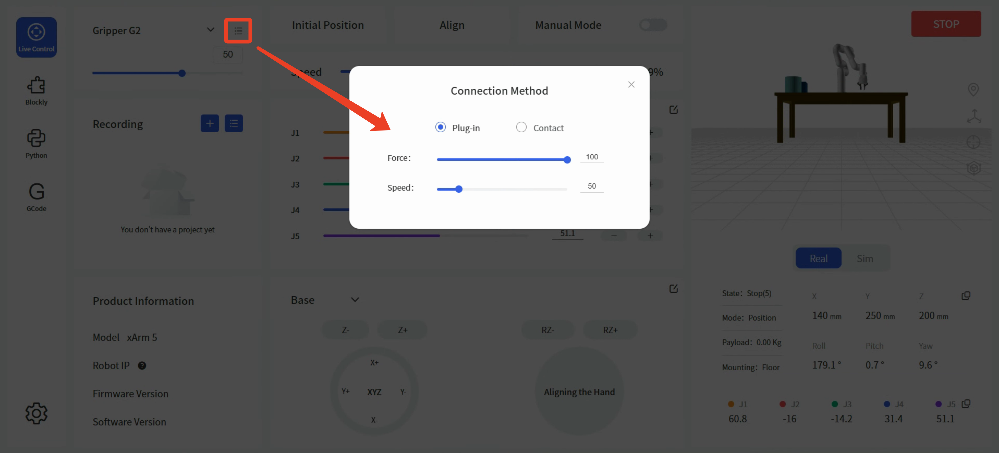
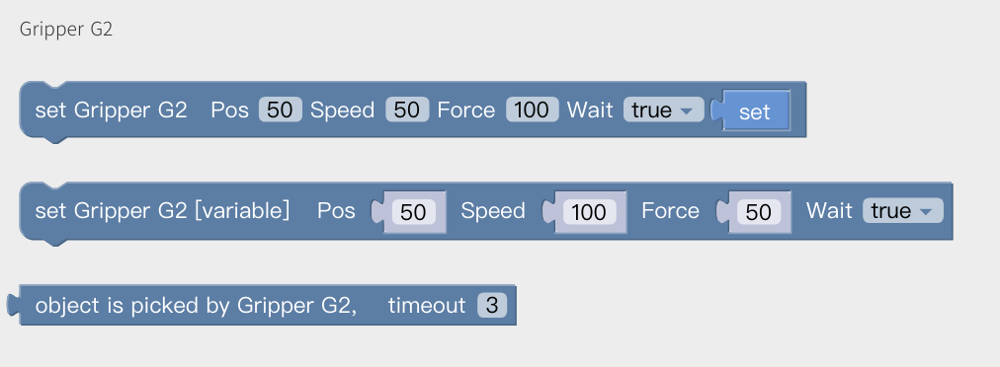
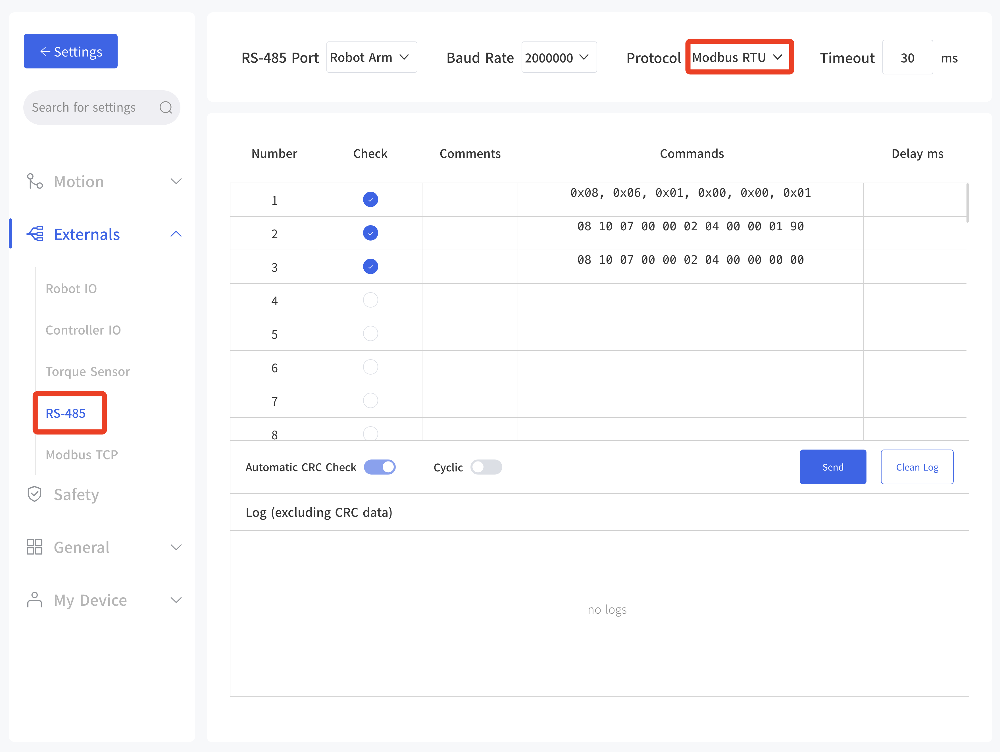
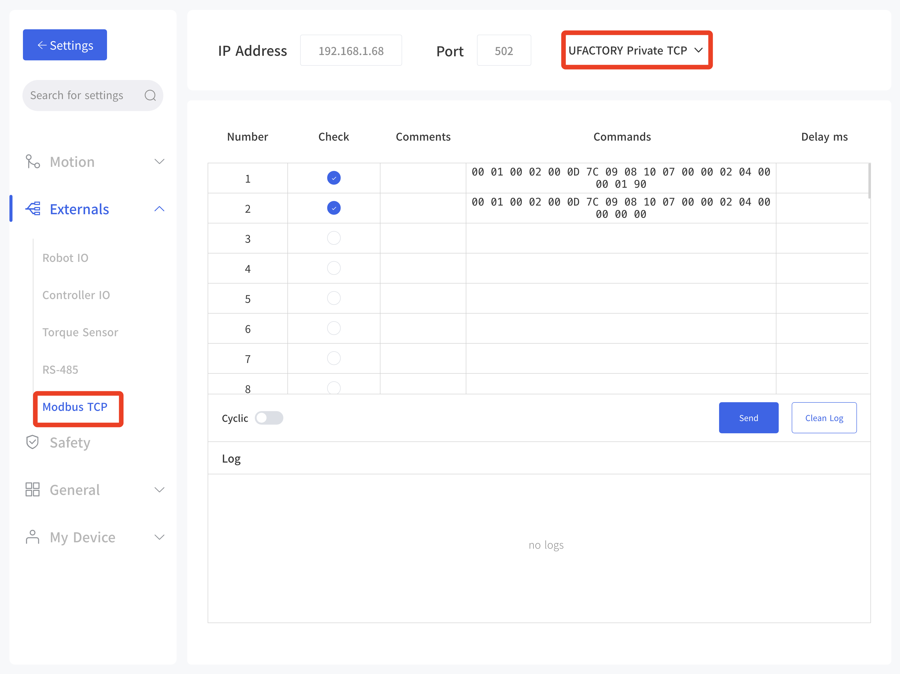

# 3. Control Methods

Programmable Parameters:
* Position: 0-840mm;
* Speed: 15-225mm/s;
* Force: 1-100 (percentage), The force setting value is expressed as a percentage, so refer to the following chart for the corresponding actual force.


## 3.1 UFACTORY Studio

### 3.1.1 Live Control
Enter the Live control page, select Gripper G2, and perform position control (range 0-840).  
Click the button in the upper right corner to select connection mode and adjust gripping force/speed.  
  


### 3.1.2 Blockly Control
Blockly provides 3 blocks for Gripper G2 control:
* Set Gripper G2 pos[] speed[] force[] wait[]
* Set Gripper G2 [variable] pos[] speed[] force[] wait[]
* Object gripped by Gripper G2 timeout[]  


### 3.1.3 Modbus RTU Control
Go to Settings -> External Devices -> RS485, select Modbus RTU protocol, and send corresponding commands.  
Refer to Chapter 4: Modbus RTU Protocol for details.  


### 3.1.4 UFACTORY Private TCP Control
Go to Settings -> External Devices -> Modbus TCP, select 'UFACTORY Private TCP', and send proprietary TCP commands.  
Refer to Appendix for UFACTORY Private TCP details.  


## 3.2 Python SDK

Common interfaces (Python SDK ≥ 1.16.0):  
`set_gripper_g2_position`: Set Gripper G2 position, force, and speed  
`get_gripper_g2_position`: Get current Gripper G2 position  

Python example:
```python
import os
import sys

sys.path.append(os.path.join(os.path.dirname(__file__), '../../..'))

from xarm.wrapper import XArmAPI

arm = XArmAPI('192.168.1.68')
arm.motion_enable(enable=True)
arm.set_mode(0)
arm.set_state(state=0)

code = arm.set_gripper_enable(True)
print('set gripper enable, code={}'.format(code))

code = arm.set_gripper_g2_position(80, wait=True, speed=200, force=80)
print('set gripper, code={}'.format(code))

print('position=', arm.get_gripper_g2_position())