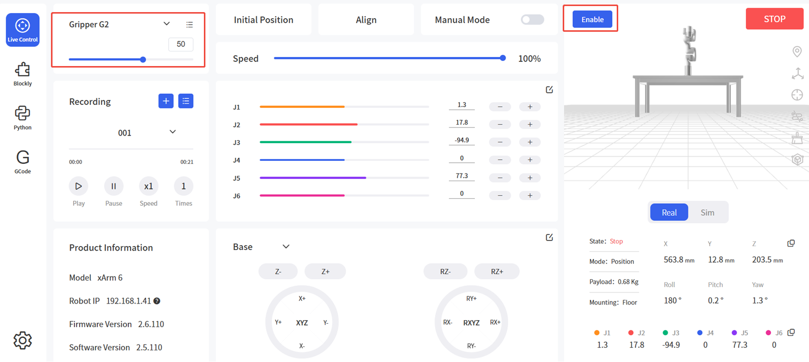

# 5. Errors and Handling

## 5.1 Error Codes

| **Software Error Code** | **Alarm Code** | **Handling Instructions**                                       |
| ----------------------- | -------------- | --------------------------------------------------------------- |
| G9                      | 0x09           | Gripper current detection abnormal. Restart arm via emergency stop button. |
| G11                     | 0x0B           | Gripper overcurrent. Click "Confirm" to re-enable gripper.      |
| G12                     | 0x0C           | Gripper overspeed. Click "Confirm" to re-enable gripper.        |
| G14                     | 0x0E           | Position command too large. Click "Confirm" to re-enable gripper. |
| G15                     | 0x0F           | Gripper EEPROM R/W error. Click "Confirm" to re-enable gripper. |
| G20                     | 0x14           | Driver IC hardware error. Click "Confirm" to re-enable gripper. |
| G21                     | 0x15           | Driver IC initialization error. Click "Confirm" to re-enable gripper. |
| G23                     | 0x17           | Excessive position deviation. Check for obstructions. If clear, click "Confirm" to re-enable. |
| G25                     | 0x19           | Command exceeds software limit. Verify position settings.       |
| G26                     | 0x1A           | Feedback position exceeds software limit.                       |
| G33                     | 0x21           | Driver overload.                                                |
| G34                     | 0x22           | Motor overload.                                                 |
| G36                     | 0x24           | Driver type error. Click "Confirm" to re-enable gripper.        |

For alarm codes not listed above: Re-enable the robotic arm and gripper. Contact technical support if errors persist.

## 5.2 Error Handling

### 5.2.1 Clearing Errors via UFACTORY Studio

1. Power cycle the robotic arm using the emergency stop button on controller.  
2. Enable the arm: Click the guide button in the error popup or the enable button on Live Control page.  
3. Select Gripper G2 and  control.  


### 5.2.2 Clearing Errors via xArm-Python-SDK

Clearing steps: ([Python-SDK API](https://github.com/xArm-Developer/xArm-Python-SDK/blob/master/doc/api/xarm_api.md))

1. Power cycle robotic arm using emergency stop button  
2. Clear errors: `clean_error()`  
3. Re-enable arm: `motion_enable(enable=True)`  
4. Set motion mode: `set_mode(0)`  
5. Set motion state: `set_state(0)`  
6. Enable Gripper G2: `set_gripper_enable(enable=True)`  

Python example:
```python
import os
import sys
import time

sys.path.append(os.path.join(os.path.dirname(__file__), '../../..'))

from xarm.wrapper import XArmAPI

arm = XArmAPI('192.168.1.68')
arm.clean_error() # Clear errors
arm.motion_enable(enable=True) # Re-enable robotic arm
arm.set_mode(0) # Set motion mode
arm.set_state(0) # Set motion state
arm.set_gripper_enable(True)  # Enable Gripper G2
```