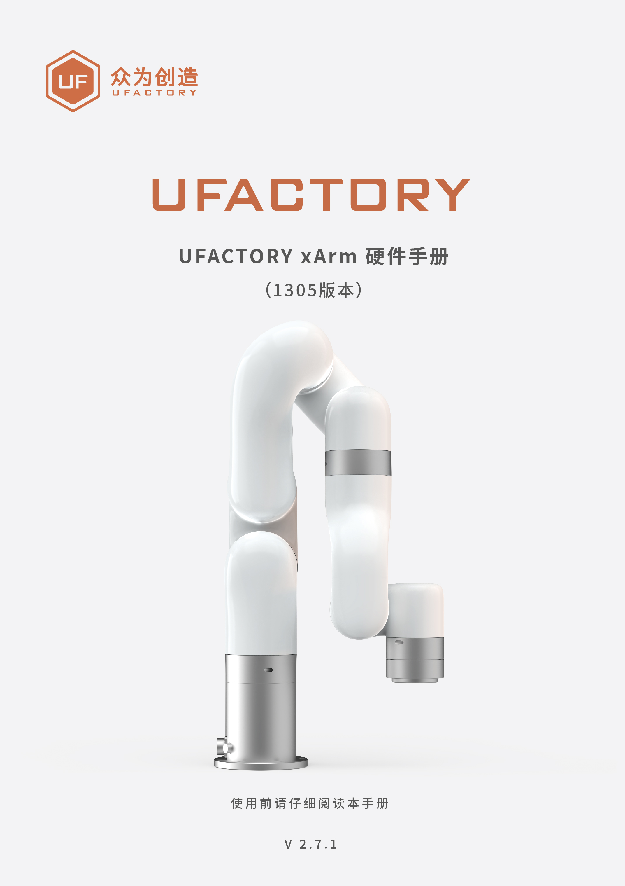

# 前言

适用产品：XF1305，XI1305，XS1305。  
控制器：AC1320, DC1320。

**关节范围：**

| 机械臂 | xArm 5     | xArm 6     | xArm 7     |
| --- | ---------- | ---------- | ---------- |
| J1  | ±360°      | ±360°      | ±360°      |
| J2  | -117°～116° | -117°～116° | -117°～116° |
| J3  | -219°～10°  | -219°～10°  | ±360°      |
| J4  | -97°～180°  | ±360°      | -6°～225°   |
| J5  | ±360°      | -97°～180°  | ±360°      |
| J6  | -          | ±360°      | -97°～180°  |
| J7  | -          | -          | ±360°      |

**运动参数：**
|            | TCP运动         | Joint运动     |
| ---------- | ------------- | ----------- |
| 速度（speed）  | 0～1000mm/s    | 0～180°/s    |
| 加速度（acc）   | 0～50000mm/s²  | 0～1145°/s²  |
| 加加速度（jerk） | 0～100000mm/s³ | 0～28647°/s³ |
* 在TCP运动（即笛卡尔空间运动）指令（SDK的set_position()函数）中，如果同时包含位置变化和姿态变化，一般情况下姿态旋转速度由系统自动算出。此时指定的速度参数为最大位置线速度，范围为：0～1000mm/s。 
* 当期望的TCP运动仅限于姿态（roll , pitch, yaw）变化，而位置(x, y, z)保持不变时，此时指定的速度参数为姿态旋转速度，所以范围0～1000mm/s对应0～180°/s。

**单位使用说明：**
| 参数              | Python-SDK   | Blockly      | 通信协议          |
| --------------- | ------------ | ------------ | ------------- |
| X（Y/Z）          | 毫米（mm）       | 毫米（mm）       | 毫米（mm）        |
| Roll（Pitch/Yaw） | 度（°）         | 度（°）         | 弧度（rad）       |
| J1~J7           | 度（°）         | 度（°）         | 弧度（rad）       |
| TCP速度           | 毫米/秒（mm/s）   | 毫米/秒（mm/s）   | 毫米/秒（mm/s）    |
| TCP加速度          | 毫米/秒²（mm/s²） | 毫米/秒²（mm/s²） | 毫米/秒²（mm/s²）  |
| TCP加加速度         | 毫米/秒³（mm/s³） | 毫米/秒³（mm/s³） | 毫米/秒³（mm/s³）  |
| 关节速度            | 度/秒（°/s）     | 度/秒（°/s）     | 弧度/秒（rad/s）   |
| 关节加速度           | 度/秒²（°/s²）   | 度/秒²（°/s²）   | 弧度/秒²（rad/s²） |
| 关节加加速度          | 度/秒³（°/s³）   | 度/秒³（°/s³）   | 弧度/秒³（rad/s³） |
