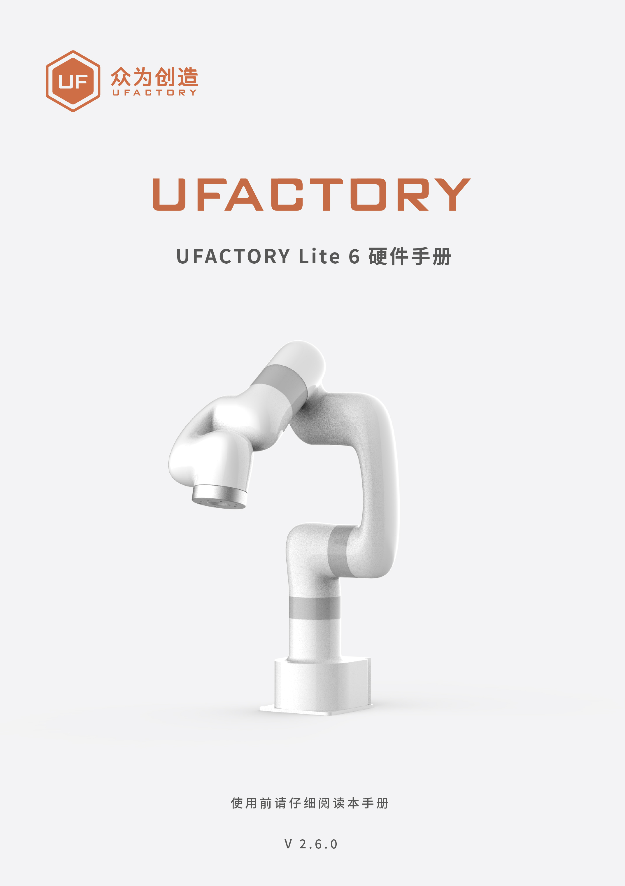

# 前言

适用产品：UFACTORY Lite6

**关节范围：**

| 关节  | 范围         | 关节  | 范围    |
| --- | ---------- | --- | ----- |
| J1  | ±360°      | J4  | ±360° |
| J2  | ±150°      | J5  | ±124° |
| J3  | -3.5°~300° | J6  | ±360° |

**运动参数：**

| 参数         | TCP运动         | Joint运动     |
| ---------- | ------------- | ----------- |
| 速度（speed）  | 0～500mm/s     | 0～180°/s    |
| 加速度（acc）   | 0～50000mm/s2  | 0～1145°/s2  |
| 加加速度（jerk） | 0～100000mm/s3 | 0～28647°/s3 |
* TCP运动指令如果同时包含位置变化和姿态变化，一般情况下姿态旋转速度由系统自动算出。 此时指定的速度参数为最大位置线速度，范围为：0～500mm/s。 
* 当期望的TCP运动仅限于姿态（roll , pitch, yaw) 变化，而位置(x, y, z)保持不变时，此   时指定的速度参数为姿态旋转速度，所以范围0～500mm/s对应0～180°/s。

**单位使用说明：**
Python/Blockly示例及通信协议中各参数单位。
| 参数                     | Python-SDK   | Blockly      | 通信协议          |
| ---------------------- | ------------ | ------------ | ------------- |
| X（Y/Z）                 | 毫米（mm）       | 毫米（mm）       | 毫米（mm）        |
| Roll（Pitch/Yaw）        | 度（°）         | 度（°）         | 弧度（rad）       |
| J1（J2 /J3/J4/J5/J6/J7） | 度（°）         | 度（°）         | 弧度（rad）       |
| TCP速度                  | 毫米/秒（mm/s）   | 毫米/秒（mm/s）   | 毫米/秒（mm/s）    |
| TCP加速度                 | 毫米/秒²（mm/s²） | 毫米/秒²（mm/s²） | 毫米/秒²（mm/s²）  |
| TCP加加速度                | 毫米/秒³（mm/s³） | 毫米/秒³（mm/s³） | 毫米/秒³（mm/s³）  |
| 关节速度                   | 度/秒（°/s）     | 度/秒（°/s）     | 弧度/秒（rad/s）   |
| 关节加速度                  | 度/秒²（°/s²）   | 度/秒²（°/s²）   | 弧度/秒²（rad/s²） |
| 关节加加速度                 | 度/秒³（°/s³）   | 度/秒³（°/s³）   | 弧度/秒³（rad/s³） |