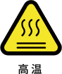

# 1. 安全

## 1.1 有效性和责任
本手册不包含设计、安装和操作一个完整的机器人应用规划，也不包含可能对应用规划的安全造成影响的周边设备。该应用规划应符合机器人安装所在国的标准和规范中确立的安全要求。  

集成商和用户有责任确保遵守国家相关的切实可行的法律法规，确保完整的一套机器人应用规划在安全情况下：  
这包括但不限于以下内容： 
* 对完整的应用规划做安全评估，与人交互时，确保路径规划与人的安全距离； 
* 将风险评估定义的其他机械和附加安全设备连接在一起；
* 在使用软件编程时，认真阅读理解接口说明，建立适当的安全设置；
* 明确使用说明，确保不会因操作不当造成不必要的财产损失和人身安全；

## 1.2 责任限制
该手册所包含的所有安全方面的信息都不得视为UFACTORY的保证，即使遵守所有的安全指示，作业操作者所造成的伤害或损害依然有可能发生。    

| 标志    |                                           |
| --- | ----------------------------------------- |
|       | **危险：** 可能引起的危险用电情况，如不可避免，可导致人员伤亡或设备严重损害。 |
|       | **警告：** 可能引发的危险情况，如不可避免，可导致人员伤亡或设备严重损害。   |
|      | **高温：** 可能引发危险的热表面，如果触碰，可造成人员伤害。          |
|      | **注意：** 如不避免，可能导致人员伤害或设备损坏。               |
|     | **小心：** 如不避免，可能导致人员伤害或设备损坏。               |

## 1.3 一般警告和提醒
该章节包含安装机器人和机器人应用规划时的注意事项，预防机器及相关设备损坏的安全设施，用户需要阅读说明书里的相关描述并完全悉知安全事项。相关情况描述无法面面俱到，具体问题需要具体分析。  

**危险**  
* 务必按照本手册指示和要求，正确安装机器人和所有电气设备。  
* 需要有专业的人员按照标准对机器人进行安装和测试。
* 确保机械臂的活动空间不会碰撞到其他设备或者周边人群。
* 首次启动系统和设备前，必须检查设备和系统是否完整，操作是否安全，检查机器人和其他设备系统是否遭到损坏。
* 在使用机器人及投入生产前需要对机器人及周边防护系统进行初步测试和检查。
* 在使用SDK(Python/ROS/C++)和图形化界面UFactory Studio时，操作人员必须要经过相应培训，必须确保输入的参数和操作流程是正确的。
* 机器人重新安装和调试后，需要再次进行全面的安全评估并保留文件记录。
* 机器人在运行期间发生意外或运行不正常的情况下，可以按下紧急停止按钮，机械臂姿态会轻微刹车下坠。
* 在机器人作业的时候，切勿有人或者其他设备出现在作业范围内。
* 在释放机器人刹车时，请注意做好机械臂保护措施，避免高处掉落造成人员伤亡或设备损坏。
* 将不同的机械连接在一起可能会加重危险或者引发新危险。应始终对安装系统做全面的安全评估。

**警告**   
* 机器人和控制器在运行的过程中会产生热量，机器人在工作时或刚停止工作时，请不要触摸机械臂和控制器。
* 切勿将手指伸到末端执行器连接处。

**注意**  
* 确保正确安装机器人，检查所有的电路情况
* 确保安装的环境，机械臂有足够的活动空间。
* 确保机械臂工作空间没有障碍物。
* 控制器必须放置在机械臂运动范围之外，以防出现紧急情况不能及时按下急停按钮
* 运行过程中，如果紧急停止，务必确保在该姿态下的机器人，重新启动或复位零点时不会碰撞到障碍物。
* 切勿改动机器人，对机器人的改动可能造成的集成商无法预料的危险，机器人授权重组需依照最新版的所有相关服务手册。如果机器人以任何方式被改变或改动，我司拒绝承担一切责任。
* 在机器人运输或搬运过程中，做好防撞防水措施。

**小心**
* 当机器人与其他机械协作时，应对整个协助系统做全面的安全评估。建议在应用规划时，对可能造成机械损坏的设备放置在机械臂工作范围以外的地方。

## 1.4 人员安全  
在操作或者运行机器人时，首先必须要确保作业人员的安全，下面列出一般性注意事项，请妥善采取确保作业人员安全的相应措施。

**注意**  
* 使用机器人系统的作业人员，应仔细阅读产品用户手册。需确保其充分掌握安全、规范的操作流程，以及机器人运行报错的处理方式。
* 在设备运转之中，即使机器人看上去已经停止，也有可能是因为机器人在等待启动信号而处在即将动作的状态。即使在这样的状态下，也应该将机器人视为正在动作中。
* 标清机器人的工作空间，使操作者了解机械臂及包含末端执行器（机械爪、真空吸头等）的动作范围。
* 定期检查机器人，防止固定机械臂或工具的螺栓松动而导致不良后果。
* 在机器人运行速度过快时，务必小心谨慎。
* 机器人意外断电，或因夹持不稳，导致物品掉落。

**警告**  
* 不要改变控制器安全配置中的任何信息。如果配置文件参数变更，整个机器人系统应被视为新系统，这就意味着所有安全审核过程，比如风险评估，都必须更新。 
* 使用部件号相同的新部件或 UFACTORY批准的相当部件替换故障部件。
* 书面记录所有维修操作，并将其保存在整个机器人系统相关的技术文档中。

**危险**    
* 从控制器移除主输入电缆以确保其完全断电，采取必要的预防措施以避免其他人在维修期间重新接通系统电源。
* 重新开启系统前请检查接地连接。
* 拆分机械臂或控制器时请遵守 ESD (静电释放)法规。
* 避免拆分控制器内的供电系统。控制器关闭后其供电系统仍可留存高压达数小时。
* 避免水或粉尘进入机械臂或控制器。

