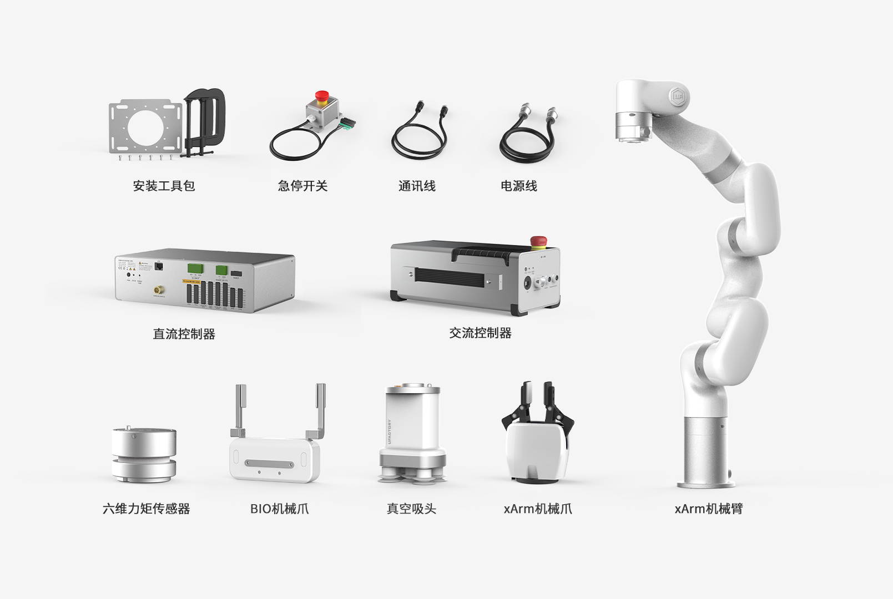
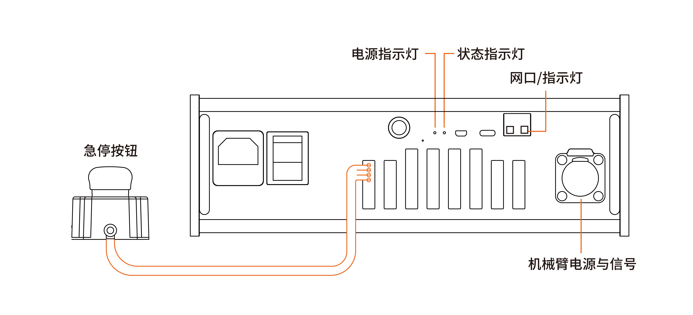
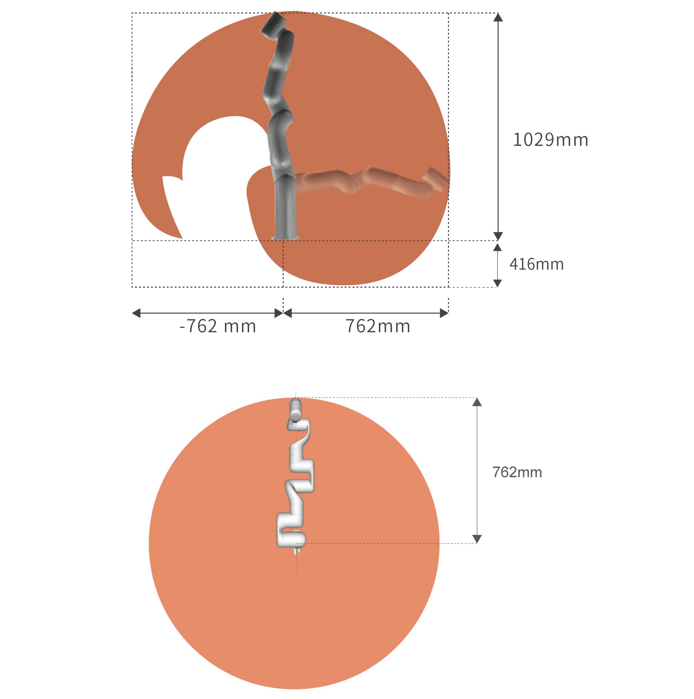
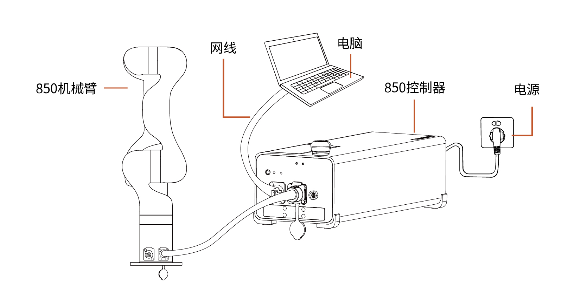
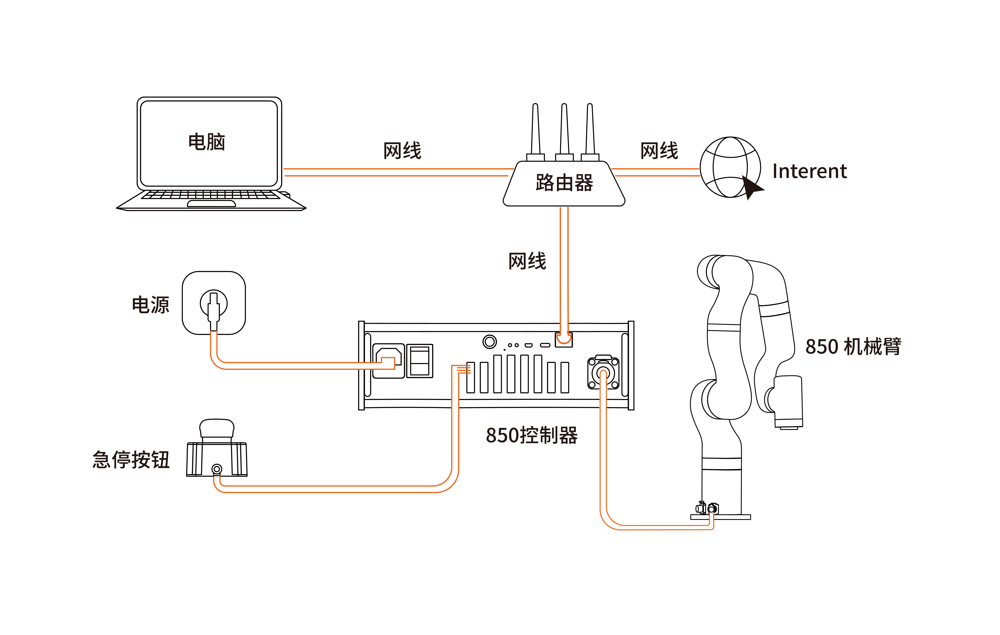
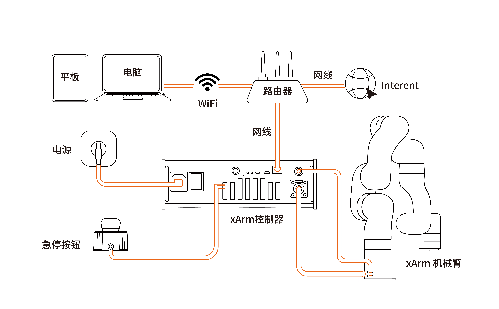
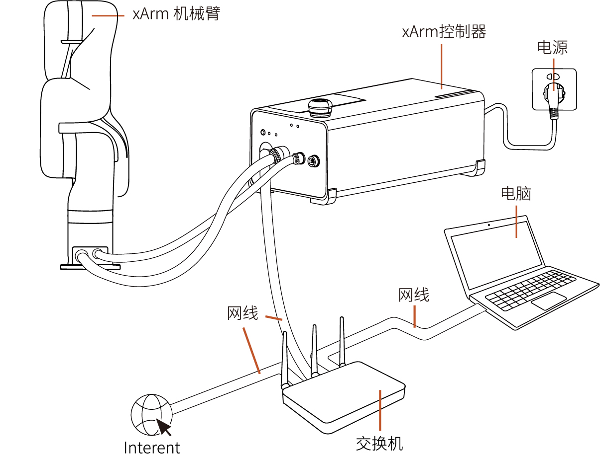
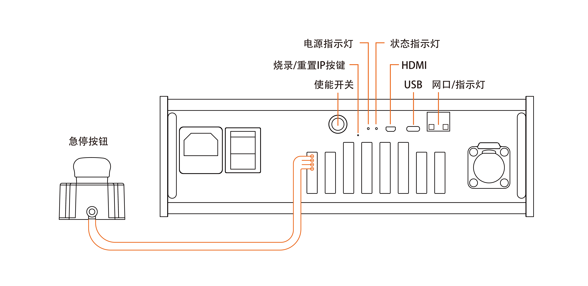

# 2. 硬件组成和安装
适用产品：XF1305，XI1305，XS1350 (1305版本)。
控制器：AC1320，DC1320。

## 2.1 硬件组成
### 2.1.1 硬件组成
机械臂主要包含的部件如下：（以发货清单为准）

* xArm机械臂
* 交流控制器
* 直流控制器
* xArm直线滑轨控制器
* 急停开关
* 机械臂电源线
* 机械臂通讯线
* DC13电源转接线
* DC13信号转接线
* 网线
* 安装工具包
* 末端执行器（六维力矩、BIO G2机械爪、真空吸头、xArm G2机械爪）

机械臂由底座和旋转关节组成，每个关节表示一个自由度，从底座往上依次表示关节1、关节2、关节3...。最后一个关节也叫工具端，用于连接末端执行器（机械爪，真空吸头等）。

### 2.1.2 紧急停止按钮
按下控制器的急停按钮，会立刻停止机械臂的一切活动，且清空控制器里所有的缓存指令，随后300ms左右断开机械臂供电电源。紧急停止不可作为风险降低措施，机械臂运行过程中出现紧急情况时，可按下紧急停止按钮，机械臂姿态会轻微刹车下坠。紧急停止按钮如下图所示：

**控制器指示灯说明**

| 指示灯      | 标签名称      | 功能           |
| -------- | --------- | ------------ |
| 机械臂电源指示灯 | ROBOT PWR | 灯亮，表示机械臂已上电  |
| 机械臂状态指示灯 | STATE     | 灯闪烁，表示控制器已开机 |
| 网口指示灯    | LAN       | 灯亮，表示机械臂通讯正常 |

**急停：** 按下急停按钮，电源指示灯熄灭，机械臂不在供电状态。  
**上电：** 按箭头指示方向旋转后急停按钮呈弹起态，机械臂电源指示灯亮起，机械臂为供电状态。

按下急停按钮后，再次使用机械臂时要进行以下操作：
* 重新给机械臂上电（按箭头指示方向旋转松开急停按钮）
* 使能机械臂（使能伺服电机），使用UFactory Studio的使能按钮或使用Python SDK的`motion_enable(true)`接口。

## 2.2 xArm安装

### 2.2.1 安装说明
**危险**  
* 确保机器人正确并安全地安装到位。安装表面必须是防震坚固的。
* 安装机器人必须检查螺栓是否拧紧。
* 将机械臂安装在一个坚固的表面，该表面应当足以承受至少 10 倍的机座关节的完全扭转力，以及至少 5 倍的机械臂的重量。

**警告** 
* 机器人切勿直接触碰液体，不应长期放置在潮湿环境。
* 每次安装完都需要进行安全评估。在连接、断开机器人电缆时，确保已断开外部交流电的连接。切勿在连接了外部交流电的情况下去连接或者断开机器人电缆，以免触电发生危险。  

### 2.2.2 确定机械臂工作空间
机械臂工作空间是指在关节延伸范围内的区域。下图为机械臂的尺寸图和工作范围图。在安装时，务必考虑机械臂的运动范围，以免磕碰到周围人员和设备（以下工作范围不包括末端执行器）。
* xArm7工作空间，单位mm

* xArm5/xArm6工作空间，单位mm

### 2.2.3 安装机械臂
简要步骤：
1. 确定好机械臂工作空间
2. 固定机械臂底座，安装机械臂
3. 机械臂与控制器连接
4. 控制器连接电缆、网线
5. 安装末端执行器

#### 2.2.3.1 固定机械臂
机械臂使用5颗M5螺栓，通过机械臂基座上的5个Ф5.5孔用安装工具夹来安装机械臂。建议以 20Nm 扭矩紧固这些螺栓。  
使用G字架或其他工具固定机械臂。

#### 2.2.3.2 连接控制器
1. 将机械臂供电电缆和机械臂通信电缆接头插入机械臂接口，接头具备防呆功能（每个接头都具有固定卡槽，请对准后再进行接线），已做限位处理，请勿暴力拆装。
2. 将机械臂供电电缆和机械臂通信电缆另一端接头插入控制器一侧的接口。
3. 将控制器电源电缆接头插入AC（110V-240V）接口，另一端插入插座插口。

#### 2.2.3.3 控制器连网
机械臂的网络设置方式有以下四种，可以根据实际情况选择合适的网络设置方式。
1. 控制器与PC端直连。**（推荐使用的连接方式）**

2. 控制器、PC与路由器通过网线连接，如下图：

3. PC（平板电脑）与路由器通过无线网络连接，控制器与路由器通过网线连接，如下图：  
注意：该连接方法有可能出现网络延时、丢包的现象。  

4. 控制器、PC与交换机通过网线连接，如下图：

## 2.3 机械臂系统上电

* 检查控制器与机械臂的电源电缆，通信线是否连接完好。
* 检查网络电缆是否连接完好。
* 检查控制器电源电缆是否连接完好。
* 确保机械臂在工作范围内不会碰到周围人员或设备。

### 2.3.1 系统上电
1. 打开控制器开关键，开关键ON/OFF灯亮起。
2. 检查状态指示灯是否亮起，若亮起表示控制器已开机。否则需手动按控制器电源按钮开机。
3. 急停按钮按照箭头指示方向旋转且向上拔起，此时机械臂电源指示灯亮起，机械臂上电。
4. 通过UFactory Stduio/SDK命令完成使能机械臂的操作。（使能伺服电机）

### 2.3.2 系统关机
1. 按下控制器上的急停按钮，机械臂电源指示灯熄灭。
2. 关闭控制器电源开关。关闭控制器电源开关需要5秒左右的时间来释放电源，关闭电源后请不要马上开机。
