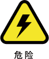
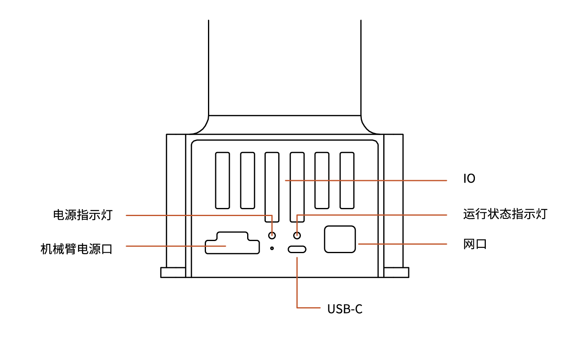
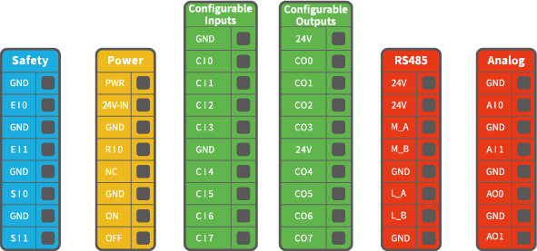
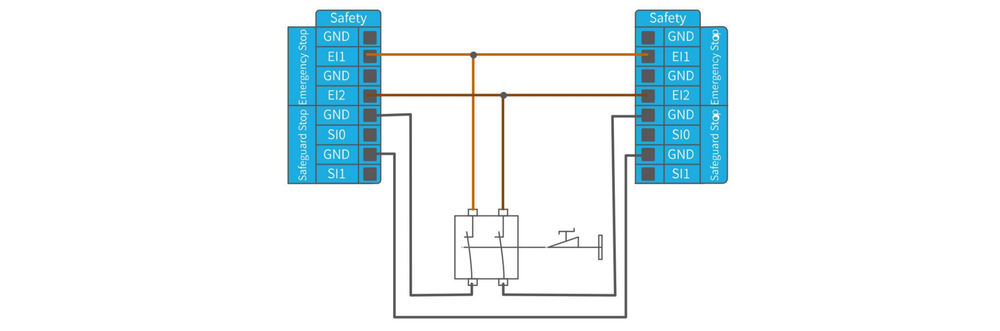
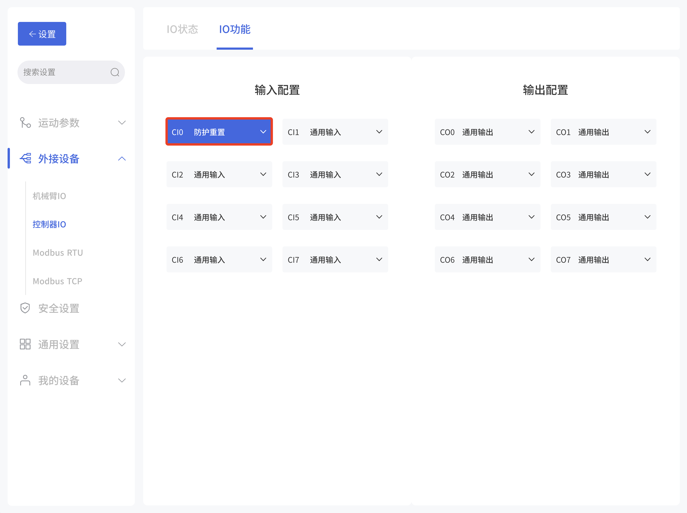
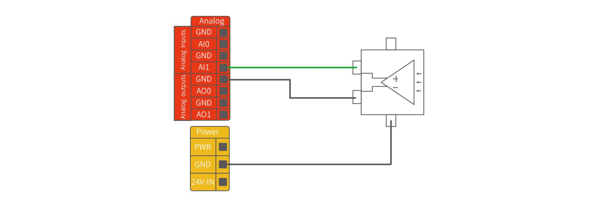
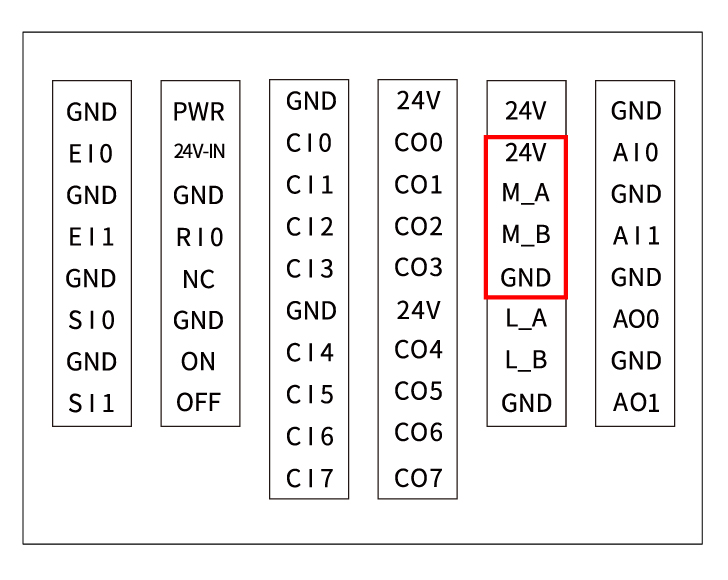
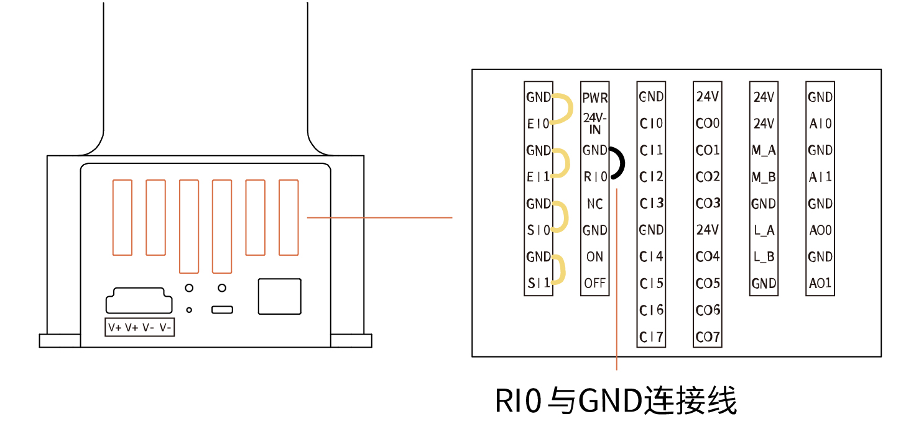
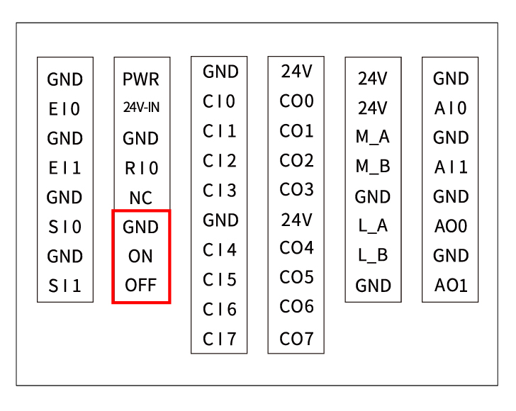

# 3. Lite6底座电气接口

## 3.1 电气警告和注意事项
在设计和安装机器人应用时，务必遵循以下警告和注意事项。实施维护作业同样要遵循这些警告和注意事项。

| 标志  |                                                                                                                                                                                         |
| --- | --------------------------------------------------------------------------------------------------------------------------------------------------------------------------------------- |
|     | 1. 请确保所有不得沾水的设备都保持干燥。如果有水进入产品，请切断电源，然后联系您的供应商。   2. 仅使用该机械臂的原装电缆。请不要在那些电缆需要弯折的应用中使用机械臂。如果需要更长的电缆或柔性电缆，可以联系您的供应商。   3. 本文提到的所有 GND 接头只适用于供电和传送信号。   4. 当向机械臂的 I/O 安装接口电缆时，务必小心。 |
|     | 1. 高于 IEC 标准中规定电平的干扰信号将会造成机械臂的异常行为。信号电平极高或过度暴露将会对机械臂造成永久性的损害。由 EMC 问题造成的任何损失，深圳市众为创造科技有限公司概不负责。   2. 用于连接控制器与其他机械和工厂设备的 I/O 电缆长度不得超过 30 米，除非进行延长测试后表明可行。                             |
|     | 控制器电气接口接线时，控制器必须断电。                                                                                                                                                                     |
|     | 切勿将安全信号连接到安全等级不合适的非安全型 PLC。如不遵守该警告，可能会因某项安全停止功能失效而导致人员严重受伤甚至死亡。    
## 3.2 通信接口
Lite6底座板提供千兆以太网接口,详见下图。

**机械臂电源指示灯：** 灯常亮红色，表示机械臂已上电。
**运行状态指示灯：** 灯闪烁，表示Lite6已开机。
**网口：** 灯亮，表示机械臂通讯正常。
**USB-C：** 用于刷系统，仅内部使用，不对外。

## 3.3 底座/控制器IO
本章说明了如何连接设备与控制器外部的 I/O。此 I/O 极其灵活，可用于多种不同的设备，其中包括气动继电器、PLC 和紧急停止按钮。
下图显示了控制器内部的电气接口布局。

可配置功能：

| 可配置功能 | CI0-CI7（可配置输入） | 可配置功能     | CO0 - CO7（可配置输出） |
| ----- | -------------- | --------- | ---------------- |
| 通用输入  | 有              | 通用输出      | 有                |
| 停止运动  | 有              | 运动停止      | 有                |
| 防护重置  | 有              | 运动中       | 有                |
| 离线任务  | 有              | 有警告       | 有                |
| 手动模式  | 有              | 发生碰撞      | 有                |
| 缩减模式  | 有              | 手动模式生效    | 有                |
| 使能机械臂 | 有              | 缩减模式生效    | 有                |
|       |                | 离线任务运行中   | 有                |
|       |                | 机械臂已使能    | 有                |
|       |                | 紧急停止按钮被按下 | 有                |

按照电气规范安装 Lite 6是非常重要的，这二类不同的输入都要做到这一点。数字 I/O 可由内部 24V 电源供电，也可通过配置电源接线盒由外部电源供电。上面（PWR）为内部的 24V 电源输出。下面的终端（24V-IN ）为供应 I/O 的 24V 输入外部电源输入。默认配置为使用内部电源，参见下文。

如果需要更大的电流，可如下图所示连接外部电源。

内部和外部电源的电气规范:

| 终端          | 参数  | 最小值 | 典型值 | 最大值 | 单位  |
| ----------- | --- | --- | --- | --- | --- |
| 内置 24V 电源   |     |     |     |     |     |
| [PWR - GND] | 电压  | 23  | 24  | 30  | V   |
| [PWR - GND] | 电流  | 0   | -   | 1.8 | A   |
| 外部 24V 输入要求 |     |     |     |     |     |
| [24V - 0V]  | 电压  | 20  | 24  | 30  | V   |
| [24V - 0V]  | 电流  | 0   | -   | 3   | A   |

控制器数字I/O电气规范：
（对于最大 1H 的电阻负载或电感性负载）

| 终端                | 参数         | 最小值 | 典型值     | 最大值 | 单位  |
| ----------------- | ---------- | --- | ------- | --- | --- |
| 控制器数字输出           |            |     |         |     |     |
| [COx]             | 电流         | 0   | -       | 100 | mA  |
| [COx]             | 电压降        | 0   | -       | 0.5 | V   |
| [COx]             | 漏电流        | 0   | -       | 0.1 | mA  |
| [COx]             | 功能         | -   | NPN（OC） | -   | 类型  |
| 控制器数字输入           |            |     |         |     |     |
| [EIx/SIx/CIx/RIx] | 电压         | 0   | -       | 30  | V   |
| [EIx/SIx/CIx/RIx] | OFF区域      | 15  | -       | 30  | V   |
| [EIx/SIx/CIx/RIx] | ON 区域(低电平) | 0   | -       | 5   | V   |
| [EIx/SIx/CIx/RIx] | 电流（0-0.5）  | 3   | -       | 8   | mA  |
| [EIx/SIx/CIx/RIx] | 功能         | -   | -       | -   | 类型  |

**警告：**  
控制器的数字输出端**没有电流限制**，若超过所规定的数据，可能会导致永久性损坏。
### 3.3.1 安全IO（EISI）
所有安全 I/O 成对存在（冗余），必须保留成两个独立的分支。单一故障应不会导致丧失安全功能。固定的安全输入有两个：机械臂紧急停止和防护停止。机械臂紧急停止输入仅用于紧急停止设备。防护停止输入用于所有类型的安全型保护设备。功能差异如下所示。

|         | 紧急停止   | 防护停止  |
| ------- | ------ | ----- |
| 机械臂停止运动 | 是      | 是     |
| 程序执行    | 停止     | 暂停    |
| 重置      | 手动     | 自动或手动 |
| 使用频率    | 不常使用   | 没有限制  |
| 需要重新初始化 | 仅释放制动器 | 否     |

**默认出厂安全配置**  
所交付的机械臂进行了默认配置，可在没有任何附加安全设备的情况下进行操作，请参阅下图，若手臂出现问题，请第一时间检查下图连线是否正确。

#### 3.3.1.1 连接紧急停止按钮
可用IO： EI1、EI2、SI0、SI1；  
在大多数应用中，需要使用一个或多个额外的紧急停止按钮。下图显示了如何连接一个或多个紧急停止按钮。

#### 3.3.1.2 与其他机器共享紧急停止
可用IO： EI1、EI2、SI0、SI1；  
当机械臂与其他机器搭配使用时，往往需要设置一条公共的紧急停止电路。下图显示了两台机械臂共享一个急停按钮（下图所示的连接方法同样适用于多台机械臂共享一个急停按钮）。

#### 3.3.1.3 可自动恢复的防护停止
门开关就是基本防护停止设备的一个例子，门打开时，机器人停止，请参见下图。

此配置仅针对操作员不能通过门并在身后关上门的应用。可配置的 I/O 可以用于设置门外的重置按钮，以重新激活机器人运动。适合进行自动恢复的另外一个例子是使用安全垫或安全型激光扫描仪，参见下图。

#### 3.3.1.4 带重置按钮的防护停止
如果使用防护接口与光幕交互，需要从安全地带外部进行重置。重置按钮必须为双通道型按钮。在本例中，将I/O 输入口CI0-CI1配置为防护停止（在UFactory studio中也要做相应的配置），参见下图。

如何实现带重置按钮的防护停止功能：
1. 在UFactory Studio里将CI0配置为防护重置，具体步骤如下图：
进入设置 - 外接设备 - 控制器IO - 将CI0配置为防护重置 - 点击保存。

1. 若需要机械臂恢复运动，则将SI0和SI1接地，并通过将CI0接地来触发机械臂运动；若需要机械臂暂停运动，则将SI0和SI1悬空。

### 3.3.2 数字输入输出（CICO）
#### 3.3.2.1 数字输入（CI）
数字输入以配有弱上拉电阻器的形式实现。这意味着浮置输入的读数始终为高。
本例显示了简单按钮与数字输入的连接方式。

#### 3.3.2.2 数字输出（CO）
控制器数字输出以**NPN**的形式实现。数字输出激活后，相应的接头即会被驱动接通 GND，数字输出端禁用后，相应的接头将处于开路（开集/开漏）。
下例说明了如何使用数字输出，因为内部输出为开漏输出，所以需要根据负载上接电阻到电源。电阻的大小及功率视具体使用情况。

注意：强烈推荐为电感性负载使用保护二极管，如下所示。

#### 3.3.2.3 与其他机器或PLC通信
如果建立了通用 GND （0V）并且机器采用开漏输出技术，则可使用数字 I/O 与其他设备通信，参见下图。

### 3.3.3 模拟IO（AIAO）
此类接口可用于设置或测量进出其他设备的电压（0-10V）。  
为获得最高准确度，建议遵循以下说明：
* 使用最靠近此 I/O 的 GND 终端。
* 设备和控制器使用相同的接地（GND）。
* 模拟 I/O 与控制器不进行电位隔离。
* 使用屏蔽电缆或双绞线。将屏蔽线与**电源**端子上的**GND**终端相连。

| 电压模式下的模拟输入 |     |     |     |     |     |
| ---------- | --- | --- | --- | --- | --- |
| 终端         | 参数  | 最小值 | 典型值 | 最大值 | 单位  |
| [AIx - AG] | 电压  | 0   | -   | 10  | V   |
| [AIx - AG] | 电阻  | -   | 10K | -   | Ω   |
| [AIx - AG] | 分辨力 | -   | 12  | 12  | 位   |

| 电压模式下的模拟输出 |     |     |      |     |     |
| ---------- | --- | --- | ---- | --- | --- |
| 终端         | 参数  | 最小值 | 典型值  | 最大值 | 单位  |
| [AOx - AG] | 电压  | 0   | -    | 10  | V   |
| [AOx - AG] | 电流  | 0   | -    | 20  | mA  |
| [AOx - AG] | 电阻  | -   | 100K | -   | Ω   |
| [AOx - AG] | 分辨力 | -   | 12   | -   | 位   |

#### 3.3.3.1 模拟输入示例
下例说明了如何连接模拟传感器(接AI0或者AI1)。

#### 3.3.3.2 模拟输出示例
下例说明了如何利用模拟速度控制输入来控制传送带(接AO0或者AO1)。

### 3.3.4 控制器RS485
控制器IO提供RS485接口，支持接入RS485通讯的第三方设备。
控制器的ID为10。

可用IO：
1. M_A
2. M_B
3. 24V
4. GND
   
**注意：**  
L_A和L_B为预留的RS485接口，暂时无功能，不可使用。
使用M_A和M_B时，机械爪只能当主机。

* 若第三方设备支持标准Modbus RTU协议，可通过UFACTORY Studio的[Modbus RTU](http://docs.usermanual.ufactory.cc/user_manual/ufactoryStudio/7.settings.html#_7-2-5-modbus-rtu)界面进行调试操作，RS-485端口选择控制盒。
* 如第三方设备不支持标准Modbus RTU协议，需要通过[getset_tgpio_modbus_data](https://github.com/xArm-Developer/xArm-Python-SDK/blob/master/example/wrapper/common/5000-set_tgpio_modbus.py)接口进行操作，并将is_transparent_transmission参数设置为True，host_id设置为10。

### 3.3.5 如何重置IP（RI0）
若更改了IP地址，务必在控制器上做好标注，以免出现不知道控制器IP地址的情况，如果忘记或丢失修改后的IP地址，可用下面的方法重置IP。

1. 按下急停开关，关闭Lite 6 电源。
2. 用导线将RI0与GND连接。

3. 开启Lite 6 控制器电源，旋转急停开关，听到“滴”的一声之后，表示控制器IP已经重置成功。重置后的IP 为：192.168.1.111。
4. 请拔掉连接RI0和GND的导线，等待控制器启动完成（60秒）即可。
5. 在浏览器中输入192.168.1.111:18333，连接机械臂。

### 3.3.6 如何远程开关机（ON/OFF）

* 开机：ON短接GND。
* 关机：OFF短接GND。