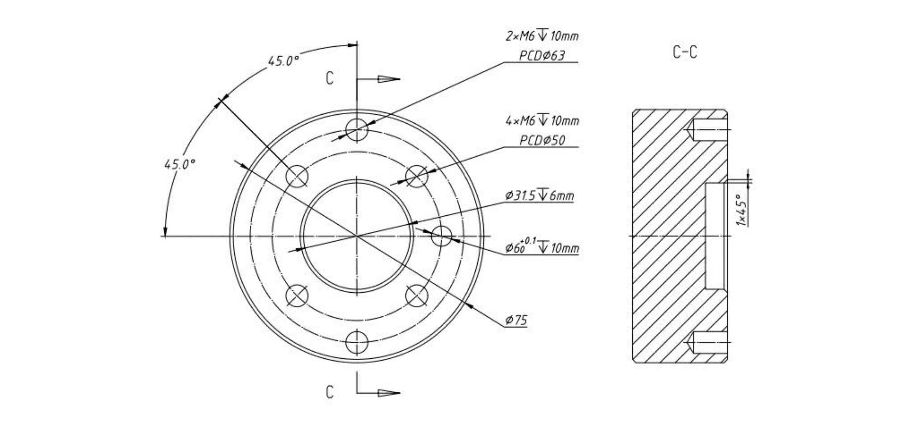
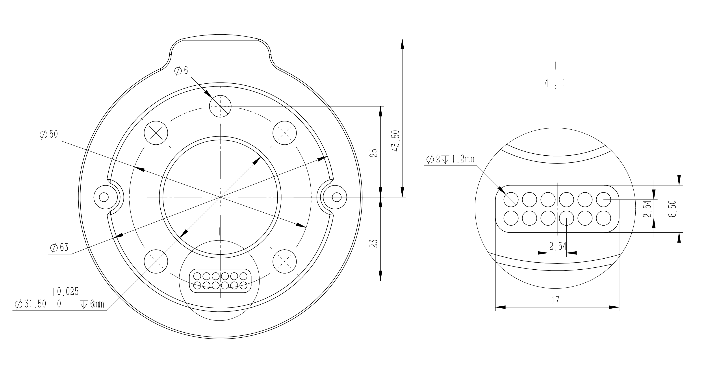
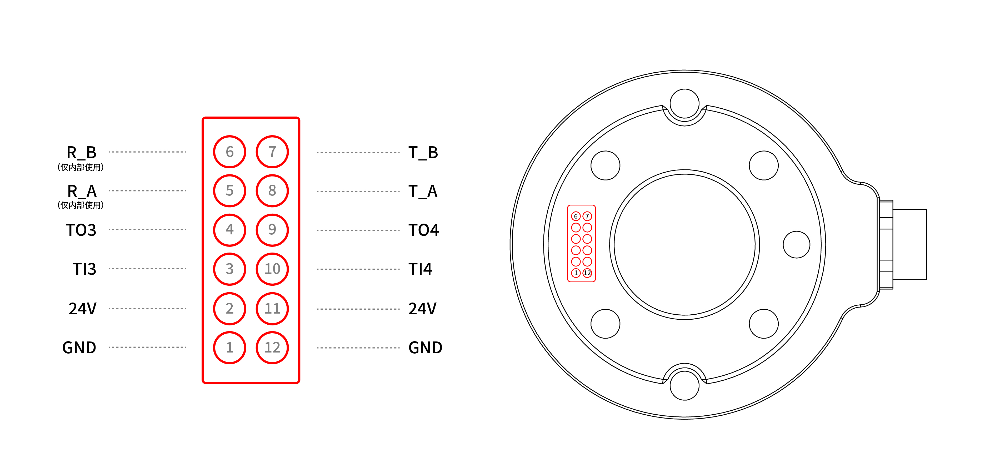

# 4. 机械臂电气接口

## 4.1 末端法兰
xArm机械臂末端工具法兰有6个 M6 螺纹孔和一个Ф6的定位孔，设计符合ISO 9409-1-50-4-M6标准。  

如果您的机械臂末端工具法兰与下图不同，请联系技术支持并提供您的机械臂SN以获取相应版本的使用手册。  

若您要安装的末端执行器没有定位孔，安装末端执行器的方向务必以文件形式存档，避免因为换人重新安装末端执行器时方向出现错误，导致运行结果完全出乎意料。  

## 4.2 工具IO
在机械臂的工具端，有一个航空插座12 芯的母工业连接器，为特定机械臂工具上使用的夹持器和传感器提供电源和控制信号。请参见下图。
  

电缆内部的12条线有不同颜色，不同颜色代表不同功能，请参见下表：
| 线序  | 颜色  | 信号       | 线序  | 颜色  | 信号         |
| --- | --- | -------- | --- | --- | ---------- |
| 1   | 棕   | +24V（电源） | 7   | 黑   | 工具输出0（TO0） |
| 2   | 蓝   | +24V（电源） | 8   | 灰   | 工具输出1（TO1） |
| 3   | 白   | 0V（GND）  | 9   | 红   | 工具输入0（TI0） |
| 4   | 绿   | 0V（GND）  | 10  | 紫   | 工具输入1（TI1） |
| 5   | 粉   | 用户485-A  | 11  | 橙   | 模拟输入0（AI0） |
| 6   | 黄   | 用户485-B  | 12  | 浅绿  | 模拟输入1（AI1） |

电气规格：
| 参数          | 最小值 | 典型值 | 最大值  | 单位  |
| ----------- | --- | --- | ---- | --- |
| 24V模式下的电源电压 | 20  | 24  | 30   | V   |
| 电源电流        | -   | -   | 1800 | mA  |

**注意**  
强烈推荐为电感性负载使用保护二极管。

**危险**   
连接工具和夹持器保证中断电源时不会导致任何危险，例如工件从工具上掉落。

### 4.2.1 工具数字输入（TI）
数字输入已配有下拉电阻器。这意味着浮置输入的读数始终为低。  

电气规格：

| 参数    | 最小值  | 典型值 | 最大值 | 单位  |
| ----- | ---- | --- | --- | --- |
| 输入电压  | -0.5 | -   | 30  | V   |
| 逻辑低电压 | -    | -   | 1.0 | V   |
| 逻辑高电压 | 1.6  | -   | -   | V   |
| 输入电阻  | -    | 47K | -   | Ω   |

下例显示了简单按钮的连接方法。  

### 4.2.2 工具数字输出（TO）
数字输出以 NPN 的形式实现，集电极开路。数字输出激活后，相应的接头即会被驱动接通 GND，数字输出端禁用后，相应的接头将处于开路（开集/开漏）。  

电气规格：  

| 参数             | 最小值 | 典型值  | 最大值 | 单位  |
| -------------- | --- | ---- | --- | --- |
| 开路时的电压         | -0.5 | -    | 30  | V   |
| 灌入 50mA 电流时的电压 | -   | 0.05 | 0.2 | V   |
| 灌电流            | 0   | -    | 100 | mA  |
| 通过 GND 的电流     | 0   | -    | 100 | mA  |

**警告：**  
工具数字输出端**没有电流限制**，若超过所规定的数据，可能会导致永久性损坏。

下例说明了如何使用工具数字输出，因为内部输出为集电集开路，所以需要根据负载上接电阻到电源。电阻的大小及功率视具体使用情况而定。

**注意：** 强烈推荐为电感性负载使用保护二极管，如下图所示。

### 4.2.3 工具模拟输入（TAI）
工具模拟输入为非差分输入。  
电气规范:

| 参数                    | 最小值  | 典型值 | 最大值 | 单位  |
| --------------------- | ---- | --- | --- | --- |
| 电压模式下的输入电压            | -0.5 | -   | 3.3 | V   |
| 分辨力                   | -    | 12  | -   | 位   |
| 电流模式下的输入电流            | -    | -   | -   | mA  |
| 4mA 至 20mA 电流范围内的下拉电阻 | -    | -   | 165 | Ω   |
| 分辨力                   | -    | 12  | -   | 位   |

下例显示了模拟传感器与**非差分输出**的连接方式。
* 电压模式

* 电流模式
  

下例显示了模拟传感器与**差分输出**的连接方式。将负输出端连接至 GND （0V），即可像非差分传感器一样工作。 
* 电压模式

* 电源模式

### 4.2.4 工具端RS485
工具末端提供RS485接口，支持接入RS485通讯的第三方设备。  
工具末端的ID为9。  

可用IO：
1. PIN5：RS485-A
2. PIN6：RS485-B
3. PIN1&PIN2：24V
4. PIN3&PIN4：GND

* 若工具端支持标准Modbus RTU协议，可通过UFACTORY Studio的[Modbus RTU界面](http://docs.usermanual.ufactory.cc/zhHans/user_manual/ufactoryStudio/7.settings.html#_7-2-5-modbus-rtu)进行调试操作。
* 若工具端不支持标准Modbus RTU协议，需要通过[getset_tgpio_modbus_data](https://github.com/xArm-Developer/xArm-Python-SDK/blob/master/example/wrapper/common/5000-set_tgpio_modbus.py)接口进行操作，并将is_transparent_transmission参数设置为True。

## 4.3 触点式接口
接触式接口定义：
 
电气规格与末端IO一致。
