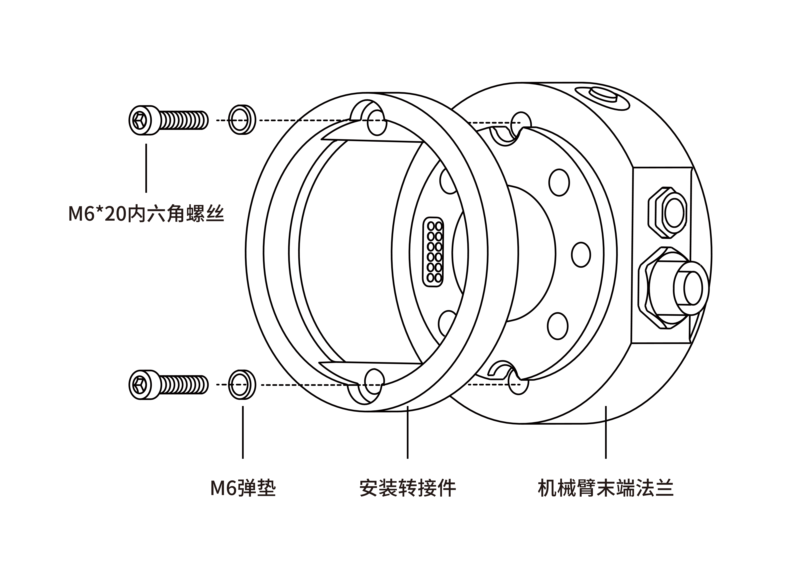
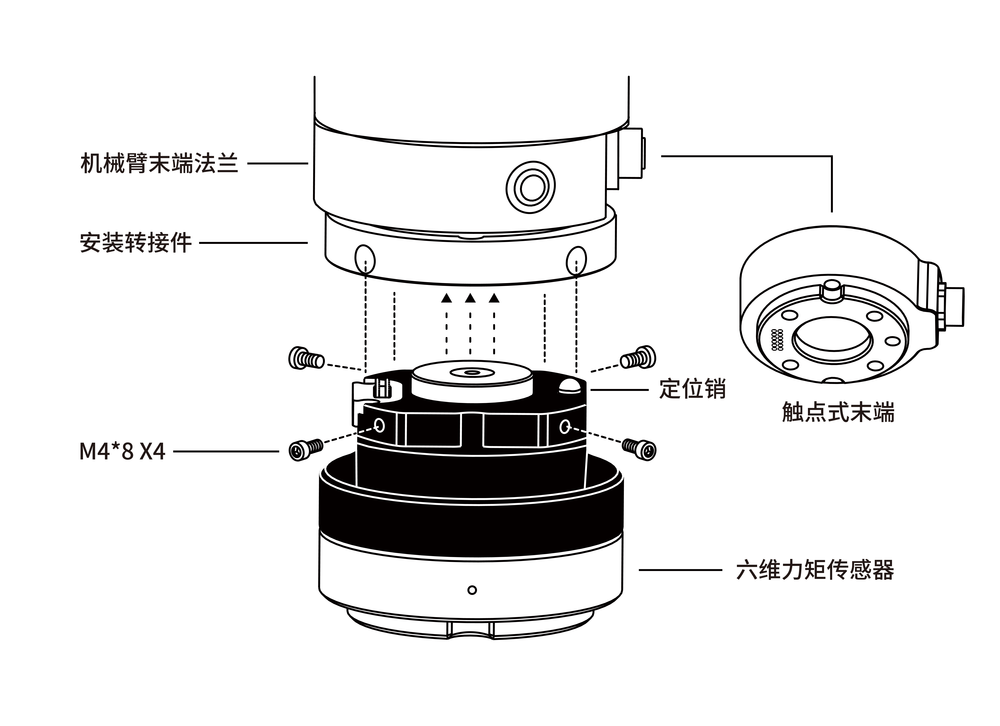
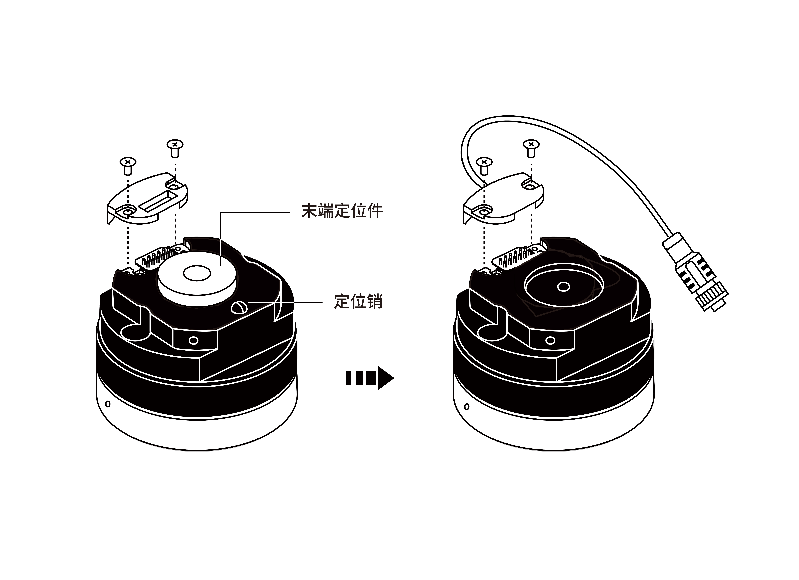
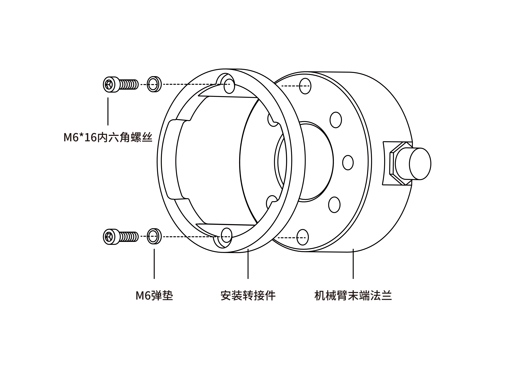
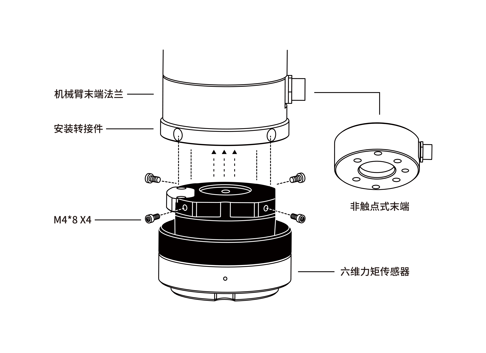
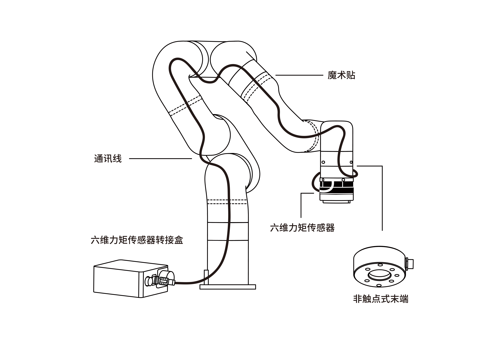


# 2.安装

## 2.1 发货清单
六维力矩传感器套件通常包括以下物品（如下图所示）：

* 六维力矩传感器*1
* 安装转接件*1
* 1300安装转接件*1
* 1300转接线*1
* 六维力矩传感器转接盒*1 
* 机械臂供电电缆*1
* 机械臂通信电缆*1  
* M6*20 内六角螺丝(2个)和M6 弹垫(2个)
* M6*16 内六角螺丝(2个)和M6 弹垫(2个)
* M4*8 内六角螺丝(4个)和M4弹垫(4个)
* 魔术贴(3米)  
* 2.5MM 和 5MM L型扳手*1

## 2.2 机械安装

### 2.2.1 触点式末端(UF850, XX1305)
适用产品：xArm1305系列，UFactory 850

1. 按下控制器上的急停按钮。
2. 用4颗M6\*20螺丝（一定要加弹垫）将六维力矩传感器安装转接件安装在末端法兰上。
   
3. 用4颗M4\*8螺丝（一定要加弹垫）将六维力矩传感器固定在安装转接件上。
   
4. 松开控制器上的急停按钮。

### 2.2.2 非触点式末端(XX1304或以下)
适用产品：xArm系列 1304 或 以下版本
1. 按下控制器上的急停按钮。
2. 将六维力矩传感器法兰面两颗螺丝拧开，取下黑色盖板，替换带通讯线的转接盖板。将定位销取下，将末端定位件取下。
   
3. 用4颗M6\*16螺丝（一定要加弹垫）将六维力矩传感器安装转接件安装在末端法兰上。
   
4. 用4颗M4\*8螺丝（一定要加弹垫）将六维力矩传感器固定在安装转接件上。
   
5. 将六维力矩通讯线接到力矩转接盒的通讯线接口上。
   

**注意：**
连接所有线缆时控制器上的急停开关一定要处于按下状态，机械臂电源指示灯熄灭，避免热插拔引起机械臂故障；

## 2.3 电气设置

### 2.3.1 触点式末端

通过机械臂末端24v直流供电和IO控制，具体引脚功能请参考下图。  
六维力矩使用24V，GND, R_A, R_B, 功率小于2.5W。

### 2.3.2 六维力矩转接盒
针对xArm 1304 或 以下 版本手臂，需要此转接盒。

