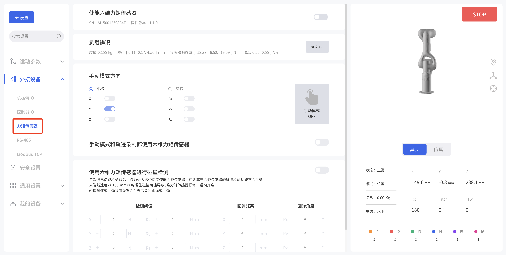
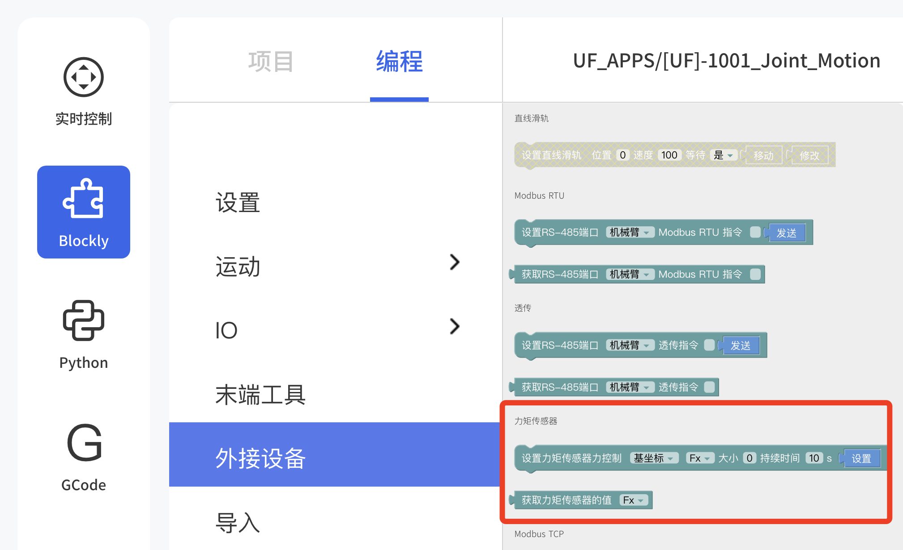
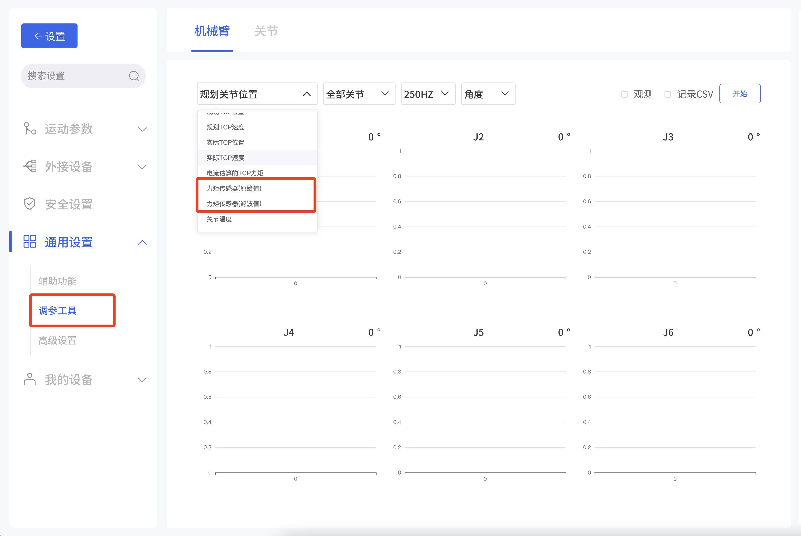

# 3.控制方式

## 3.1 UFACTORY Studio 控制

### 3.1.1 基础设置

* 使能六维力矩传感器：使能，获取并显示SN和固件版本。
* 负载辨识：负载辨识过程中，机械臂将会执行一系列动作，大约5分钟。结束后自动显示质量，质心和传感器偏移量并应用。
* 手动模式方向：可选择平移或旋转方向，开启后激活即可打开力矩手动模式。
* 手动模式和轨迹录制都使用六维力矩传感器
* 使用六维力矩传感器进行碰撞检测：可设置检测阈值、回弹距离、回弹角度。

### 3.1.2 Blockly

* 设置力传感器力控制：可编程参数如下
  坐标系：基坐标、工具坐标  
  可选方向：Fx, Fy, Fz, Tx, Ty, Tz
  大小：-105~105N(Fx, Fy, Fz) ;  -2.8~2.8N(Tx, Ty, Tz)
  持续时间：0-9999秒

* 读取力矩传感器的值：可编程参数如下
  可选方向：Fx, Fy, Fz, Tx, Ty, Tz
  

### 3.1.3 数据观测
  

进入设置 - 通用设置 - 调参工具 - 机械臂界面，勾选观测或记录CSV，点击开始，通过TCP端口上报获得数据并绘图。  
可选参数：
* 观测值：力矩传感器（原始值），力矩传感器（滤波值）
* 观测关节：全部关节，单关节
* 频率：200HZ，5HZ
* 单位：角度，弧度

## 3.2 Python SDK 控制

对于使用Python-SDK控制六维力矩传感器的详细内容请见点击下面的链接查看:

https://github.com/xArm-Developer/xArm-Python-SDK/tree/master/example/wrapper/common

参考example：8000-8010

常用接口：
`ft_sensor_enable`: 使能六维力矩传感器
`iden_ft_sensor_load_offset`：力矩传感器的负载辨识
`set_ft_sensor_load_offset`：将力矩传感器负载辨识结果设为0点
`set_ft_sensor_mode`：设置力控模式（0：非力控， 1：导纳控制， 2：力位混合控制）
`get_ft_sensor_data`：获取补偿和滤波后的力矩传感器数据
`set_ft_sensor_admittance_parameters`：设置导纳控制参数（M,B,K），参考坐标系，柔顺轴
`set_ft_collision_detection`：设置基于力矩传感器的碰撞检测
`set_ft_collision_rebound`：设置碰撞后是否回弹

## 3.3 用C++ SDK 控制六维力矩传感器
对于使用C++ SDK控制六维力矩传感器的详细内容请见点击下面的链接查看:

https://github.com/xArm-Developer/xArm-CPLUS-SDK/tree/master/example

参考example：8000-8010

