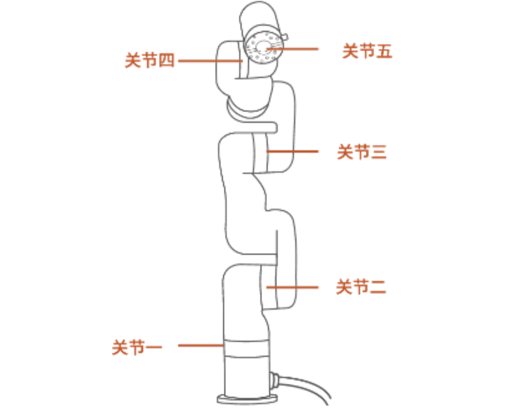
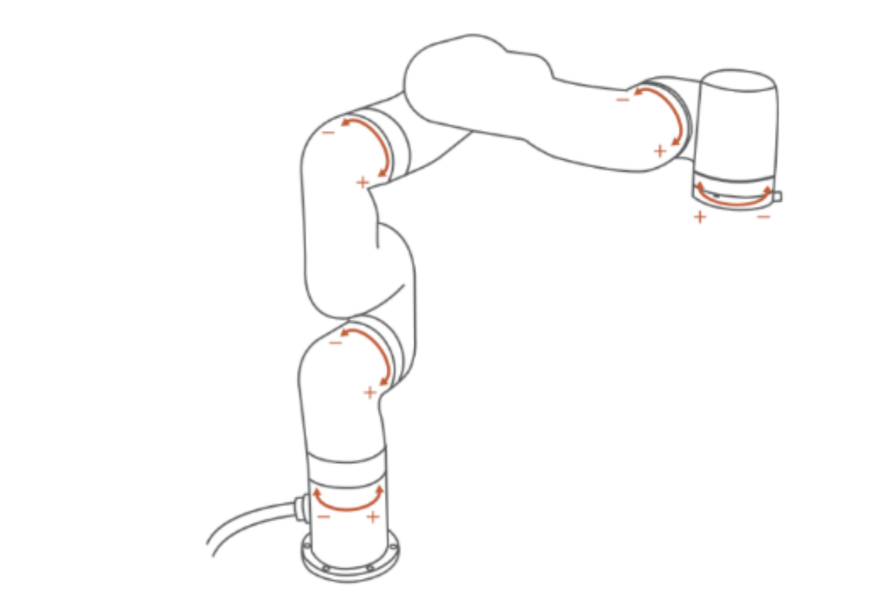
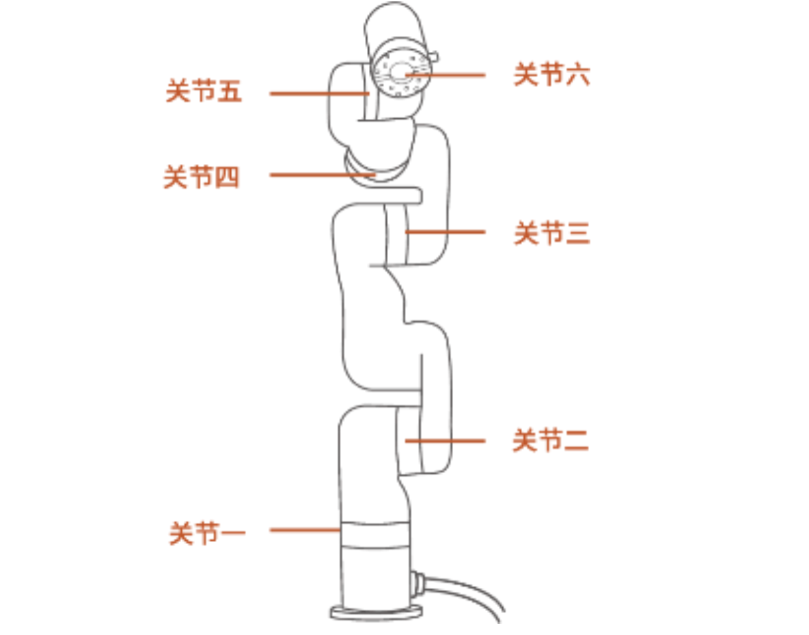
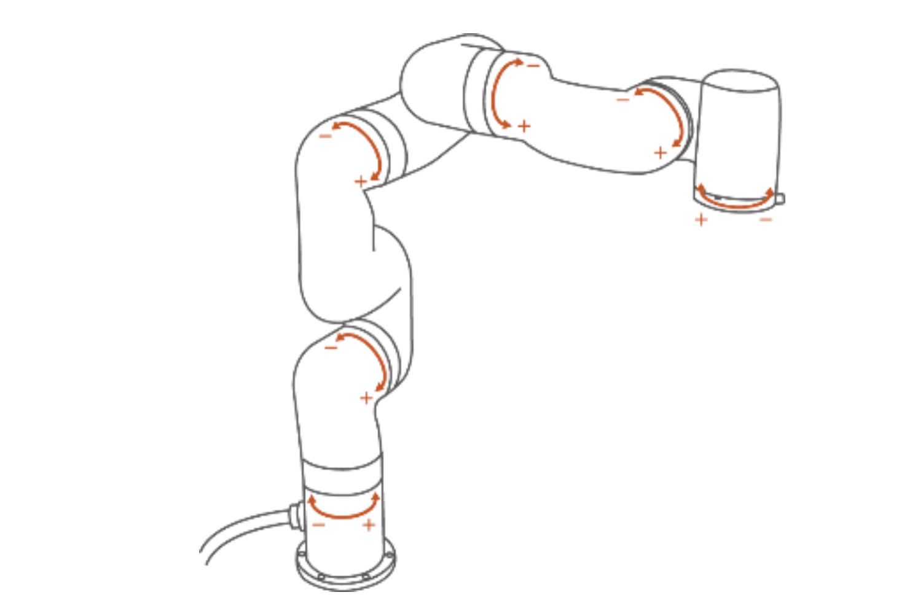
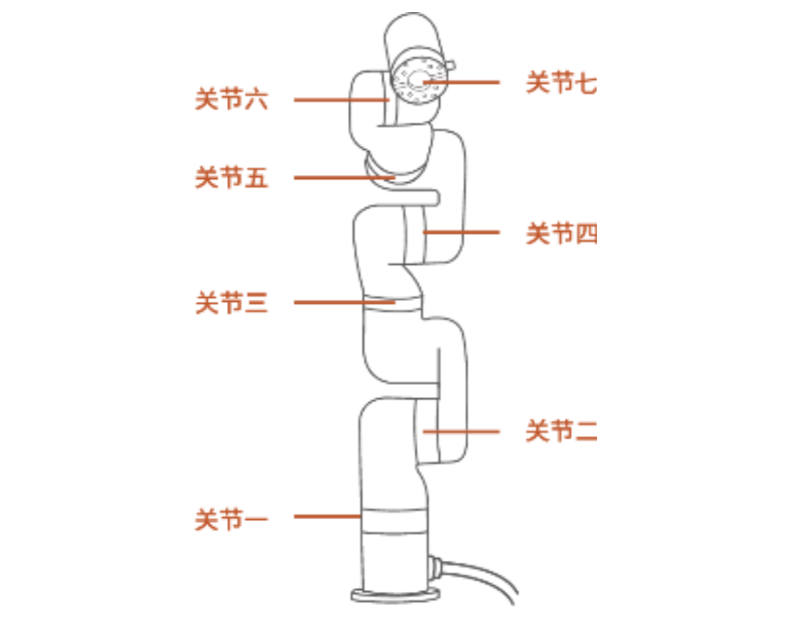
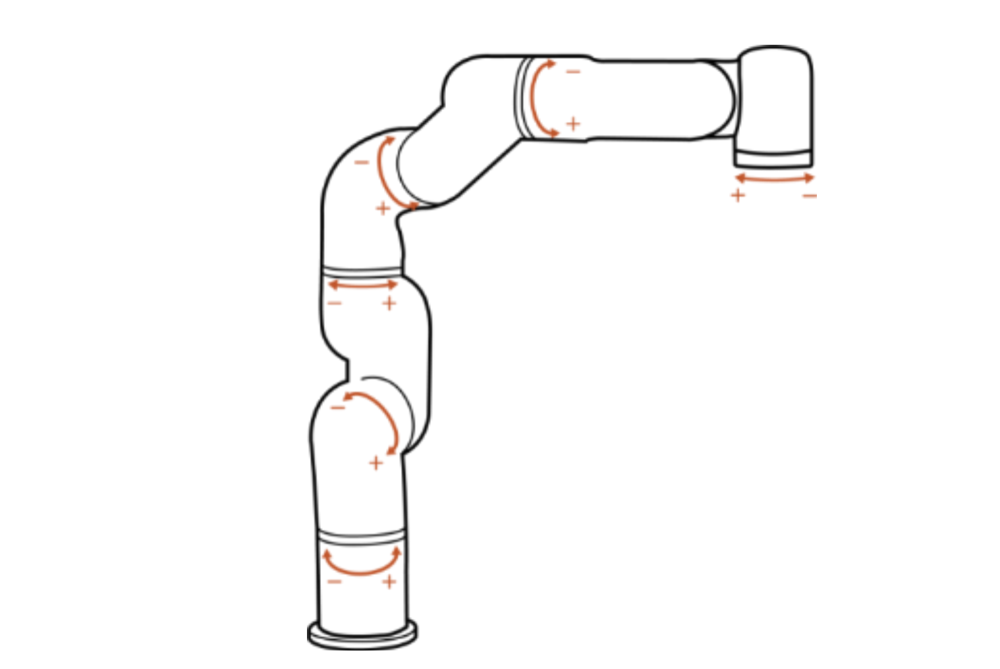

# 8. 技术规格

## 8.1 xArm5/xArm6/xArm7通用规格

| xArm Series |                                                              |
| ----------- | ------------------------------------------------------------ |
| 机器人类型       | xArm                                                         |
| 笛卡尔范围       | X: ±700mm; Y: ±700mm; Z: -400~951.5mm; Roll/Pitch/Yaw: ±180° |
| 最大关节速度      | 180°/s                                                       |
| 最大末端速度      | 1m/s                                                         |
| 重复定位精度      | ±0.1mm                                                       |
| 环境温度        | 0-50℃                                                        |
| 功耗          | 最低8.4W，典型200W，推荐500W                                         |
| 输入电源        | 24V DC, 20.8A                                                |
| ISO洁净室等级    | 5                                                            |
| 安装方向        | 任意角度                                                         |
| 材料          | 铝、碳纤维                                                        |
| 占地面积        | Ø 126 mm                                                     |
| 末端工具法兰      | DIN ISO 9409-1-A50/63（M5*6）                                  |
| 机械臂通信协议     | 私有TCP协议（自定义）                                                 |
| 末端工具485通信协议 | Modbus TCP                                                   |
| 编程方式        | UFACTORY Studio图形界面, Python/C++/ROS底层接口                      |

|           | 交流控制器                                                                        | 直流控制器                                                                       |
| --------- | ---------------------------------------------------------------------------- | --------------------------------------------------------------------------- |
| 输入        | 100-240V AC , 50/60Hz                                                        | 24-72V DC                                                                   |
| 输出        | 24V DC 20.8A                                                                 | 24V DC 672Wmax                                                              |
| 控制器通信协议   | 私有TCP协议（自定义）                                                                 | 私有TCP协议（自定义）                                                                |
| 控制器通信方式   | Ethernet（以太网）                                                                | Ethernet（以太网）                                                               |
| 控制器IO接口   | 8×CI+8×DI（数字输入） 8×CO+8×DO（数字输出） 2×AI（模拟输入）  2×AO（模拟输出） 1×S-485 主 | 8×CI+8×DI（数字输入） 8×CO+8×DO（数字输出） 2×AI（模拟输入） 2×AO（模拟输出） 1×S-485 主 |
| 重量        | 3.9kg                                                                        | 2.6kg                                                                       |
| 尺寸(长×宽×高) | 285×135×101mm                                                                | 262×160×76mm                                                                |

| 机械爪   |        |        |            |
| ----- | ------ | ------ | ---------- |
| 额定电压  | 24V DC | 最大输入电压 | 28V DC     |
| 静态功耗  | 1.5W   | 峰值电流   | 1.5A       |
| 重量    | 802g   | 最大夹持力  | 30N        |
| 行程    | 84mm   | 工作范围   | 0-84mm     |
| 手指形态  | 可更换    |        |            |
| 通讯方式  | RS-485 | 通讯协议   | Modbus RTU |
| 可编程参数 | 速度、位置  | 反馈     | 位置         |

| 真空吸头（AS1200） |          |        |                 |
| ------------ | -------- | ------ | --------------- |
| 额定电压         | 24V DC   | 最大输入电压 | 28V DC          |
| 最大负压         | -55kPa   | 空气流量   | >4L/min         |
| 重量           | 610g     | 尺寸     | 122.5×91.6×75mm |
| 负载           | ≤5kg     | 噪音     | ＜65dB           |
| 静态电流         | 20mA     | 峰值电流   | 500mA           |
| 控制方式         | 数字IO     | 状态指示灯  | 电源状态、工作状态       |
| 反馈           | 气压（低或常规） |        |                 |

## 8.2 xArm5规格

| xArm5                     |                                                     |
| ------------------------- | --------------------------------------------------- |
| 关节范围                      | J1~J5 (±360°, -117~116°, -219~10°, -97~180°, ±360°) |
| 最大负载                      | 3kg                                                 |
| 自由度                       | 5                                                   |
| 机械臂重量（不含控制器）              | 11.3kg                                              |
|  |                            |

## 8.3 xArm6规格

| xArm6                     |                                                            |
| ------------------------- | ---------------------------------------------------------- |
| 关节范围                      | J1~J6 (±360°, -117~116°, -219~10°, ±360°, -97~180°, ±360°) |
| 最大负载                      | 5kg                                                        |
| 自由度                       | 6                                                          |
| 机械臂重量（不含控制器）              | 12.5kg                                                     |
|  |                                   |

## 8.4 xArm7规格

| xArm7                     |                                                                  |
| ------------------------- | ---------------------------------------------------------------- |
| 关节范围                      | J1~J7 (±360°, -117~116°, ±360°, -6~225°, ±360°, -97~180°, ±360°) |
| 最大负载                      | 3.5kg                                                            |
| 自由度                       | 7                                                                |
| 机械臂重量（不含控制器）              | 14.3kg                                                           |
|  |                                         |

