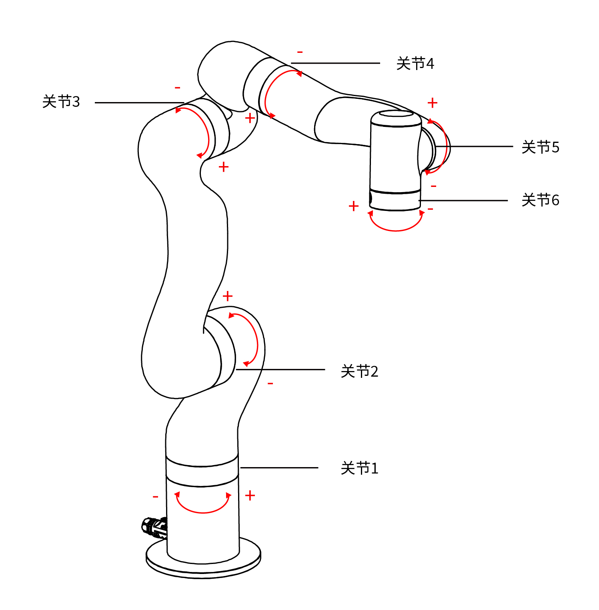

# 8. 技术规格

|  UFACTORY 850           |                                                             |
| ----------- | ----------------------------------------------------------- |
| 机器人类型       | UFACTORY 850                                                |
| 机器人重量       | 20kg（仅机械臂）                                                  |
| 机器人最大负载重量   | 5kg                                                         |
| 笛卡尔范围       | X: ±850mm; Y: ±850mm; Z: -400~1214mm; Roll/Pitch/Yaw: ±180° |
| 关节范围        | J1~J6 (±360°, ±132°, -242~3.5°, ±360°, ±124°, ±360°)        |
| 最大关节速度      | 180°/s                                                      |
| 最大末端速度      | 1m/s                                                        |
| 重复定位精度      | ±0.02mm                                                     |
| 环境温度        | 0-50℃                                                       |
| 功耗          | 典型240W，推荐500W以上电源，最高1000W                                   |
| 输入电源        | 48V DC, 20.8A                                               |
| 安装方向        | 任意角度                                                        |
| 材料          | 铝、碳纤维                                                       |
| 占地面积        | Ø 190 mm                                                    |
| 末端工具法兰      | DIN ISO 9409-1-A50/63（M6*6）                                 |
| 机械臂通信协议     | 私有TCP协议（自定义）                                                |
| 末端工具485通信协议 | Modbus TCP                                                  |
| 编程方式        | UFACTORY Studio图形界面, Python/C++/ROS底层接口                     |
| 关节旋转方向      |                                        |

|         | 交流控制器(AC8510)                                                                         | 直流控制器(DC8510)                                                                           |
| ------- | ----------------------------------------------------------------------------- | ------------------------------------------------------------------------------- |
| 输入      | 100-240V AC , 47/63Hz                                                         | 48-72V DC                                                                       |
| 输出      | 48V DC 1000Wmax                                                               | 48V DC 960Wmax                                                                  |
| 控制器通信协议 | 私有TCP协议（自定义）                                                                  | 私有TCP协议（自定义）                                                                    |
| 控制器通信方式 | Ethernet（以太网）                                                                 | Ethernet（以太网）                                                                   |
| 控制器IO接口 | 8×CI+8×DI（数字输入） 8×CO+8×DO（数字输出） 2×AI（模拟输入）  2×AO（模拟输出） 1×RS-485 主  1×RS-485 从| 8×CI+8×DI（数字输入）  8×CO+8×DO（数字输出）  2×AI（模拟输入）  2×AO（模拟输出） 1×RS-485 主 1×RS-485 从 |
| 重量      | 3.8kg                                                                         | 2.5kg                                                                           |
| 尺寸(长宽高) | 269× 178×86mm                                                                 | 209×176×82mm                                                                    |

| 机械爪G2(AG1200)   |        |        |            |
| ----- | ------ | ------ | ---------- |
| 额定电压  | 24V DC | 最大输入电压 | 28V DC     |
| 静态功耗  | 1W   | 负载   | 5kg       |
| 重量    | 800g   | 夹持力  | 10-50N        |
| 行程    | 84±1mm   | 开合速度   | 15-225mm/s     |
| 手指形态  | 可更换    |  寿命      |  >2,000,000循环        |
| 通讯方式  | RS-485 | 通讯协议   | Modbus RTU |
| 可编程参数 | 速度、位置、力矩  | 反馈     | 位置         |
| 防护等级 | IP40  | 使用环境     | 0-50℃         |

| 真空吸头（AS1200） |          |        |                 |
| ------------ | -------- | ------ | --------------- |
| 额定电压         | 24V DC   | 最大输入电压 | 28V DC          |
| 最大负压         | -55kPa   | 空气流量   | >4L/min         |
| 重量           | 610g     | 尺寸     | 122.5×91.6×75mm |
| 负载           | ≤5kg     | 噪音     | ＜65dB           |
| 静态电流         | 20mA     | 峰值电流   | 500mA           |
| 控制方式         | 数字IO     | 状态指示灯  | 电源状态、工作状态       |
| 反馈           | 气压（低或常规） |        |                 |

