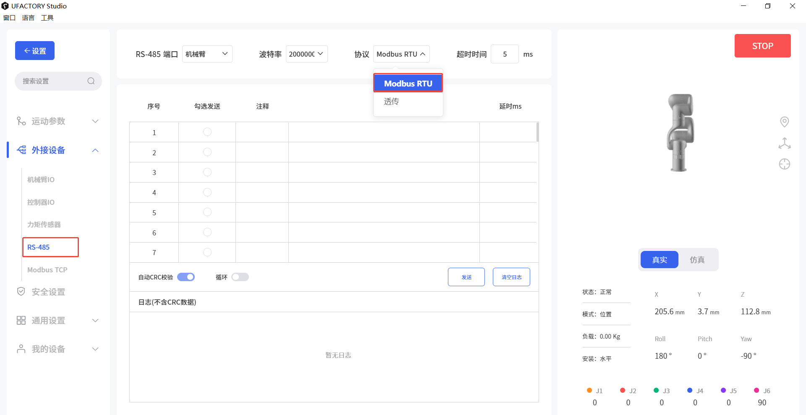

# xArm 控制器 RS-485（Modbus RTU）功能使用手册

## 1. 概述

本手册用于说明 UFACTORY xArm 控制器的 RS-485 通信功能，以及其在 Modbus RTU 协议下的使用方法。  

当前控制器已支持： 
* Modbus RTU 主站（Master）功能 
* Modbus RTU 从站（Slave）功能（控制器AC1310或以上，固件V2.7.104或以上）


## 2. Modbus RTU 主站模式

xArm 作为 Modbus 主机，主动访问外部 485 从机。

### 2.1 接口定义

| 端子  | 说明            |     |
| --- | ------------- | --- |
| M_A | RS-485 A / D+ | 主机  |
| M_B | RS-485 B / D- | 主机  |
| GND | 信号地           |     |

### 2.2 通信参数


| 参数   | 默认      |                                                                                                     |
| ---- | ------- | --------------------------------------------------------------------------------------------------- |
| 波特率  | 2000000 | 4800, 9600, 19200, 38400, 57600, 115200, 230400, 460800, 921600, 1000000, 1500000, 2000000, 2500000 |
| 数据位  | 8       |                                                                                                     |
| 停止位  | 1       | 1,2                                                                                                 |
| 校验位  | None    | 无(N)，奇校验(O), 偶校验(E); (0-2)                                                                          |
| 超时时间 | 50      | 1-9999ms                                                                                            |


### 2.3 控制方式

#### 2.3.1 UFACTORY Studio
RS-485端口： 控制器
协议：Modbus RTU  

此页面会在填入的命令后自动增加CRC。


#### 2.3.2 Python SDK
1. 设置控制器端波特率
```
arm.set_rs485_baudrate(200000, target='control_box')
```

2. 设置超时时间
```
arm.set_rs485_timeout(1000, target='control_box')
```

3. 发送数据
```
arm.set_rs485_data([0x08, 0x06, 0x01, 0x00, 0x00, 0x01], target='control_box')
```

## 3. Modbus RTU 从站模式

xArm 作为 Modbus 从机，被 PLC 或上位机访问。

### 3.1 接口定义

| 端子  | 说明            |     |
| --- | ------------- | --- |
| L_A | RS-485 A / D+ | 从机  |
| L_B | RS-485 B / D- | 从机  |
| GND | 信号地           |     |

### 3.2 通信参数


| 参数   | 默认      | 参数范围                                                                                               |
| ---- | ------- | -------------------------------------------------------------------------------------------------- |
| 从机地址 | 1       | 1-247                                                                                              |
| 波特率  | 9600(1) | 4800, 9600, 19200, 38400, 57600, 115200, 230400, 460800, 921600, 1000000, 1500000, 2000000; (0-12) |
| 数据位  | 8       |                                                                                                    |
| 停止位  | 1       | 1, 2                                                                                               |
| 校验位  | None(0) | 无(N)，奇校验(O), 偶校验(E); (0-2)                                                                         |


### 3.3 参数修改

#### 修改参数
```python
arm.set_modbusrtu_params(slave_id=1, baudrate=9600, stopbits=1, parity=0)
```

#### 获取参数
```python
arm.get_modbusrtu_params()
```
输出示例
```text
(0, [1, 9600, 1, 0])
```

### 3.4 寄存器映射示例

#### 3.4.1 功能码
* 离散输入寄存器
  * 0x02：读取多个寄存器的值
* 输入寄存器
  * 0x04：读取多个寄存器的值
* 线圈状态寄存器：
  * 0x01：读取多个寄存器的值
  * 0x05：写单个寄存器的值
  * 0x0F：写多个寄存器的值
* 保持寄存器：
  * 0x03：读取多个寄存器的值
  * 0x06：写单个寄存器的值
  * 0x10：写多个寄存器的值
  * 0x16：以掩码的形式写单个寄存器的值
  * 0x17：写多个寄存器的值，并读多个寄存器的值

#### 3.4.2 状态寄存器（只读）
##### 离散输入状态寄存器（1位，只读）
| 地址(十进制) | 地址(十六进制) | 说明                                    |
| ------------ | -------------- | --------------------------------------- |
| 0 \~ 31      | 0x00 \~ 0x1F   | 32路控制器的数字输⼊IO (当前仅16路有效) |
| 32 \~ 39     | 0x20 \~ 0x27   | 8路末端⼯具的数字输⼊IO (当前仅2路有效) |
| 40 \~ 127    | 0x28 \~ 0x7F   | 保留                                    |

##### 输⼊寄存器（16位, 只读）
| 地址(十进制) | 地址(十六进制)  | 说明                                                         |
| ------------ | --------------  | ------------------------------------------------------------ |
| 0 \~ 1       | 0x00 ~0x01    | 32路控制器的数字输⼊IO, 每1位表⽰1路IO (当前仅16路有效)      |
| 2            | 0x02            | 8路末端⼯具的数字输⼊IO, 每1位表⽰1路IO (当前仅2路有效)      |
| 3 \~ 6       | 0x03 ~0x06    | 4路控制器的模拟输⼊IO, 寄存器的值是实际值的1000倍 (当前仅2路 有效) |
| 7 \~ 10      | 0x07 ~0x0A    | 4路末端⼯具的模拟输⼊IO, 寄存器的值是实际值的1000倍 (当前仅2 路有效) |
| 11 \~ 31     | 0x0B ~0x1F    | 保留                                                         |
| 32           | 0x20            | 机械臂的错误码                                               |
| 33           | 0x21            | 机械臂的警告码                                               |
| 34 \~ 35     | 0x22 ~0x23    | 计数器的值 (0x22存储计数器的⾼16位, 0x23存储计数器的低16位)  |
| 36 \~ 63     | 0x23 ~0x3F    | 保留                                                         |
| 64 \~ 72     | 0x40 ~0x48    | 机械臂的x/y/z/roll/pitch/yaw/rx/ry/rz值, 寄存器的值是实际值的10倍 (单位: mm, 度) |
| 73 \~ 76     | 0x49 ~0x4C    | 机械臂的TCP负载mass(1000倍)/center\_x(10倍)/center\_y(10 倍)/center\_z(10倍) (单位: kg, mm) |
| 77 \~ 82     | 0x4D ~0x52    | 机械臂的TCP偏移, 寄存器的值是实际值的10倍(单位: mm, 度)      |
| 83 \~ 88     | 0x53 ~0x58    | 机械臂的基座标偏移, 寄存器的值是实际值的10倍(单位: mm, 度)   |
| 89 \~ 95     | 0x59 ~0x5F    | 机械臂各关节(J1-J7)的⾓度, 寄存器的值是实际值的10倍(单位: 度) |
| 86 \~ 102    | 0x60~0x66    | 机械臂各关节(J1-J7)的温度 (单位: 摄⽒度)                     |
| 103 \~ 109   | 0x67~0x6D    | 机械臂各关节(J1-J7)的速度, 寄存器的值是实际值的10倍(单位: 度/s) |
| 110          | 0x6E            | 机械臂的TCP速度, 寄存器的值是实际值的10倍(单位: mm/s)        |
| 111 \~ 127   | 0x6F ~0x7F    | 保留                                                         |

#### 3.4.3 控制寄存器（读写）
##### 线圈状态寄存器（1位, 可读可写）
| 地址(十进制) | 地址(十六进制) | 说明                                                         |
| ------------ | -------------- | ------------------------------------------------------------ |
| 0 \~ 31      | 0x00 \~ 0x1F   | 32路控制器的数字输出IO (当前仅16路有效)                      |
| 32 \~ 39     | 0x20 \~ 0x27   | 8路末端⼯具的数字输出IO (当前仅2路有效)                      |
| 40 \~ 127    | 0x28 \~ 0x7F   | 保留                                                         |
| 128 \~ 134   | 0x80 \~ 0x86   | 关节(J1-J7)的报闸状态                                        |
| 135 \~ 141   | 0x87 \~ 0x8D   | 关节(J1-J7)的使能使能状态                                    |
| 142          | 0x8E           | 缩减模式(0关闭, 1开启)                                       |
| 143          | 0x8F           | 围栏模式(0关闭, 1开启)                                       |
| 144          | 0x90           | 暂停运动控制(0表⽰不是暂停, 1表⽰暂停)                       |
| 145          | 0x91           | 停⽌运动控制(0表⽰不是停⽌, 1表⽰停⽌)                       |
| 146 \~ 159   | 0x92 \~ 0x9F   | 运动模式(0表⽰不是处于该模式, 1表⽰处于该模式), 分别对应模式0-13 |
| 160 \~ 255   | 0xA0 \~ 0xFF   | 保留                                                         |
| 256 \~ 511   | 0x100 \~ 0x1FF | ⽤户⾃定义使⽤                                               


##### 保持寄存器（16位, 可读可写）


| 地址(十进制)    | 地址(十六进制)     | 说明                                                                                                   |
| ---------- | ------------ | ---------------------------------------------------------------------------------------------------- |
| 0 \~ 1     | 0x00~0x01    | 32路控制器的数字输出IO, 每1位表⽰1路IO (当前仅16路有效)                                                                  |
| 2          | 0x02         | 8路末端⼯具的数字输出IO, 每1位表⽰1路IO (当前仅2路有效)                                                                   |
| 3 \~ 6     | 0x03 \~ 0x06 | 4路控制器的模拟输出IO, 寄存器的值是实际值的1000倍 (当前仅2路有效)                                                              |
| 7 \~ 10    | 0x07 \~ 0x0A | 4路末端⼯具的模拟输出IO, 寄存器的值是实际值的1000倍 (当前仅0路有 效)                                                            |
| 11   | 0x0B         | Modbus RTU从机ID                                                                                       |
| 12         | 0x0C         | Modbus RTU串口波特率                                                                                      |
| 13         | 0x0D         | Modbus RTU串口停止位                                                                                      |
| 14         | 0x0E         | Modbus RTU串口校验位                                                                                      |
| 15~31      | 0x0F ~ 0x1F  | 保留                                                                                                   |
| 32         | 0x20         | 机械臂模式                                                                                                |
| 33         | 0x21         | 机械臂状态                                                                                                |
| 34 \~ 47   | 0x22 \~ 0x2F | 保留                                                                                                   |
| 48 \~ 63   | 0x30 \~ 0x3F | 离线(Blockly)任务 (**仅⽀持通过0x10功能码往0x30地址写最多16个寄存器 的值来触发离线任务, 每个寄存器的值对应Blockly⼯程名, 1对应00001, 12对应00012**) |
| 64 \~ 255  | 0x40~0xFF    | 保留                                                                                                   |
| 256 \~ 511 | 0x100~0x1FF  | 保留                                                                                                   |
