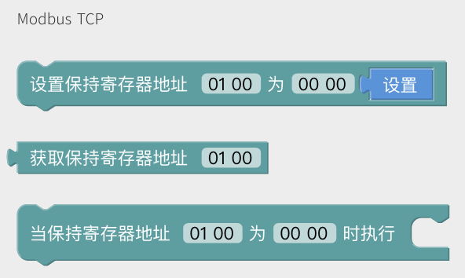
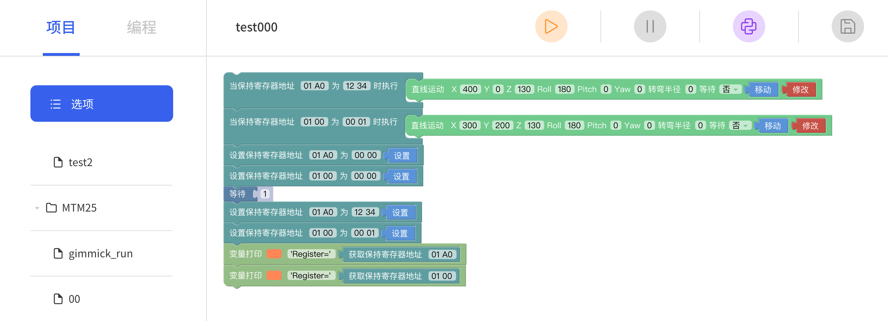

# 如何在 Blockly 中使用'Modbus TCP'模块？

固件要求：
- 固件版本：V2.4.0+
- UFactory Studio 版本：V2.4.100+

Blockly块：外接设备 - Modbus TCP


保持寄存器 (Holding register):
- 地址 (Address): 256 ~ 511 (0x0100 ~ 0x01FF)
- 值 (Value): 0 ~ 255 (0x00 ~ 0xFF)

**示例：**

创建一个名为 00015 的 Blockly 项目。

拖拽出积木块，并输入对应的寄存器地址和值，只有该寄存器的值**跳变**时才可以触发对应的事件。



通过 Modbus TCP 触发 Blockly 项目：
1. 发送命令以触发名为 00015 的 Blockly 项目。
```
00 01 00 00 00 09 01 10 00 30 00 01 02 00 0F
```

2. 发送命令将 '12 34' 写入地址 '01 A0'，这会让机械臂运动到坐标 [400, 0, 130, 180, 0, 0]。

```
00 01 00 00 00 06 01 06 01 A0 12 34
```

3. 发送命令将 '00 01' 写入地址 '01 00'，这会让机械臂运动到坐标 [300, 200, 130, 180, 0, 0]。

```
00 01 00 00 00 06 01 06 01 00 00 01
```