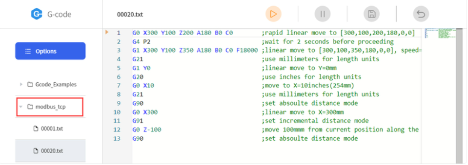

# 如何通过 Modbus TCP 启动 Gcode 文件？

固件要求：
- 固件版本：V2.4.0+
- UFactory Studio版本：V2.4.0+


保持寄存器:
- 功能码：0x10
- 寄存器地址：0x40

**此功能仅会触发 modbus_tcp 文件夹下的 Gcode 文件。**



## 启动 1 个 Gcode 文件的示例

启动名为 00020 的 Gcode 文件。
```
00 01 00 00 00 09 01 10 00 40 00 01 02 00 14
```
- **00 01 00 00**：固定值
- **00 09**：数据长度
- **01**：ID，固定值
- **10**：功能码
- **00 40**：寄存器地址
- **00 01**：触发 1 个 Gcode 文件
- **02**：数据长度
- **00 14**：Gcode 文件名


## 启动 2 个 Gcode 文件的示例

启动名为 00001 和 00050 的 2 个 Gcode 文件。
```
00 01 00 00 00 0B 01 10 00 40 00 02 04 00 01 00 32
```
- **00 01 00 00**：固定值
- **00 0B**：数据长度
- **01**：ID，固定值
- **10**：功能码
- **00 40**：寄存器地址
- **00 02**：触发 2 个 Gcode 文件
- **04**：数据长度
- **00 01**：名为 00001 的 Gcode 文件
- **00 32**：名为 00050 的 Gcode 文件

