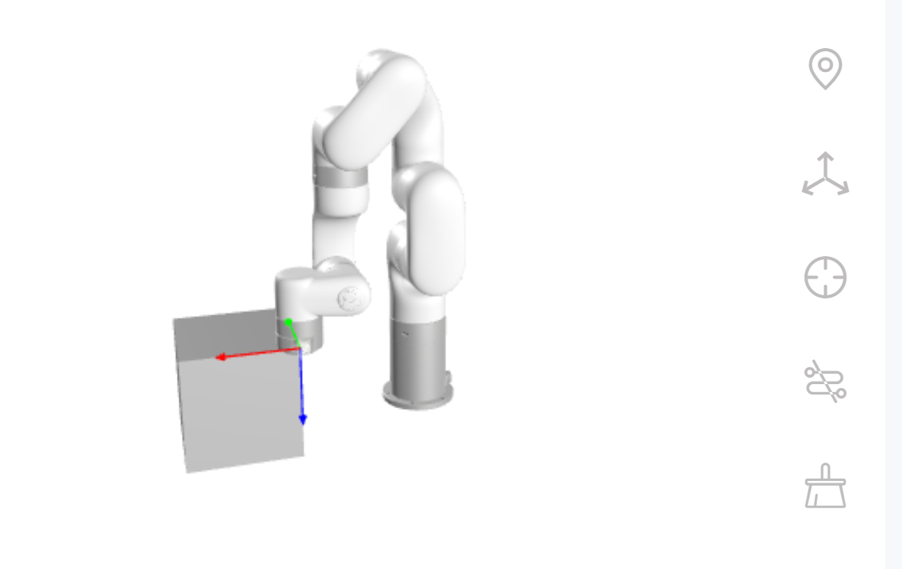
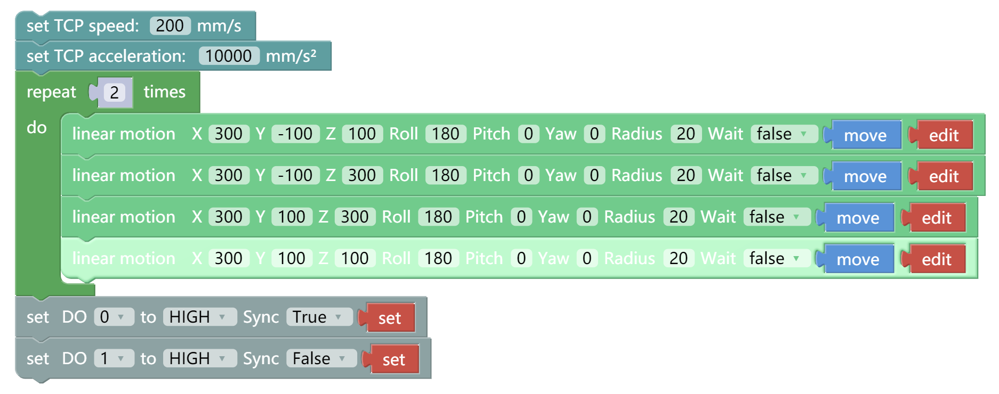
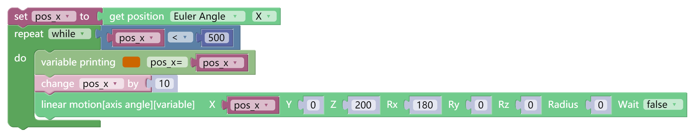

# V2.6.0新功能

## 实时控制-快捷输入
功能说明
* 用于快速输入关节角度或者TCP位姿的数据，支持数值和数组输入。
* 输入后，长按移动到目标位置。

## 实时控制-末端自碰撞模型偏移
功能说明
* 用于设置末端自定义的自碰撞模型相对于工具坐标系的X和Y方向的偏移量，用于调整碰撞模型的位置。

* 设置偏移后，效果如下

## Blockly编程-IO-数字输出异步参数

功能说明
* 用于设置数值和模拟输出的同步/异步逻辑。
* 设置为同步，IO指令会进入指令序列，按顺序执行。设置为异步，IO指令会立即执行。
* 默认值为同步。

下面这个Blockly程序用于观察同步和异步逻辑的区别。DO 0会在运动指令执行完后拉高，DO 1会在程序启动时立即拉高。

## Blockly编程-获取关节角或者TCP位姿
功能说明
* 用于获取机械臂的位置或者关节角，用于打印或者变量赋值。
下面这个Blockly程序，展示了获取TCP 位置的最简单的用法。获取当前位置的X的值，并以每次10 mm的向X正方向移动直到X大于等于500 mm 停止循环。

## 设置-高级设置-只读模式
功能说明
* 只读模式用于机械臂的管理，开启后防止其他人修改或者删除Blockly/Python IDE/Gcode文件。
* 只读模式下，用户无法操作Blockly/Python IDE/Gcode文件的修改和删除。
* 只读模式需要进入管理员界面设置。
