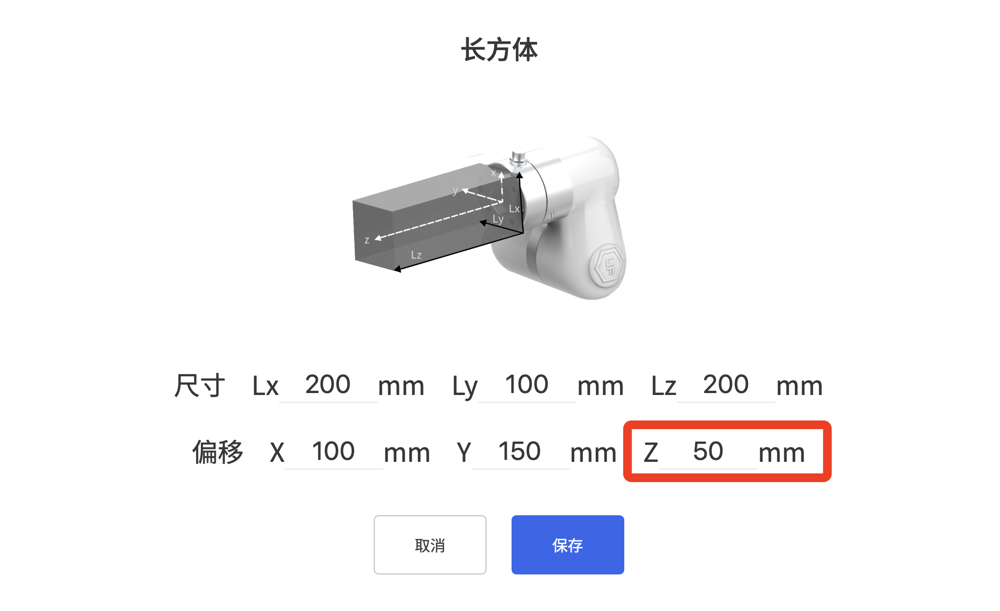
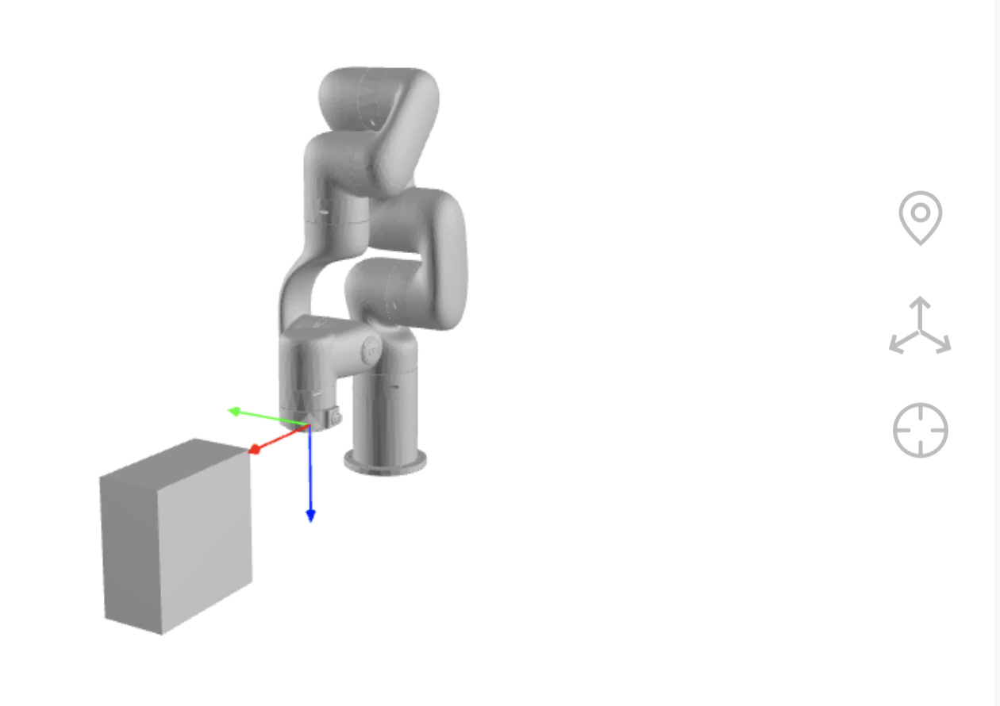
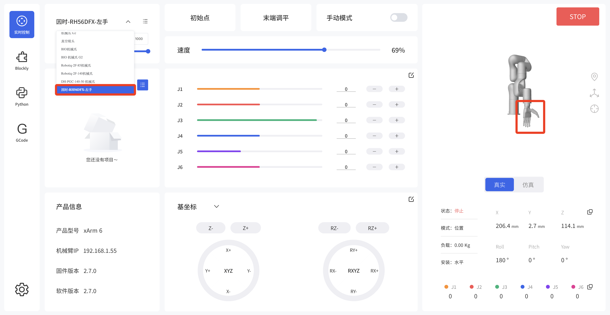
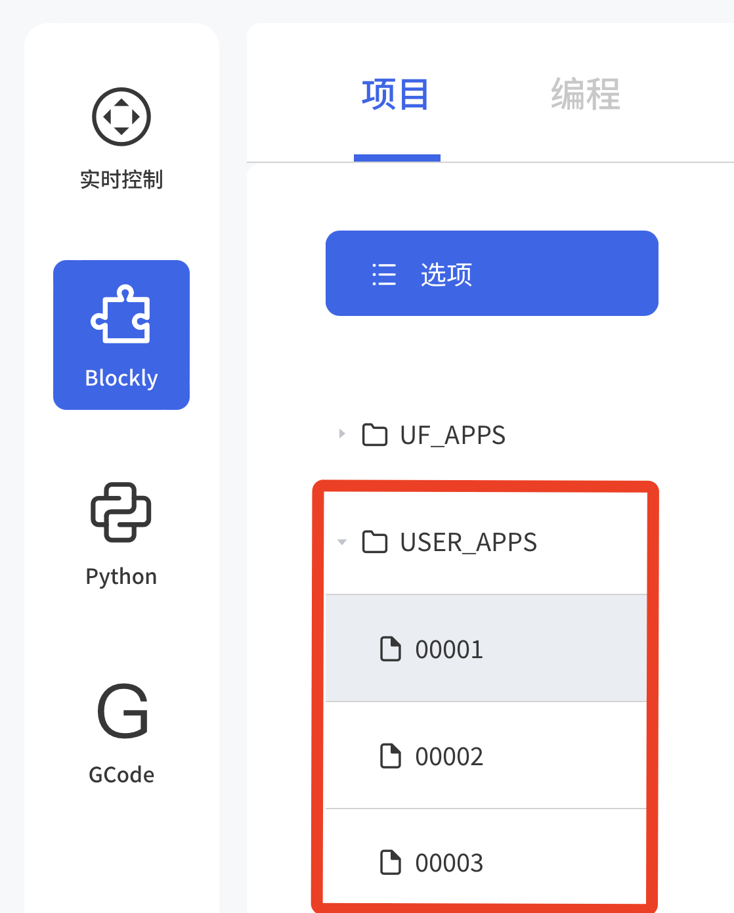
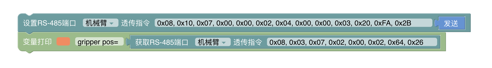
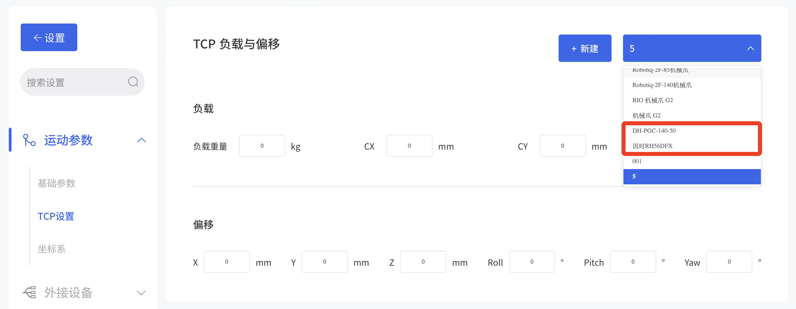
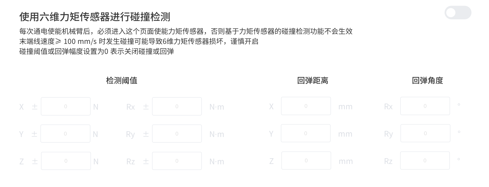
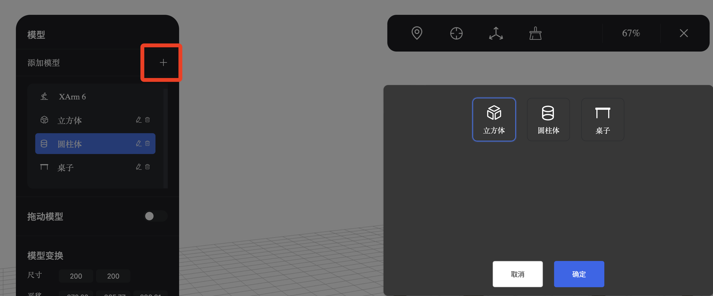
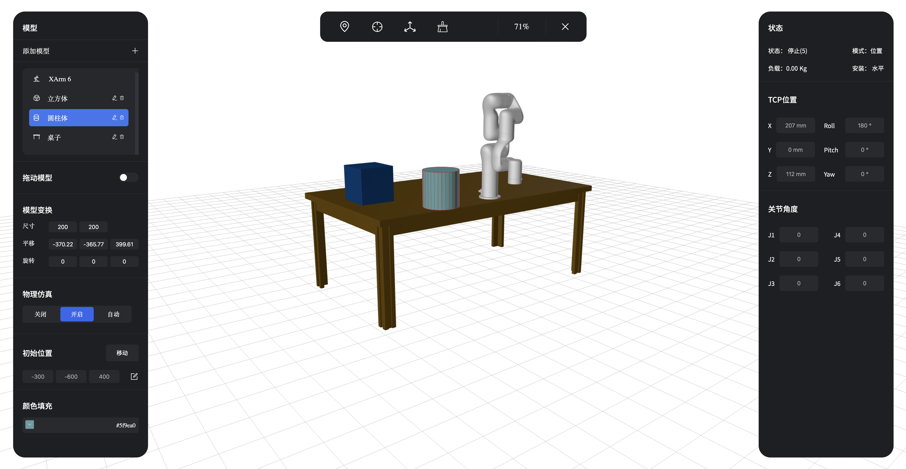
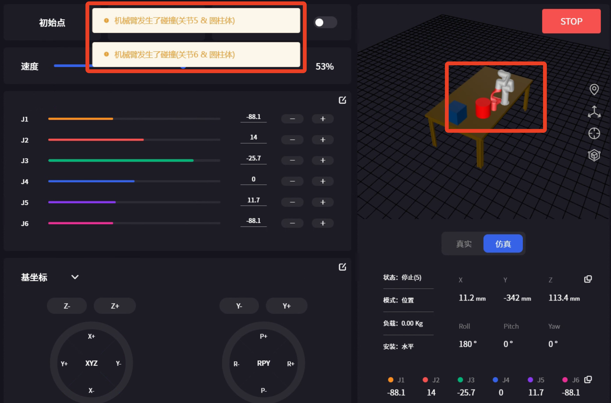

# V2.7.0新功能

## 实时控制-末端自碰撞模型偏移
功能说明
* 用于设置末端自定义的自碰撞模型相对于工具坐标系的Z方向的偏移量，用于调整碰撞模型的位置。

* 设置偏移后，效果如下

## 实时控制-末端执行器-真空吸头
功能说明
* 新增选择连接方式：插接式连接、触点连接
* 仅针对850，xArm(≥1305)
  

## 实时控制-末端执行器模型
功能说明
* 兼容UFACTORY机械爪G2,因时RH56DFX灵巧手,大寰DH-PGC-140-50机械爪，支持控制及添加自碰撞模型。

## Blockly编程-文件名
功能说明
* 文件名增加排序逻辑。如按顺序新建文件名为003, 002, 001的项目，显示如下

## Blockly编程-外接设备-透传
功能说明
* 用于机械臂和末端执行器或控制器进行RS485通信，机械臂只进行转发，不添加处理数据。
* 可选参数：机械臂（末端）、控制盒
下面这个程序为，打开UFACTORY机械爪G2，并获取其的位置。
  

## 设置-运动参数-TCP设置
功能说明
* 新增因时RH56DFX、大寰DH-PGC-140-50的TCP 负载与偏移参数。
  

## 设置-外接设备-力矩传感器
功能说明
* 增加力矩传感器碰撞检测开关和碰撞检测参数配置。
* 可配置参数：检测阈值、回弹距离、回弹角度。
* 末端线速度≥100mm/s时可能会撞坏传感器，请谨慎开启。
  

## 设置-辅助功能-环境仿真(测试预览版)
功能说明
* 在通用设置-辅助功能中，打开环境仿真选项。（此功能还在测试中）
* 可在环境中增加模型：立方体、圆柱体、桌子。
* 选中模型后，可开启拖动模型选项，将模型拖动到对应的位置。也可以打开物理仿真，考虑真实重力及碰撞情况。

* 若发生碰撞，软件会弹窗相应的提示，如下图
  