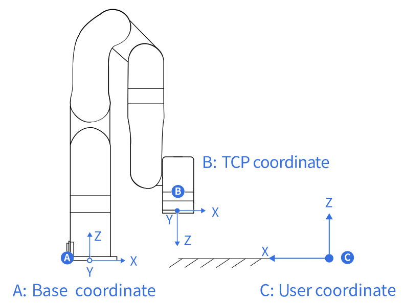

# 术语和定义

## 单位定义

| 参数                     | Python-SDK        | Blockly           | 通信协议           |
| ------------------------ | ----------------- | ----------------- | ------------------ |
| X（Y/Z）                 | 毫米（mm）        | 毫米（mm）        | 毫米（mm）         |
| Roll（Pitch/Yaw）        | 度（°）           | 度（°）           | 弧度（rad）        |
| J1（J2 /J3/J4/J5/J6/J7） | 度（°）           | 度（°）           | 弧度（rad）        |
| TCP速度                  | 毫米/秒（mm/s）   | 毫米/秒（mm/s）   | 毫米/秒（mm/s）    |
| TCP加速度                | 毫米/秒²（mm/s²） | 毫米/秒²（mm/s²） | 毫米/秒²（mm/s²）  |
| TCP加加速度              | 毫米/秒³（mm/s³） | 毫米/秒³（mm/s³） | 毫米/秒³（mm/s³）  |
| 关节速度                 | 度/秒（°/s）      | 度/秒（°/s）      | 弧度/秒（rad/s）   |
| 关节加速度               | 度/秒²（°/s²）    | 度/秒²（°/s²）    | 弧度/秒²（rad/s²） |
| 关节加加速度             | 度/秒³（°/s³）    | 度/秒³（°/s³）    | 弧度/秒³（rad/s³） |

## 术语和定义

### **控制器**

> 为机械臂的核心部分，它是机械臂控制系统的集成。

### **末端执行器**

> 末端执行器安装在机械臂手腕的前端，用来安装夹持器和专用工具（如机械爪、真空吸头等），可以直接执行工作任务。
### **使能机械臂**

> 给机械臂上电，且开启机械臂电机，机械臂使能后，可正常开始运动。

### **TCP**

> 工具中心点。（未设置末端执行器偏移时，为法兰盘中心）

### **TCP运动**

> 目标位置为笛卡尔空间坐标点的运动，末端在运动中遵循指定的轨迹（圆弧，直线等）。
### **TCP负载（末端负载）**

> 负载重量是指实际的（末端执行器+托运外物）的重量，单位是 kg; X/Y/Z 轴表示 TCP 的重心相对于默认工具坐标系（位于法兰中心）的位置，单位是 mm。

### **TCP偏移(末端执行器偏移)**

> 设置 TCP（末端执行器）坐标系与定义在法兰中心的工具坐标系之间的相对偏移量，单位是 mm。

### **Roll/Pitch/Yaw**

> Roll / Pitch / Yaw 围绕所选坐标系（基本坐标系）的 X / Y / Z 顺序旋转。下面举例描述坐标系{B}姿态的一种方法：例如，坐标系 {B} 和已知的参考坐标系 {A} 重合。首先将 {B} 旋转 γ，然后旋转 β ，最后旋转 α.每次旋转都围绕固定的参考坐标系 {A} 的轴。这种方法称为 XYZ 固定角度坐标系，有时它们被定义为回转角（roll）、俯仰角（pitch）和偏转角（yaw）。

等效旋转矩阵为：

Rxyz(γ,β,α)=Rz(α)Ry(β)Rx(γ)

> 注意: γ 对应 roll;β对应pitch;α对应于yaw。

以上描述如下图所示：

### **轴角**

> Rx/Ry/Rz与Roll/Pitch/Yaw一样，使用3个值表示姿态，但不是三个旋转角度，而是一个三维旋转向量[x,y,z]和一个旋转角度phi（标量）的乘积。轴角表示的性质：
假设旋转轴为[x,y,z]，旋转角度为phi。则轴角表示即为`[Rx, Ry, Rz] = [x * φ, y * φ, z * φ] ` 
 注意： 其中[x,y,z]为单位向量，phi为非负值，因而[Rx,Ry,Rz]的向量长度(模)即可推算旋转角度，向量方向即为旋转方向。
如果想表示逆向旋转，则将旋转轴向量[x,y,z]取反，φ值不变。
使用phi和[x,y,z]同样可以推导出单位四元数的姿态表示`q = [cos （φ / 2）， sin （φ / 2） * x， sin （φ / 2） * y， sin （φ / 2） * z]`。
 举例：
当前TCP坐标系的姿态是基坐标系围绕某个空间向量旋转某个角度得到的。比如用基坐标系表示的旋转轴的向量为[1,0,0]，旋转角度为180度(pi弧度），则这个姿态的轴角表示即为[π,0,0]。如果旋转轴
为[0.707,0.707,0]，旋转角度为90度(π/2弧度），则轴角姿态为[0.707*(pi/2),0.707*(pi/2),0]。

### **坐标系**

#### **基坐标系**

>基坐标系是以机器人安装基座为基准、用来描述机器人本体运动的笛卡尔坐标系。
任何机器人都离不开基坐标系，也是机器人TCP在三维空间运动所必须的基本坐标系（面对机器人前后：X轴，左右：Y轴，上下：Z轴）
#### **工具坐标系**

>由工具中心点TCP与坐标方位组成。
如果没有设置TCP偏移，那么默认工具坐标系位于法兰中心。是以工具中心点作为零点，机器人的轨迹参照工具坐标系。

#### **用户坐标系**

>用户坐标系可定义为机器人运动范围内的任意位置，设定任意角度的X、Y、Z 轴，坐标系的方向根据客户需要任意定义。

### **手动模式**

> 即示教模式或力矩模式，在该模式下，操作人员可直接手动控制机械臂。

### **示教灵敏度**

> 示教灵敏度范围 1~5 个等级。设定的指越大，示教灵敏度等级越高，开启示教模式拖拽关节所需的力越小。
### **碰撞灵敏度**

> 碰撞灵敏度范围 0~5 个等级,设置为 0 时表示不开启碰撞检测。设定的值越大，碰撞灵敏度等级越高，机械臂碰撞检测后所需的力越小。
### **GPIO**

> 通用型之输入输出。 
对于输入，可以通过读取某个寄存器来确定引脚电位的高低； 
对于输出，可以通过写入某个寄存器来让这个引脚输出高电位或者低电位；
### **安全边界**

>该模式被激活后，可以限制机械臂笛卡尔空间的边界范围，如果工具法兰中心（TCP 偏移点）超出设置的安全边界，机械臂将停止运动。
### **缩减模式**

> 该模式被激活后，机械臂的笛卡尔运动的最大运动线速度、关节运动的最大关节速度和关节范围将受到限制。