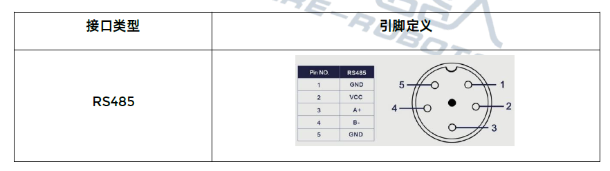
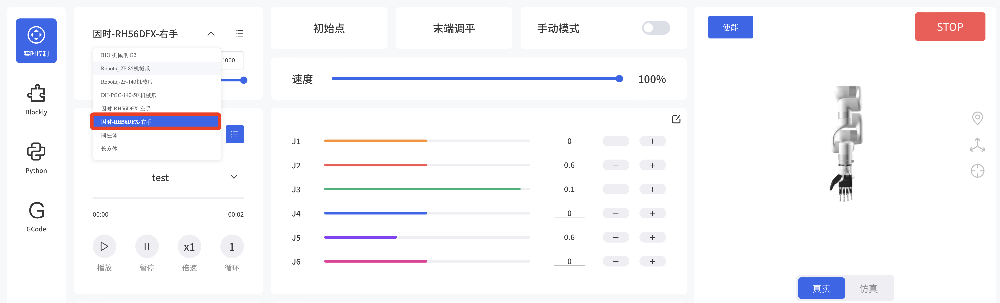
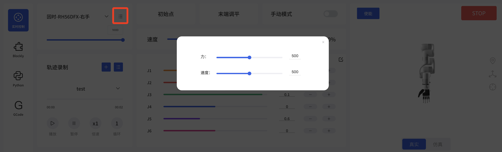
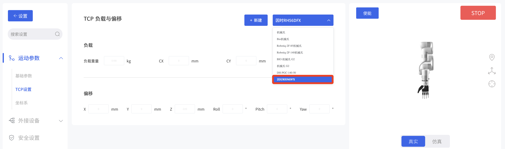
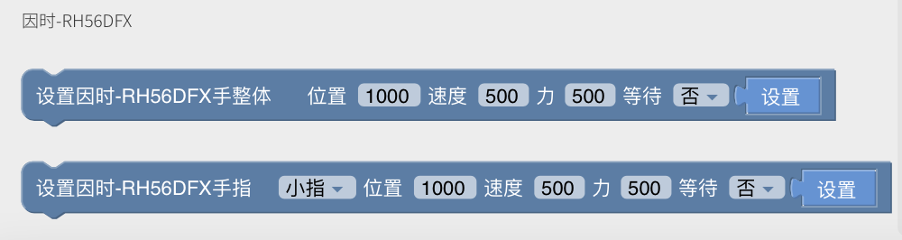

# UFACTORY机械臂与灵巧手RH56DFX


## 项目概述
此项目是基于 UFACTORY机械臂 和 INSPIRE-ROBOTS 仿人灵巧手RH56DFX系列 的应用演示。用户可以通过UFACTORY Studio软件快速控制灵巧手，实现快速抓取等应用。  

以下视频使用灵巧手抓取鸡蛋和橙子，到用电钻钻纸板，以及控制电脑鼠标切换网页。

[](https://www.youtube.com/watch?v=-fEBGHV0h9Y)


## 硬件要求
* 机械臂：UFACTORY 850, xArm系列(1305版本) ([深圳市众为创造科技有限公司](https://www.cn.ufactory.cc/))
* 灵巧手：因时-RH56DFX-左手, 因时-RH56DFX-右手 ([因时机器人](https://www.inspire-robots.com/dexterous%20hands/rh56dfx-series/))


## 硬件连接
### 机械臂末端定义
* **接触式**


| 线序  | 颜色  | 信号       | 线序  | 颜色  | 信号         |
| --- | --- | -------- | --- | --- | ---------- |
| 1   | 棕   | +24V（电源） | 7   | 黑   | 工具输出0（TO0） |
| 2   | 蓝   | +24V（电源） | 8   | 灰   | 工具输出1（TO1） |
| 3   | 白   | 0V（GND）  | 9   | 红   | 工具输入0（TI0） |
| 4   | 绿   | 0V（GND）  | 10  | 紫   | 工具输入1（TI1） |
| 5   | 粉   | 用户485-A  | 11  | 橙   | 模拟输入0（AI0） |
| 6   | 黄   | 用户485-B  | 12  | 浅绿  | 模拟输入1（AI1） |

* **触点式**
  
  
### RH56DFX灵巧手定义


**注意：**
机械臂末端和灵巧手无法直接连接，可联系因时机器人提供转接航空头。

## 控制方式
### UFACTORY Studio控制
UFACTORY Studio版本: ≥V2.7.0

#### 1.实时控制界面控制
选择 因时-RH56DFX-左手 或 因时-RH56DFX-右手，弹框选择是将机械臂波特率设置为115200。可调参数：位置、力、速度；



#### 2.TCP设置  
进入设置-运动参数-TCP设置，选择 因时RH56DFX。


#### 3.Blockly控制
Blockly模块为灵巧手提供两个块，可以选择控制手整体，或单个手指。
  

可选参数：
* 手指：小指、无名指、中指、食指、大拇指弯曲、大拇指旋转、手整体
* 位置：0-1000
* 速度：0-1000
* 力：0-1000
* 是否等待：是否等待命令结束再发送下一条指令（同步或异步逻辑）

### Python SDK控制
#### 1.设置UFACTORY机械臂末端波特率
```python
code = arm.set_tgpio_modbus_baudrate(115200)
```
#### 2.进行485通讯
```python
code, res_data = arm.getset_tgpio_modbus_data(modbus, timeout=100)
```

示例：[set_yinshi_rh56_gripper.py](https://github.com/xArm-Developer/xArm-Python-SDK/blob/master/example/wrapper/thridparty/set_yinshi_rh56_gripper.py)