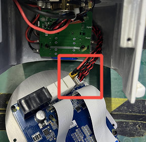
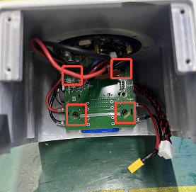

# 如何更换底座电池？

底座电池：底座电池用于给机械臂各关节的编码器供电。若电池没电或损坏，编码器数据将会丢失，各关节无法记住零点位置。  

型号： 18650，2节或1节，6400mAh。

## 1. 拆开底座
以Lite6为例。
* 将底座的贴纸撕开；拧下8颗螺丝，将底座取下；
* 断开两根连接线；

## 2. 更换电池
拧下4颗螺丝，更换电池。1节或2节都可以。

## 3. 重写数据
1. 下载并运行[xarm-tool-gui-2.17.12](https://update.ufactory.cc/xarm-tool-gui-2.17.12.zip), 输入<u>控制器IP</u>，点击<u>连接</u>；
2. 点击<u>0.关闭关节限位</u>；
3. 点击<u>多圈归零</u>；
4. 拍下急停按钮，**等待10秒**，松开急停按钮；
5. 点击<u>6.零点校准（写入）</u>；
6. 点击<u>7.打开关节限位</u>。

